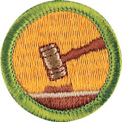

# Public Speaking Merit Badge

## Overview

A lot happens during the course of every person’s life and your ability to communicate your feelings and ideas is the best way to connect to the larger world. Even if you haven’t stood at a podium on the stage and find the whole idea scary, sooner or later, someone is going to ask you to get up and say a few words. If you are prepared, it won’t be scary. It can even be fun.

## Requirements

- (1) Give a three- to five-minute introduction of yourself to an audience such as your troop, class at school, or some other group.

  **Resources:** [How To Introduce Yourself In A Speech  (video)](https://youtu.be/l0Nve1zPvNkZ), [Introduction Speech Example (video)](https://youtu.be/e_swBD_-yR4)

- (2) Prepare a three- to five-minute talk on a topic of your choice that incorporates body language and visual aids.

  **Resources:** [How Should I Pick My Speech Topic? (video)](https://youtube.com/shorts/xmMfr8RtWkY), [4 Essential Body Language Tips From a World Champion Public Speaker (video)](https://youtu.be/ZK3jSXYBNak), [3 Minute Speech: How to Craft a Memorable Short Speech?  (video)](https://youtu.be/QZ9_4mcMpS0), [5 Presentation Aids to Make Your Presentation Pop (video)](https://youtube.com/shorts/IEAmkl7VmHU)

- (3) Give an impromptu talk of at least two minutes, either as part of a group discussion or before your counselor. Use a subject selected by your counselor that is interesting to you but that is not known to you in advance and for which you do not have time to prepare.

  **Resources:** [What is Impromptu Speaking? (video)](https://youtube.com/shorts/cOObqPtUlNk), [Mastering Impromptu Speaking: An Opportunity! (video)](https://youtube.com/shorts/PcbigPvCi1Y), [Mastering Impromptu Speaking: Deep Breaths and Go Slow (video)](https://youtube.com/shorts/L87VlHjbm_M), [How Do I Improve my Impromptu Speeches? (video)](https://youtube.com/shorts/nsGHoxuH-VU), [How to Pick a Captivating Speech Topic (video)](https://youtu.be/Rw2TZv56qO4)

- (4) Select a topic of interest to your audience. Collect and organize information about the topic and prepare an outline. Write an eight- to 10-minute speech, practice it, then deliver it in a conversational way.

  **Resources:** [How to Prepare a Speech (video)](https://youtube.com/shorts/5G9FQ7Gkt1g), [The Easiest Way to Practice for a Speech or Presentation (video)](https://youtube.com/shorts/zNpPaeRXVIs)

- (5) Show you know parliamentary procedure by leading a discussion or meeting according to accepted rules of order; or by answering questions on the rules of order.

  **Resources:** [Robert's Rules (video)](https://youtu.be/Kit39MysFL4), [Roberts Rules of Order Updated (video)](https://youtu.be/gDfhNGMO_0gl)

## Resources

- [Public Speaking merit badge page](https://www.scouting.org/merit-badges/public-speaking/)
- [Public Speaking merit badge PDF](https://filestore.scouting.org/filestore/Merit_Badge_ReqandRes/Pamphlets/Public%20Speaking.pdf) ([local copy](files/public-speaking-merit-badge.pdf))
- [Public Speaking merit badge pamphlet](https://www.scoutshop.org/public-speaking-merit-badge-pamphlet-655689.html)
- [Public Speaking merit badge workbook PDF](http://usscouts.org/mb/worksheets/Public-Speaking.pdf)
- [Public Speaking merit badge workbook DOCX](http://usscouts.org/mb/worksheets/Public-Speaking.docx)

Note: This is an unofficial archive of Scouts BSA Merit Badges that was automatically extracted from the Scouting America website and may contain errors.