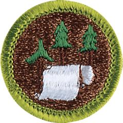

# Pulp and Paper Merit Badge

## Overview

Here’s an astonishing number to digest. Each person in the United States uses about 700 pounds of paper each year. Paper is everywhere in our lives. Every year in the United States, more than 2 billion individual books, 24 billion newspapers, and 350 million magazines are published on paper.

## Requirements

- (1) Tell the history of papermaking. Describe the part paper products play in our society and economy.

  **Resources:** [The History of Paper From Ancient China to Modern Times (video)](https://youtu.be/gvdeiWWOG8w)

- (2) Learn about the pulp and paper industry.
  - (a) Describe the ways the industry plants, grows, and harvests trees.

    **Resources:** [How They Grow Trees for Paper Manufacture (video)](https://youtu.be/qNX5EkbqYek)
  - (b) Explain how the industry manages its forests so that the supply of trees keeps pace with the demand.

    **Resources:** [Forest Management (video)](https://youtu.be/jGvlrhivWo8)
  - (c) Tell how the industry has incorporated the concepts of sustainable forest management (SFM).

    **Resources:** [Sustainable Forestry (video)](https://youtu.be/dYFt-3LNNNg)
  - (d) Describe two ways the papermaking industry has addressed pollution.

    **Resources:** [Green Spotlight on the Paper Industry (video)](https://youtu.be/bNjp_J3yang)

- (3) Name at least four types of trees that are major sources of papermaking fibers. Then do the following:

  **Resources:** [What Kind of Tree Does Paper Come From (video)](https://youtube.com/shorts/oRgPQdX0CLI)

  - (a) Discuss what other uses are made of the trees and the forestland owned by the pulp and paper industry.

    **Resources:** [Purposes and Techniques of Forest Management (website)](https://www.britannica.com/science/forestry/Range-and-forage)
  - (b) Describe two ways of getting fibers from wood, and explain the major differences between them.

    **Resources:** [From Tree to Paper (video)](https://youtube.com/shorts/c-87Bw_lXso)
  - (c) Tell why some pulps are bleached, and describe the process.

    **Resources:** [Bleaching (video)](https://youtu.be/d43q0j831f8)

- (4) Describe how paper is made. Discuss how paper is recycled. Make a sheet of paper by hand.

  **Resources:** [Production of Paper (video)](https://youtu.be/OEbf9ffkyy8), [From Tree to Sheet: How Paper Is Made | Unveiling the Manufacturing Process (video)](https://youtu.be/invUjqvE0Oc), [How to Make Handmade Paper from Recycled Materials (video)](https://youtu.be/Ow5LeG-zzyg)

- (5) Explain what coated paper is and why it is coated. Describe the major uses for different kinds of coated papers. Describe one other way that paper is changed by chemical or mechanical means to make new uses possible.

  **Resources:** [Coated vs. Uncoated Paper (video)](https://youtu.be/TCFpE6vtC4s)

- (6) Make a list of 15 pulp or paper products found in your home. Share examples of 10 such products with your counselor.

- (7) With your parent or guardian's and counselor's approval, do ONE of the following:
  - (a) Visit a pulp mill. Describe how the mill converts wood to cellulose fibers.

    **Resources:** [How Is Paper Made Today? (website)](https://www.afandpa.org/news/2025/how-paper-made-today)
  - (b) Visit a paper mill and get a sample of the paper made there. Describe the processes used for making this paper. Tell how it will be used.
  - (c) Visit a container plant or box plant. Describe how the plant's products are made.

    **Resources:** [Corrugated Box Companies Listings (website)](https://corrugatedboxcompanies.com/more-corrugated-box-companies-listings/)
  - (d) Visit a recycled paper collection or sorting facility. Describe the operations there.

    **Resources:** [Discover How Paper is Sorted for Recycling! (video)](https://youtu.be/xEdwIHtK_6k), [How Is Paper Recycled? (video)](https://youtu.be/ZuZJZccjI34), [Recycling Centers in the US (website)](https://recycling-centers.regionaldirectory.us/)
  - (e) Using books, magazines, your local library, the internet (with your parent or guardian's permission), and any other suitable research tool, find out how paper products are developed. Find out what role research and development play in the papermaking industry. Share what you learned with your counselor.

    **Resources:** [Revolutionizing the Paper Industry (video)](https://youtu.be/xcrVyh7s6zA), [Top 10 Pulp and Paper Trends & Innovations in 2025 (website)](https://www.startus-insights.com/innovators-guide/pulp-and-paper-trends/)

- (8) Find out about three career opportunities in the papermaking industry that interest you. Pick one and find out the education, training, and experience required for this profession. Discuss this with your counselor, and explain why this profession might interest you.

  **Resources:** [Why a Career in Pulp and Paper Pays Off (video)](https://youtu.be/JceCMm-kbg4), [Career Opportunities at Catalyst Paper (video)](https://youtu.be/QUeAwmqD4CM), [Amazing Summer Internships for Students at Pulp and Paper (video)](https://youtu.be/yfZzS3zmytQ), [Working for International Paper (video)](https://youtu.be/-zw1BXofRK4), [Jobs in the Paper Industry (website)](https://www.indeed.com/career-advice/finding-a-job/jobs-in-paper-industry)

## Resources

- [Pulp and Paper merit badge page](https://www.scouting.org/merit-badges/pulp-and-paper/)
- [Pulp and Paper merit badge PDF](https://filestore.scouting.org/filestore/Merit_Badge_ReqandRes/Pamphlets/Pulp-Paper.pdf) ([local copy](files/pulp-and-paper-merit-badge.pdf))
- [Pulp and Paper merit badge pamphlet](https://www.scoutshop.org/pulp-paper-merit-badge-pamphlet-655713.html)
- [Pulp and Paper merit badge workbook PDF](http://usscouts.org/mb/worksheets/Pulp-and-Paper.pdf)
- [Pulp and Paper merit badge workbook DOCX](http://usscouts.org/mb/worksheets/Pulp-and-Paper.docx)

Note: This is an unofficial archive of Scouts BSA Merit Badges that was automatically extracted from the Scouting America website and may contain errors.