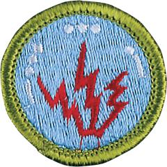

# Radio Merit Badge

## Overview

Radio is a way to send information, or communications, from one place to another. Broadcasting includes both one-way radio (a person hears the information but can¹t reply) as well as two-way radio (where the same person can both receive and send messages).

## Requirements

- (1) **Radio Safety.** Explain the safety precautions for working with radio gear, including:
  - (a) The differences between broadcast radio and hobby radio
  - (b) The differences between broadcasting and two-way communications
  - (c) Radio station call signs and how they are used in broadcast radio and amateur radio

- (2) **Radio Fundamentals.** Do the following:
  - (a) Do the following:
  - (1) Draw a chart of the electromagnetic spectrum covering 300 kilohertz (kHz) to 3,000 Megahertz (MHz).
  - (2) Label the MF, HF, VHF, UHF, and microwave portions of the spectrum on your diagram.
  - (3) Locate on your chart at least eight radio services, such as AM and FM commercial broadcast, citizens band (CB), television, amateur radio (at least four amateur radio bands), public service (police and fire), cellular, Wi-Fi, and Bluetooth.
  - (b) Discuss the following topics with your counselor:
  - (1) The definition of radio
  - (2) The differences between broadcast radio and two-way radio
  - (3) The differences between commercial broadcast radio and hobby radio.

- (3) **How Radio Waves Travel.** Do the following:
  - (a) Sketch a diagram showing how different radio wavelengths can travel locally or around the world.
  - (b) Explain how the radio stations WWV and WWVH can be used to help determine what you can expect to hear when you listen to a shortwave radio.
  - (c) Explain the difference between a distant (DX) and a local station.

- (4) **Information by Radio.** Discuss the following with your counselor:
  - (a) How radio waves carry information using continuous wave (CW) Morse Code transmission, amplitude modulation (AM), frequency modulation (FM), single sideband (SSB) transmission, and frequency hopping.
  - (b) How digitized radio standards including Bluetooth, Wi-Fi, and 5G can offer more reliable data transmission and reception than analog standards.
  - (c) How the effective range varies for different methods of information encoding.
  - (d) How the maximum data rate from a Wi-Fi radio system compares to a hard-wired or fiber-optic system.

- (5) **Radio Hardware and Services.** Do the following:
  - (a) Explain the differences between a block diagram and a schematic diagram.
  - (b) Draw a block diagram for a radio station that shows a microphone, speaker, transceiver, transmitter, receiver, amplifier, feedline, and antenna and discuss the function of these components.
  - (c) List consumer devices and services that use analog or digital radio communications.
  - (d) Explain how NOAA Weather Radio (NWR) can alert you to danger.
  - (e) Explain how RFID works and what are some of its uses in everyday life.

- (6) **Radio Regulation.** Discuss the following with your counselor:
  - (a) What the Federal Communications Commission (FCC) does and how it is different from the International Telecommunication Union (ITU).
  - (b) How radio station call signs are used in broadcast radio and amateur radio.
  - (c) How the phonetic alphabet is used to communicate clearly.

- (7) **Cell Phones** Do the following:
  - (a) Explain how cellular systems differ from broadcast and hobby radio.
  - (b) Explain what Airplane Mode is and why it is important.
  - (c) Explain how cell phones keep the correct time and show locations and elevations.
  - (d) Explain the benefits and limitations of cell phones in emergencies.
  - (e) Explain wireless charging for cell phones and other devices.

- (8) **Amateur and Professional Radio.** Do ONE of the following options:
  - **Option A—Amateur Radio.** Do ALL of the following:
  - (1) Tell why the FCC has an amateur radio service. Describe activities that amateur radio operators can do on the air, once they have earned an amateur radio license.
  - (2) Explain differences between the Technician, General, and Extra Class license requirements and privileges. Explain who administers amateur radio exams.
  - (3) Explain at least five Q signals or amateur radio terms.
  - (4) Explain how you would make an emergency call on voice or Morse code.
  - (5) Explain the differences between handheld, mobile, and base station transceivers and their uses. Explain the use of amateur radio repeaters.
  - (6) Using proper call signs, Q signals, and abbreviations, carry on a 10-minute real or simulated amateur radio contact using voice, Morse code, or digital mode. Properly log the real or simulated amateur radio contact, and record the signal report.
    **Note:** Licensed amateur radio operators may substitute five QSL cards as evidence of contacts with five amateur radio operators.
  - **Option B—Radio Broadcasting.** Do ALL of the following:
  - (1) Discuss with your counselor FCC broadcast regulations. Include power levels, frequencies, and the regulations for low-power stations.
  - (2) Prepare a program schedule for radio station "KBSA" of exactly one-half hour, including music, news, commercials, and proper station identification. Record your program on audiotape or in a digital audio format, using proper techniques.
  - (3) Listen to and properly log 15 broadcast stations. Determine the program format and target audience for five of these stations.
  - (4) Explain to your counselor at least eight terms used in commercial broadcasting, such as segue, cut, fade, continuity, remote, Emergency Alert System, network, cue, dead air, PSA, and playlist.
  - (5) Discuss with your counselor alternative radio platforms such as internet streaming, satellite radio, and podcasts.
  - **Option C—Shortwave and Medium-Wave Listening.** Do ALL of the following:
  - (1) Listen across several shortwave bands for four one-hour periods-at least one period during daylight hours and at least one period at night. Log the stations properly and locate them geographically on a map, globe, or web-based mapping service.
  - (2) Listen to several medium-wave stations for two one-hour periods, one period during daylight hours and one period at night. Log the stations properly and locate them on a map, globe, or web-based mapping service.
  - (3) Compare your daytime and nighttime logs; note the frequencies on which your selected stations were loudest during each session. Explain differences in the signal strength from one period to the next.
  - (4) Compare your medium-wave broadcast station logs and explain why some distant stations are heard at your location only during the night.
  - (5) Demonstrate listening to a radio broadcast using a smartphone/cell phone. Include international broadcasts in your demonstration.
  - **Option D—Amateur Radio Direction Finding.** Do ALL of the following:
  - (1) Describe amateur radio direction finding and explain why direction finding is important as both an activity and in competition.
  - (2) Describe what frequencies and equipment are used for ARDF or fox hunting.
  - (3) Build a simple directional antenna for either of the two frequencies used in ARDF.
  - (4) Participate in a simple fox hunt using your antenna along with a provided receiver.
  - (5) Show, on a map, how you located the "fox" using your receiver.
  - **Option E—Family Radio Service (FRS) & General Mobile Radio Service (GMRS) Walkie Talkies.** Do ALL of the following:
  - (1) Explain what the Family Radio Service (FRS) and General Mobile Radio Service (GMRS) are and how they are different from each other, from other commercial two-way radios, and from Citizens Band (CB) & Amateur Radio (HAM).
  - (2) Explain each of the following for using a FRS radio or GMRS walkie talkie:
  - (3) Use the FRS radios or GMRS walkie talkies with family, friends, or Scouts on a hike, at an event, or in a team game. Discuss what you learned with your counselor.
  - (a) Is any type of license needed to use these radios? If so: what kind?
  - (b) What radio frequencies are used and how is information encoded?
  - (c) How much power can be used when transmitting?
  - (d) What type of antenna can be used?
  - (e) What is the effective range and what limits it?
  - (f) What are common everyday uses for these radios?
  - (g) How can these radios be useful in an emergency?

- (9) **Careers.** Do ONE of the following.
  - (a) Explore careers related to radio. Research one career to learn about the training and education needed, costs, job prospects, salary, job duties, and advancement. With permission of your parent or guardian, your research methods may include an internet or library search, an interview with a professional in the field, or a visit to a location where people in this career work or train. Discuss your findings and career interest with your counselor.
  - (b) Explore how you could use radio knowledge and skills to develop a hobby or to serve as a volunteer. If possible, with permission of your parent or guardian, interview a radio hobbyist or volunteer. Research training and licensing needed, expenses, and organizations that promote or support your objectives. Discuss with your counselor what short-term and long-term goals you might have if you pursue this.

## Resources

- [Radio merit badge page](https://www.scouting.org/merit-badges/radio/)
- [Radio merit badge PDF](https://filestore.scouting.org/filestore/Merit_Badge_ReqandRes/Pamphlets/Radio.pdf) ([local copy](files/radio-merit-badge.pdf))
- [Radio merit badge pamphlet](https://www.scoutshop.org/bsa-radio-merit-badge-pamphlet-661041.html)
- [Radio merit badge workbook PDF](http://usscouts.org/mb/worksheets/Radio.pdf)
- [Radio merit badge workbook DOCX](http://usscouts.org/mb/worksheets/Radio.docx)

Note: This is an unofficial archive of Scouts BSA Merit Badges that was automatically extracted from the Scouting America website and may contain errors.