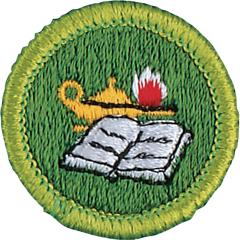

# Reading Merit Badge

## Overview

If you have ever wanted to go back in time or wished you could visit the future, if you are curious about the world, or if you are interested in how things work or like to learn new things, these are all reasons why you should want to read. Reading is fascinating. It’s full of surprises. And it will take you places you can’t get to in any other way.

## Requirements

* NOTE:  The official merit badge pamphlets are now free and downloadable  [HERE](https://filestore.scouting.org/filestore/Merit_Badge_ReqandRes/Pamphlets/Reading.pdf) or can be purchased at the [Scout Shop.](https://www.scoutshop.org/)
* (1) Do the following:
    * (a) Take a tour of a library. Discuss with your counselor how the library is organized and what resources and/or services are offered in the library. Resources: [How Is a Library Organized (video)](https://youtu.be/wm3OYbqWGt4) [Library of Congress Classification (video)](https://youtu.be/Vq_nXCKqvvI?si=GIOeyfCbat453Qtp)
    * (b) Learn how to search a library's card catalog or computerized catalog by author, title, and subject.Resource: [How to Use a Card Catalog (video)](https://youtu.be/bBoBFioGVJc?si=W5X75XCeu-dxS8if)
    * (c) In a library, search the card catalog or computerized catalog for six books of four different types, such as poetry, fiction, nonfiction, and biographies. Resource: [Locating a Book in a Library (video)](https://youtu.be/yqg41rMDlKA)
    * (d) With the assistance of your counselor or the librarian, see if you can locate on the shelves the six books you selected.
    * (e) Explain what a library card is, why it is needed, and how to get one. Resource: [How Do I...Get a Library Card (video)](https://youtu.be/LOhNkY0yb4s?si=fCdFQINKX1P4wNYJ)

* (2) Do the following:
    * (a) Identify a book you have enjoyed. Find out what other books the author has written.
    * (b) Look at one or more "best books" lists. These can be based on year, subject, or even all time. Identify at least one book you would like to read. Resources: [Best Selling Books Ever (video)](https://www.youtube.com/watch?v=wPDAjvQCgIg) [10 Most Read Books of All Time (video)](https://www.youtube.com/shorts/_FWW0V4rwj4)

* (3) Read four different types of books, such as poetry, fiction, nonfiction, or biographies. Do one of the following for each book you have read: Resources: [Every Book Genre Explained (video)](https://youtu.be/aPVgS3CI5SU?si=OkVFctCrfbNYCegr)  [Literary Genres: Nonfiction (video)](https://youtu.be/mQINQAxu-5k?si=dNoZJStT4sCeK5NA)  [How to Get Into Poetry as a Beginner (video)](https://youtu.be/G5GUUgHVruQ?si=Vb-wmUTGtTSsRvDN)
    * (a) Write a review of the book. Include what you liked and/or didn't like about the book. Include whether you would recommend this book, and if so, who might enjoy reading it. Resources: [How to Write a Book Review (video)](https://youtu.be/IhYF3v3zTeo) [How to Write a Book Review (12 Steps) (video)](https://youtu.be/BJfKSm0VpuU?si=IsukhqXWGXupIMa1)
    * (b) Watch a movie based on the book. What was the same between the book and movie? What was different? Which did you enjoy more? Discuss this with your counselor. Resource: [7 Big Differences (video)](https://youtu.be/Ho70o1kiwf4)
    * (c) Give a "book talk" to your class, troop, or patrol. Resource: [How to Do a Book Talk (video)](https://youtu.be/XoHzONEs5Uw)

* (4) Read a nonfiction book or magazine that teaches you how to do something like cooking, wood-building projects, video game design, science experiments, knot-tying, etc. With your counselor's and parent or guardian's permission, complete a project from the book. Share your experience with your counselor. Reading a merit badge pamphlet will not count toward completing this requirement. Resource: [How to Improve Reading Comprehension (video)](https://youtu.be/3nLX0CjMO-Q?si=4SNTBq8jqKAhZioe)
* (5) Read about the world around you from any two sources: books, magazines, newspapers, the internet (with your parent or guardian's permission), field manuals, etc. Topics may include Scouting, sports, environmental problems, politics, social issues, current events, nature, religion, etc. Discuss what you have learned with your counselor. Resource: [Summarizing Main Ideas (video)](https://youtu.be/LbO3lRXT0ww?si=GDgqXvC8Jw_0S09p)
* (6) With your counselor's and parent or guardian's permission, choose ONE of the following activities and devote at least four hours of service to that activity. Discuss your participation with your counselor.
    * (a) Read to a sick, blind, or homebound person in a hospital or in an extended-care facility. Resource: [Tips on Reading Out Loud (video)](https://www.youtube.com/watch?v=sxdINJaZ9q4)
    * (b) Perform volunteer work at your school library or a public library. Resource: [Teen Volunteer Opportunities (video)](https://youtu.be/XhAR6VUfzBU?si=TCckKMIiB1Xllwgq)
    * (c) Read stories to younger children, in a group or individually. Resource: [Top Tips for Reading to Children (video)](https://youtu.be/iRPNPCAf84E)
    * (d) Organize a book swap in your troop, school, or place of worship. Resource: [Host a Book Swap Party (video)](https://youtu.be/jRX9vZqx4AI?si=IViwsmilodCCMP7L)
    * (e) Organize a book drive to collect books. Donate them to an organization in need. Resource: [Brag Book (video)](https://youtu.be/W9G0X6gAhwY)

## Resources

- [Reading merit badge page](https://www.scouting.org/merit-badges/reading/)
- [Reading merit badge PDF](https://filestore.scouting.org/filestore/Merit_Badge_ReqandRes/Pamphlets/Reading.pdf) ([local copy](files/reading-merit-badge.pdf))
- [Reading merit badge pamphlet](https://www.scoutshop.org/bsa-reading-merit-badge-pamphlet-boy-scouts-of-america-659872.html)

Note: This is an unofficial archive of Scouts BSA Merit Badges that was automatically extracted from the Scouting America website and may contain errors.