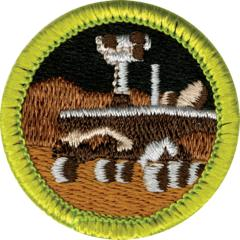

# Robotics Merit Badge

## Overview

Build your own working robot with the Robotics Merit Badge. Learn about the robotics industry, discover the different fields of robotics, explore the available career options in robotics, and design, build, program and test your own robot.

## Requirements

* NOTE:  The official merit badge pamphlets are now free and downloadable  [HERE](https://filestore.scouting.org/filestore/Merit_Badge_ReqandRes/Pamphlets/Robotics.pdf) or can be purchased at the [Scout Shop.](https://www.scoutshop.org/)
* (1) Safety. Do the following:
    * (a) Explain to your counselor the most likely hazards you may encounter while working with robots and what you should do to anticipate, mitigate and prevent, and respond to these hazards. Describe the appropriate safety gear and clothing that should be used when working with robotics. Resource: [Hazards and Robot Safety (video)](https://youtu.be/7v3cylLL9hw?list=PLHGEvyG5wuthXQZzTc-mLwFrP5F6_1Lce)
    * (b) Discuss first aid and prevention for the types of injuries that could occur while participating in robotics activities and competitions, including cuts, eye injuries, and burns (chemical or heat). Resource: [How to Treat Cuts and Scrapes (video)](https://www.youtube.com/watch?v=0jp5FgLmKtk&list=PLHGEvyG5wuthXQZzTc-mLwFrP5F6_1Lce&index=1)

* (2) Robotics Industry. Discuss the following with your counselor:
    * (a) The kinds of things robots can do and how robots are best used today. Resource: [TYPES OF ROBOTS | Robots Classification (video)](https://youtu.be/fc_Cynqr6jM)
    * (b) The similarities and differences between remote-control vehicles, telerobots, and autonomous robots. Resources: [What's The Difference Between Autonomous Robots and Controlled Robots? (video)](https://youtu.be/kdYJyGQwtL4) [What Is the Difference Between Autonomous and Teleoperated Robots? (video)](https://milvus.io/ai-quick-reference/what-is-the-difference-between-autonomous-and-teleoperated-robots)
    * (c) Three different methods robots can use to move themselves other than wheels or tracks. Describe when it would be appropriate to use each method. Resource: [The No Wheel, Circular Gear, or Sprocket Robot Race (video)](https://youtu.be/aVuNcVW-gzE?si=xoginEhjVnWEPiMd)

* (3) General Knowledge. Discuss with your counselor three of the five major fields of robotics (human-robot interface, mobility, manipulation, programming, sensors) and their importance to robotics development. Discuss either the three fields as they relate to a single robot system OR talk about each field in general. Find pictures or at least one video to aid your discussion. Resource:  [5 Sub-Disciplines of Robotics (video)](https://youtu.be/exEBkd1Gn0I)
* (4) Design, Build, Program, Test. Do the following: Resources: [What Qualifies as a Robot for Robotics Merit Badge? (video)](https://youtu.be/6dYq9bBSaWc?list=PLHGEvyG5wuthXQZzTc-mLwFrP5F6_1Lce)  [Methods Robots Use to Move (video)](https://youtu.be/T0JeYyU7R-c?list=PLHGEvyG5wuthXQZzTc-mLwFrP5F6_1Lce)  [Robotics: Degrees of Freedom (video)](https://youtu.be/55O-DGeoFic?list=PLHGEvyG5wuthXQZzTc-mLwFrP5F6_1Lce)
    * (a) With your counselor's approval, choose a task for the robot or robotic subsystem that you plan to build. Include sensor feedback and programming in the task. Document this information in your robot engineering notebook.
    * (b) Design your robot. The robot design should use sensors and programming and have at least 2 degrees of freedom. Document the design in your robot engineering notebook using drawings and a written description.
    * (c) Build a robot or robotic subsystem of your original design to accomplish the task you chose for requirement 4(a).
    * (d) Discuss with your counselor the programming options available for your robot. Then do ONE of the following:
        * (1) Program your robot to perform the task you chose for your robot in 4(a). Include a sample of your program's source code in your robot engineering notebook. Resource: [VEXcode VR (website)](https://www.vexrobotics.com/vexcode/vr?srsltid=AfmBOopvcCE5uFUVB__bxV0UiLP20ZZQwq0WrNHHJWuIQUDXmLAwl8UL%5C)
        * (2) Prepare a flowchart of the desired steps to program your robot for accomplishing the task in 4(a). Include procedures that show activities based on sensor inputs. Place this in your robot engineering notebook. Resources: [General Guide to Creating Flowcharts (video)](https://youtu.be/SWRDqTx8d4k) [Flowchart Tutorial for Beginners (video)](https://youtu.be/c8asK8iCaRk)

    * (e) Test your robot and record the results in your robot engineering notebook. Include suggestions on how you could improve your robot, as well as pictures or sketches of your finished robot.

* (5) Demonstrate. Do the following:
    * (a) Demonstrate for your counselor the robot you built in requirement 4.
    * (b) Share your robot engineering notebook with your counselor. Talk about how well your robot accomplished the task, the improvements you would make in your next design, and what you learned about the design process.

* (6) Competitions. Do ONE of the following. Resources:  [About FIRST Robotics Competition (2021) (video)](https://youtu.be/Jd29kzjclV0)  [About VEX Robotics (video)](https://youtu.be/Mi6E37oU8yc)
    * (a) Attend a robotics competition and report to your counselor what you saw and learned about the competition and how teams are organized and managed.
    * (b) Learn about three youth robotics competitions. Tell your counselor about these, including the type of competition, time commitment, age of the participants, and how many teams are involved.

* (7) Careers. Name three career opportunities in robotics. Pick one and find out the education, training, and experience required for this profession. Discuss this with your counselor, and explain why this profession might interest you. Resources:  [Learn about the careers of robotics technicians (video)](https://youtu.be/0dwkGhRPQW4)  [Careers in Robotics (video)](https://youtu.be/5YTYFrrSdV4?list=PLHGEvyG5wuthXQZzTc-mLwFrP5F6_1Lce)

## Resources

- [Robotics merit badge page](https://www.scouting.org/merit-badges/robotics/)
- [Robotics merit badge PDF](https://filestore.scouting.org/filestore/Merit_Badge_ReqandRes/Pamphlets/Robotics.pdf) ([local copy](files/robotics-merit-badge.pdf))
- [Robotics merit badge pamphlet](https://www.scoutshop.org/robotics-merit-badge-pamphlet-662428.html)

Note: This is an unofficial archive of Scouts BSA Merit Badges that was automatically extracted from the Scouting America website and may contain errors.