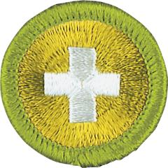

# Safety Merit Badge

## Overview

Knowing about safety helps Scouts to make the right choices and to take the best actions to avoid accidents by making informed choices in their everyday activities and to respond appropriately during an emergency situation.

## Requirements

- (1) **Safety and Hazards.** Do the following:
  - (a) Explain what safety is and what it means to be safe.

    **Resources:** [What is Safety? (video)](https://youtu.be/qNmd4z2VFAY?si=KG7EvkG4mt08gSxz), [What Does Safety Mean to You? (video)](https://youtu.be/GRqwuAMqjnY)
  - (b) Explain what hazards are and how people manage hazards to reduce risks of harm and to improve safety.

    **Resources:** [Hazard and Risk - What's the Difference? (video)](https://youtu.be/_GwVTdsnN1E?si=FyaKmgWPC4Hrod-P)

- (2) **Family and Home Safety.** Do the following:
  - (a) Explain common causes of and prevention of home injuries.

    **Resources:** [Seven Common Home Injuries (website)](https://healthtalk.unchealthcare.org/7-common-injuries-that-happen-at-home/), [Home Accident Statistics (website)](https://www.rubyhome.com/blog/home-accident-stats/)
  - (b) Discuss the dangers involved with the use of fireworks.

    **Resources:** [Fireworks Safety (video)](https://youtu.be/8HxuUMoJyGA?si=bmAF8-rKBe0A1g1v), [Dangers of Fireworks (website)](https://www.mayoclinichealthsystem.org/hometown-health/speaking-of-health/use-caution-with-fireworks)
  - (c) Explain common causes of and prevention of home fires.

    **Resources:** [5 Causes of Home Fires (website)](https://www.nfpa.org/news-blogs-and-articles/blogs/2020/12/17/most-home-fires-result-from-five-general-causes)
  - (d) Using the Home Safety Checklist in the *Safety* merit badge pamphlet, or one approved by your counselor, inspect your home or a similar building for hazards with an adult. Review your checklist and findings with your counselor.

    **Resources:** [Home Safety Checklist (PDF)](https://filestore.scouting.org/filestore/Merit_Badge_ReqandRes/Requirement%20Resources/Emergency%20Preparedness/Home%20Safety%20Checklists%20%231%20%23%202%2001%202026.pdf)
  - (e) Develop a fire-escape plan for your home or for a similar building. Include in your drawings exit routes from each room and a meeting place outside. Conduct a fire-escape drill. Review your plan and your drill with your counselor.

    **Resources:** [Home Fire Escape Planning (website)](https://www.nfpa.org/education-and-research/home-fire-safety/escape-planning#safety-tips), [Demonstration of Safely Escaping a House Fire (video)](https://www.youtube.com/watch?v=zeiN_A-OSt8&t=2s)
  - (f) Develop a family emergency action plan for evacuation because of weather or other natural disasters that occur in your area. Using a checklist in the *Safety* merit badge pamphlet or one approved by your counselor, assemble or inspect an emergency supplies kit. Explain to your counselor how a family would use the plan and the kit supplies in an emergency.

    **Resources:** [Checklist for a Family Emergency Evacuation Kit (PDF)](https://filestore.scouting.org/filestore/Merit_Badge_ReqandRes/Requirement%20Resources/Emergency%20Preparedness/Family%20Emergency%20Kit%20Checklist%2001%202026.pdf), [Wildfire Evacuation Planning (video)](https://youtu.be/EOXSpBkH6zE?si=TgfY5UUhvGwcB8SP), [How to Shelter in Place (video)](https://youtu.be/4NbejEMQ6cg), [Evacuation Planning (website)](https://www.ready.gov/evacuation)

- (3) **Safety from Crime.** Do the following:
  - (a) Explain common types of crimes that can affect teens.
  - (b) Using a Home Security Checklist in the *Safety* merit badge pamphlet or one approved by your counselor, inspect your home or a similar building for crime security measures with an adult. Review your checklist and findings with your counselor.

    **Resources:** [Home Security Checklist (PDF)](https://filestore.scouting.org/filestore/Merit_Badge_ReqandRes/Requirement%20Resources/Crime%20Prevention/Home%20Security%20Checklists%20%231%20%232.pdf)

- (4) **Safety in Public Places.** Explain each of the following to your counselor:
  - (a) How a person would safely exit from public buildings, a hotel, and a stadium in an emergency.

    **Resources:** [How to Survive a Stampede (video)](https://youtu.be/KaDcgIx2PlY?si=1EIJSxfDfMlG0AfV), [How to Survive a Burning High Rise (video)](https://youtu.be/P8Naa4pzDdo?si=5Wr7bMJOmXW9p0XG)
  - (b) How and why Scouts would take shelter at camp.

    **Resources:** [Camp Emergency Planning (video)](https://www.youtube.com/shorts/no3dR86WRss), [Camp Evacuation Planning (website)](https://www.acacamps.org/resources/wildfire-evacuations)
  - (c) How should Scouts respond to an active shooter.

    **Resources:** [How to Respond to an Active Shooter (video)](https://youtu.be/sshDd_AgRAA?si=IRhkIwBLtRN6uqjF)
  - (d) The meaning of this saying: "If You See Something, Say Something.®"

    **Resources:** [If You See Something, Say Something® (video)](https://youtu.be/Lgm5QWD1T3k?si=ABHK45yx-DqYETJh)

- (5) **Safeguarding Youth.** Do the following:
  - (a) Discuss Scouting America's Safeguarding Youth guidelines that adults and Scouts must follow so that everyone is safe at Scouting activities.

    **Resources:** [Youth Protection Policies (video)](https://filestore.scouting.org/filestore/YPSAT/YT%20Mod4%20Final%20Master%20Small.mp4)
  - (b) Discuss with your counselor what situations and behaviors would prompt you to Recognize, Resist, and Report a possible abuse situation.
  - (c) Discuss how you, other Scouts, leaders, and anyone can report situations suspicious for abuse through the Scouts First Helpline and other means.

- (6) **Safety from Assault.** Explain how to avoid or prevent:
  - (a) Assault on a street

    **Resources:** [Muggers Reveal How They Target Their Victims (video)](https://youtu.be/aQdCVTon3HQ)
  - (b) Assault at a restaurant event
  - (c) Sexual assault at a party or on a date

- (7) **Online Safety.** Discuss the following with your counselor:
  - (a) How to avoid being the victim of online crimes.

    **Resources:** [Protect Your Personal Information From Hackers and Scammers (website)](https://consumer.ftc.gov/protect-your-personal-information-hackers-scammers#keep), [Passkeys Explained in Under 4 Minutes (video)](https://youtu.be/bdp8RdjV6PU?si=MPYq7d0la_3KVSuX)
  - (b) Common online financial scams.

    **Resources:** [Common Online Scams (video)](https://youtu.be/k8UVnkh8i0c), [10 Common Internet Scams (video)](https://youtu.be/CDhAOvsyw2s?si=42nASL5CjtBBKwru)
  - (c) Effective online security

    **Resources:** [Effective Online Security (video)](https://youtu.be/aO858HyFbKI)
  - (d) Identity theft and how to prevent it

    **Resources:** [Preventing Identity Theft (video)](https://youtu.be/kDFeSUUwRnA?si=ncAfMQF1RIdIWetC)
  - (e) How criminals use social media to target victims.

    **Resources:** [How Criminals Use Social Media (video)](https://youtu.be/5bdBvNCBeho?si=bJdF2LM50LG_tm74)
  - (f) How bullying, texting, and sharing photos can become crimes.

- (8) **Travel Safety.** Explain guidelines for traveling safely:
  - (a) As a pedestrian in a city

    **Resources:** [Pedestrian Safety (video)](https://youtu.be/QUXLT3gcFb8)
  - (b) In a friend's car or truck

    **Resources:** [Passenger Responsibilities for Safety (website)](https://www.fmins.com/blog/how-to-be-a-better-passenger/)
  - (c) In a rideshare vehicle

    **Resources:** [Rideshare Safety Tips (website)](https://riskadvisory.ucsf.edu/tips-stay-safe-while-ridesharing), [Ride-Sharing Safety (video)](https://youtu.be/3ElQynt6rV4?si=ZqpLU9aEY7P2SzLY)
  - (d) On a bus

    **Resources:** [Riding a Bus Safely (video)](https://youtu.be/fbsDdX7auRo?si=KB3o4EPoNUeZc2xQ), [How to Ride a Bus Safely (video)](https://youtu.be/YiI8bnDwkcE)
  - (e) On a subway or train

    **Resources:** [How to Ride a Train Safely (video)](https://youtu.be/5w2X_16tuK4)
  - (f) On a commercial airplane

    **Resources:** [Air Travel Do Not Do's (video)](https://youtu.be/vsfudxcksHI)

- (9) **Careers.** Do ONE of the following:
  - (a) Explore careers related to Safety merit badge. Research one career to learn about the training and education needed, costs, job prospects, salary, job duties, and career advancement. With permission of your parent or guardian, your research methods may include an internet or library search, an interview with a professional in the field, or a visit to a location where people in this career work. Discuss with your counselor both your findings and what about this profession might make it an interesting career.

    **Resources:** [Wondering How To Get Qualified To Work in Safety?! (video)](https://youtu.be/zumgPs4PAiA), [Building Safety Careers (video)](https://youtu.be/MT9yVrlSn7M?si=TKjtM1VAhMXmou99)
  - (b) Explore how you could use knowledge and skills related to safety to pursue a hobby, lifestyle, or service as a volunteer. Research any training needed, expenses, and organizations that promote or support it. Discuss with your counselor what short-term and long-term goals you might have if you pursue this.

    **Resources:** [Volunteers in Mountain Rescue (video)](https://youtu.be/SfFb2D-3H2s), [Safety Tips for Serving as Park Volunteer (video)](https://youtu.be/ZlgAJHEWmeg?si=-sKGTI3ErflGOuA_), [Safety as a Passion (website)](https://www.iloveit.net/passion/safety-as-a-passion-and-hobby/)

## Resources

- [Safety merit badge page](https://www.scouting.org/merit-badges/safety/)
- [Safety merit badge PDF](https://filestore.scouting.org/filestore/Merit_Badge_ReqandRes/Pamphlets/Safety.pdf) ([local copy](files/safety-merit-badge.pdf))
- [Safety merit badge pamphlet](https://www.scoutshop.org/safety-merit-badge-pamphlet-660411.html)
- [Safety merit badge workbook PDF](http://usscouts.org/mb/worksheets/Safety.pdf)
- [Safety merit badge workbook DOCX](http://usscouts.org/mb/worksheets/Safety.docx)

Note: This is an unofficial archive of Scouts BSA Merit Badges that was automatically extracted from the Scouting America website and may contain errors.