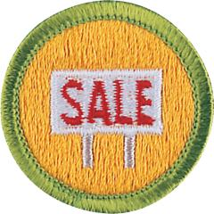

# Salesmanship Merit Badge

## Overview

By studying salesmanship, Scouts can learn self-confidence, motivation, friendliness, and the persistence necessary to overcome obstacles and solve problems. Sales can offer a challenging and rewarding career for those who enjoy interacting with people from all walks of life.

## Requirements

- (1) Do the following:
  - (a) Explain the responsibilities of a salesperson and how a salesperson serves customers and helps stimulate the economy.

    **Resources:** [Sales Representative Duties and Responsibilities (video)](https://youtu.be/bpuVvUZnWxE)
  - (b) Explain the differences between a business-to-business salesperson and a consumer salesperson.

    **Resources:** [Understanding B2C vs B2B for Beginners (video)](https://youtu.be/XEVR9zIbMiw)

- (2) Explain why it is important for a salesperson to do the following:
  - (a) Research the market to be sure the product or service meets the needs of customers.

    **Resources:** [Market Research The Secret Ingredient for Business Success (video)](https://youtu.be/CqaFYgRGDmo)
  - (b) Learn all about the product to be sold.

    **Resources:** [3 Keys for Successful Selling Know Your Product (video)](https://youtu.be/FDVR9MoQb44)
  - (c) If possible, visit the location where the product is built and learn how it is constructed. If a service is being sold, learn about the benefits of the service to the customer.
  - (d) Follow up with customers after their purchase to confirm their satisfaction and discuss their concerns about the product.

    **Resources:** [Why Is Following Up Important (video)](https://youtu.be/DMfH_03nR0o)

- (3) Write and present a sales plan for a product and a sales territory assigned by your counselor.

  **Resources:** [How to Write Your Marketing Plan (video)](https://youtu.be/pFG_Q7e14AA)

- (4) Make a sales presentation of a product assigned by your counselor.

  **Resources:** [How to Give Effective Sales Presentations (video)](https://youtu.be/8eo01Wlkd4o)

- (5) Do ONE of the following and keep a record (cost sheet). Use the sales techniques you have learned, and share your experience with your counselor:
  - (a) Help your unit raise funds through sales of merchandise or of tickets to a Scout event.
  - (b) Sell your services such as lawn raking or mowing, pet watching, dog walking, show shoveling, and car washing to your neighbors. Follow up after the service has been completed and determine the customer's satisfaction.
  - (c) Earn money through retail selling.

- (6) Do ONE of the following:

  **Resources:** [How to Conduct an Interview (video)](https://youtu.be/kO9WcdINoRk)

  - (a) Interview a salesperson and learn the following:
    - (1) What made the person choose sales as a profession?
    - (2) What are the most important things to remember when talking to customers?
    - (3) How is the product sold?
    - (4) Include your own questions.
  - (b) Interview a retail store owner and learn the following:
    - (1) How often is the owner approached by a sales representative?
    - (2) What good traits should a sales representative have? What habits should the sales representative avoid?

      **Resources:** [Top 5 Traits of Great Sales People (video)](https://youtu.be/OjCnfTSrq1s)
    - (3) What does the owner consider when deciding whether to establish an account with a sales representative?
    - (4) Include at least two of your own questions.

- (7) Investigate and report on career opportunities in sales, then do the following:

  **Resources:** [Is Sales the Perfect Career for YOU? Career Deep Dive (video)](https://youtu.be/2iQ6clokEPo)

  - (a) Prepare a written statement of your qualifications and experience. Include relevant classes you have taken in school and merit badges you have earned.

    **Resources:** [Easy Guide to Writing a High School Student Resume (video)](https://youtu.be/-z4v-Dw7n50)
  - (b) Discuss with your counselor what education, experience, or training you should obtain so you are prepared to serve in a sales position.

    **Resources:** [How to become a Highly Paid Salesperson (video)](https://youtu.be/frRl9nrntpM)

## Resources

- [Salesmanship merit badge page](https://www.scouting.org/merit-badges/salesmanship/)
- [Salesmanship merit badge PDF](https://filestore.scouting.org/filestore/Merit_Badge_ReqandRes/Pamphlets/Salesmanship.pdf) ([local copy](files/salesmanship-merit-badge.pdf))
- [Salesmanship merit badge pamphlet](https://www.scoutshop.org/bsa-salesmanship-merit-badge-pamphlet-boy-scouts-of-america-660398.html)
- [Salesmanship merit badge workbook PDF](http://usscouts.org/mb/worksheets/Salesmanship.pdf)
- [Salesmanship merit badge workbook DOCX](http://usscouts.org/mb/worksheets/Salesmanship.docx)

Note: This is an unofficial archive of Scouts BSA Merit Badges that was automatically extracted from the Scouting America website and may contain errors.