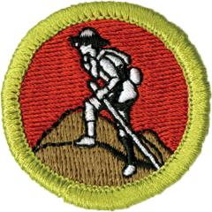

# Scouting Heritage Merit Badge

## Overview

Explore the origins of the Scouting movement by earning the Scouting Heritage Merit Badge. Scouts will learn about the life and times of Lord Baden-Powell, discover how Scouting grew in the United States, and understand how Scouting’s programs have developed and adapted over time.

## Requirements

* (1) Discuss with your counselor the life and times of Lord Baden-Powell of Gilwell. Explain why he felt a program like Scouting would be good for the young men of his day. Include in your discussion how Scouting was introduced in the United States, and the origins of Boy Scouting and Cub Scouting under Baden-Powell. Resource:  [Baden Powell - Father of Scouting, Origins of Scouting (video)](https://www.youtube.com/watch?v=tn9S4qB-fdw&list=PLeqxtqwBBzS-Z290oRp20bqnDqXZkSb3j&index=1)
* (2) Do the following:
    * (a) Give a short biographical summary of any TWO of the following, and tell of their roles in how Scouting developed and grew in the United States.
        * (1) Daniel Carter Beard Resource: [Daniel Carter Beard - BSA Founder (video)](https://www.youtube.com/watch?v=GIaIyxfuLCQ&list=PLeqxtqwBBzS-Z290oRp20bqnDqXZkSb3j&index=2)
        * (2) William D. Boyce Resource: [William D. Boyce - BSA Founder (video)](https://www.youtube.com/watch?v=Ulhu9fefMo4&list=PLeqxtqwBBzS-Z290oRp20bqnDqXZkSb3j&index=3)
        * (3) Waite Phillips Resource: [Waite Phillips - BSA Benefactor and Donor of Philmont (video)](https://youtu.be/QiKK97PQ7Us)
        * (4) Ernest Thompson Seton Resource: [Ernest Thompson Seton - BSA Founder (video)](https://youtu.be/-azpLxf8wpA?si=tiMSbrOyFEHx0L9u)
        * (5) James E. West Resource: [James E. West - BSA Founder (video)](https://youtu.be/cpIpdHl4cug)
        * (6) Green Bar Bill Hillcourt.Resource: [Green Bar Bill Hillcourt Biography (video)](https://www.youtube.com/watch?v=ZJofraVDGuA)

    * (b) Discuss the significance to Scouting of any TWO of the following:
        * (1) Brownsea Island Resource: [Artifact of the Week - Brownsea Island (video)](https://www.youtube.com/watch?v=HWPZkK5YL2k)
        * (2) The First World Scout Jamboree Resources: [Artifact of the Week - World Scout Jamborees Part 01 (video)](https://www.youtube.com/watch?v=8p-SalnhA4Q) [Artifact of the Week - World Scout Jamborees Part 02 (video)](https://www.youtube.com/watch?v=JjdgmAKqUS4)
        * (3) Scouts BSA Handbook Resources: [NSM History of the Scout Handbook (video)](https://www.youtube.com/watch?v=X2njF0Sv5q8&t=2s) [Artifact of the Week - First Scout Handbook (video)](https://www.youtube.com/watch?v=JaGjYXkcyLU&t=2s)
        * (4) Scout Life magazine (formerly Boys' Life). Resources: [Artifact of the Week - Boys' Life to Scout Life (video)](https://www.youtube.com/watch?v=R55NMMY21TM) [The Story of Boys' Life / Scout Life (video)](https://www.youtube.com/watch?v=OIyZwBnlF5c)

* (3) Discuss with your counselor how Scouting's programs have developed over time and been adapted to fit different age groups and interests (Cub Scouting, Scouts BSA, Exploring, Venturing).Resources:  [Legacy Video Scouting History Timeline (video)](https://www.youtube.com/watch?v=p8DUnLSK3Zo)  [Artifact of the Week - Development of Cub Scouting (video)](https://www.youtube.com/watch?v=p8DUnLSK3Zo)  [Artifact of the Week - Sea  Scouts (video)](https://www.youtube.com/watch?v=FxKOogN-oiU)  [History of Venturing (website)](https://www.youtube.com/watch?v=uL87DDrVEbQ)  [History of Exploring (website)](https://www.scouting.org/commissioners/exploring-a-bit-of-a-background/)
* (4) Do ONE of the following:
    * (a) Attend either a Scouting America National Jamboree, OR World Scout Jamboree, OR a national Scouting America high-adventure base. While there, keep a journal documenting your day-to-day experiences. Upon your return, report to your counselor what you did, saw, and learned. You may include photos, brochures, and other documents in your report. Resources: [100 Years of the World Scout Jamboree (video)](https://youtu.be/cpbtEAtIlWc?si=T4QAeuUnWo_uy9PT) [Scouting America High Adventure Overview (video)](https://youtu.be/EbC5b5dyBo0?si=0iu96JjlTcPaVrjq)
    * (b) Write or visit the National Scouting Museum. Obtain information about this facility. Give a short report on what you think the role of this museum is in the Scouting program. Resources: [National Scouting Museum at Summit Bechtel Reserve Virtual Tour (video)](https://www.youtube.com/watch?v=QU8IcMvygmc&list=PLeqxtqwBBzS_SXfxztRYSvmUzirJSZ1SU&index=8) [National Scouting Museum at Philmont Virtual Tour (website)](https://www.philmontscoutranch.org/museums/national-scouting-museum-virtual-tour/)
    * (c) Visit an exhibit of Scouting memorabilia or a local museum with a Scouting history gallery, or (with your parent or guardian's permission and counselor's approval) visit with someone in your council who is recognized as a dedicated Scouting historian or memorabilia collector. Learn what you can about the history of Scouting America. Give a short report to your counselor on what you saw and learned.

* (5) Learn about the history of your unit or Scouting in your area. Interview at least two people (one from the past and one from the present) associated with your troop. These individuals could be adult unit leaders, Scouts, troop committee members, or representatives of your troop's chartered organization. Find out when your unit was originally chartered. Create a report of your findings on the history of your troop, and present it to your patrol or troop or at a court of honor, and then add it to the troop's library. This presentation could be in the form of an oral/written report, an exhibit, a scrapbook, or a computer presentation such as a slide show.
* (6) Make a collection of some of your personal patches and other Scouting memorabilia. With their permission, you may include items borrowed from family members or friends who have been in Scouting in the past, or you may include photographs of these items. Show this collection to your counselor, and share what you have learned about items in the collection. Note: There is no requirement regarding how large or small this collection must be. Resources:  [Scouting Memorabilia Collection - Philmont License Plates (video)](https://www.youtube.com/watch?v=njI2Wb4sAEw&t=1s)  [Philmont Recognition Patches (video)](https://www.youtube.com/watch?v=2u8drmz3T-s&t=7s)
* (7) Reproduce the equipment for an old-time Scouting game such as those played at Brownsea Island. You may find one on your own (with your counselor's approval) or pick one from the Scouting Heritage merit badge pamphlet. Teach and play the game with other Scouts. Resources:  [Troop Games - Large Area (website)](https://troopleader.scouting.org/activities/troop-games/troop-games-large-area/)  [Troop Games - Small Space (website)](https://troopleader.scouting.org/activities/troop-games/troop-games-small-space/)  [Troop Games - Pre-Meeting (website)](https://troopleader.scouting.org/activities/troop-games/pre-opening-gathering-period-activities/)
* (8) Interview at least three people (different from those you interviewed for requirement 5) over the age of 40 who were Scouts. Find out about their Scouting experiences. Ask about the impact that Scouting has had on their lives. Share what you learned with your counselor.

## Resources

- [Scouting Heritage merit badge page](https://www.scouting.org/merit-badges/scouting-heritage/)
- [Scouting Heritage merit badge PDF](https://filestore.scouting.org/filestore/Merit_Badge_ReqandRes/Pamphlets/Scouting%20Heritage.pdf) ([local copy](files/scouting-heritage-merit-badge.pdf))
- [Scouting Heritage merit badge pamphlet](https://www.scoutshop.org/scouting-heritage-merit-badge-pamphlet-662432.html)

Note: This is an unofficial archive of Scouts BSA Merit Badges that was automatically extracted from the Scouting America website and may contain errors.