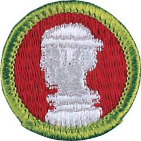

# Sculpture Merit Badge

## Overview

This merit badge introduces Scouts to sculpture, an art form that allows an artist to express what he sees and feels by using these three dimensions by shaping materials such as clay, stone, metal, and wood.

## Requirements

- (1) Explain to your counselor the precautions that must be followed for the safe use and operation of a sculptor's tools, equipment, and other materials.

  **Resources:** [Working Safely With Clay & DIY Modeling Tools (video)](https://youtu.be/-fX0YeZnEME?si=suWmdxmEVZaWz3L2), [The Essential Rules of Clay Safety: What You Need to Know (website)](https://artabys.com/the-essential-rules-of-clay-safety-what-you-need-to-know/)

- (2) Do TWO of the following:
  - (a) Model in clay a life-size human head. Then sculpt in modeling clay, carve in wood or plaster, or use 3D modeling software to make a small-scale model of an animal or person. Explain to your counselor the method and tools you used to sculpt the figure.

    **Resources:** [Sculpting a Head in Clay (video)](https://youtu.be/6dnyYu4Ff7U?si=j9qg_lNcXGVH7HnQ), [Portrait Sculpting in Clay (video)](https://youtu.be/G-Drvb5WTM0?si=PbFCpiwrwnoTyGOl), [Clay Sculpting Tools (video)](https://youtu.be/IyBRSsVQOTY?si=w4VRR1chFY0pE7ns)
  - (b) Make a plaster mold of a fruit or vegetable. In this mold, make a copy of the fruit or vegetable. Explain to your counselor the method and tools you used to make the copy.

    **Resources:** [Fruit and Vegetable Art - Silicone Moulds and Plaster Casts (website)](https://www.instructables.com/Fruit-and-Vegetable-Art-Silicone-Moulds-and-Plaste/), [Plaster Fruit Cast (video)](https://youtu.be/FN7WLH5tNaY?si=mxbwZBRnf3lv6s6f)
  - (c) With your parent or guardian's permission and your counselor's approval, visit a museum, art exhibit, art gallery, artists' co-op, or artist's studio. After your visit, share with your counselor what you have learned. Discuss the importance of visual arts and how it strengthens social tolerance and helps stimulate cultural, intellectual, and personal development.

    **Resources:** [How to Visit an Art Museum (video)](https://youtu.be/drrBd1bCiW0?si=K3DwDeSzVPwmYDyy)

- (3) Do ONE of the following:
  - (a) Explore careers related to this merit badge. Research one career to learn about the training and education needed, costs, job prospects, salary, job duties, and career advancement. Your research methods may include—with your parent or guardian's permission—an internet or library search, an interview with a professional in the field, or a visit to a location where people in this career work. Discuss with your counselor both your findings and what about this profession might make it an interesting career.

    **Resources:** [12 Careers for Sculptors (website)](https://www.indeed.com/career-advice/finding-a-job/careers-for-sculptors), [How To Become an Artist/Sculptor (video)](https://youtu.be/N6HeVopwRmQ?si=YJyPrJ4CvPLj9cx0), [Craft Artist Careers (video)](https://youtu.be/T_X9ZdUq-2Q?si=p0lV3ApJiQH0OqXe)
  - (b) Explore how you could use knowledge and skills from this merit badge to pursue a hobby. Research any training needed, expenses, and organizations that promote or support it. Discuss with your counselor what short-term and long-term goals you might have if you pursued this.

    **Resources:** [Exploring the Benefits of Sculpting as a Hobby (website)](https://metamuu.com/archives/21536)

## Resources

- [Sculpture merit badge page](https://www.scouting.org/merit-badges/sculpture/)
- [Sculpture merit badge PDF](https://filestore.scouting.org/filestore/Merit_Badge_ReqandRes/Pamphlets/Sculpture.pdf) ([local copy](files/sculpture-merit-badge.pdf))
- [Sculpture merit badge pamphlet](https://www.scoutshop.org/sculpture-merit-badge-pamphlet-650742.html)
- [Sculpture merit badge workbook PDF](http://usscouts.org/mb/worksheets/Sculpture.pdf)
- [Sculpture merit badge workbook DOCX](http://usscouts.org/mb/worksheets/Sculpture.docx)

Note: This is an unofficial archive of Scouts BSA Merit Badges that was automatically extracted from the Scouting America website and may contain errors.