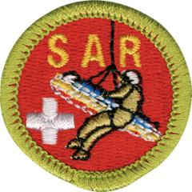

# Search and Rescue Merit Badge

## Overview

A search is an emergency situation requiring a team of trained searchers to locate a missing person. A rescue is an emergency situation where a person’s location is known – perhaps having just been found by searchers – and he or she must be removed from danger and returned to safety. By working on the Search and Rescue merit badge, you will learn and practice many skills that may someday save a life.

## Requirements

* A Note About Unauthorized and Restricted Activities   The Scouting America's Guide to Safe Scouting states under "Unauthorized and Restricted Activities" that flying in aircraft as part of a search and rescue mission is an unauthorized activity for youth members. For complete information, see [Scouting America's Scouting Safely](https://www.scouting.org/health-and-safety/) web page.
* NOTE:  The official merit badge pamphlets are now free and downloadable  [HERE](https://filestore.scouting.org/filestore/Merit_Badge_ReqandRes/Pamphlets/Search%20and%20Rescue.pdf) or can be purchased at the [Scout Shop.](https://www.scoutshop.org/)
* (1) Do the following:
    * (a) Explain to your counselor the hazards you are most likely to encounter while participating in search and rescue (SAR) activities, and what you should do to anticipate, help prevent, mitigate, and respond to these hazards.
    * (b) Discuss first aid and prevention for the types of injuries or illnesses that could occur while participating in SAR activities, including: snakebites, dehydration, shock, environmental emergencies such as hypothermia or heatstroke, blisters, and ankle and knee sprains.

* (2) Demonstrate knowledge to stay found and prevent yourself from becoming the subject of a SAR mission.
    * (a) How does the buddy system help in staying found and safe?
    * (b) How can knowledge of the area and its seasonal weather changes affect your plans?
    * (c) Explain how the Ten Essentials are similar to a "ready pack."

* (3) Discuss the following with your counselor:
    * (a) The difference between search and rescue
    * (b) The difference between PLS (place last seen) and LKP (last known point)
    * (c) Explain the following terms:
        * (1) AFRCC (Air Force Rescue Coordination Center)
        * (2) IAP (Incident Action Plan)
        * (3) ICS (Incident Command System)
        * (4) Evaluating search urgency
        * (5) Establishing confinement
        * (6) Scent item
        * (7) Area air scent dog
        * (8) Briefing and debriefing.

* (4) Find out who in your area has authority for search and rescue and what their responsibilities are. Discuss this with your counselor, and explain the official duties of a search and rescue team.
* (5) Working with your counselor, become familiar with the Incident Command System.  You may use any combination of resource materials, such as printed or online.  Discuss with your counselor how features of the ICS compare with Scouting's patrol method.
* (6) Identify four types of search and rescue teams and discuss their use or role with your counselor. Then do the following:
    * (a) Interview a member of one of the teams you have identified above, and learn how this team contributes to a search and rescue operation. Discuss what you learned with your counselor.
    * (b) Describe the process and safety methods of working around at least two of the specialized SAR teams you identified above.
    * (c) Explain the differences between wilderness, urban, and water SARs.

* (7) Discuss the Universal Transverse Mercator (UTM) system, latitude, and longitude. Then do the following:
    * (a) Using a 1:24,000 scale USGS topographic map, show that you can identify a location of your choice using UTM coordinates.
    * (b) Using a 1:24,000 scale map, ask your counselor to give you a UTM coordinate on the map, then identify that location.
    * (c) Show that you can identify your current location using the UTM coordinates on a Global Positioning System (GPS) unit and verify it on a 1:24,000 scale map.
    * (d) Determine a hypothetical place last seen, and point out an area on your map that could be used for containment using natural or human-made boundaries.

* (8) Choose a hypothetical scenario, either one presented in the Search and Rescue merit badge pamphlet or one created by your counselor.  Then do the following:
    * (a) Complete an incident objectives form for this scenario.
    * (b) Complete an Incident Action Plan (IAP) to address this scenario.
    * (c) Discuss with your counselor the behavior of a lost person and how that would impact your incident action plan (for example, the differences between searching for a young child versus a teen).
    * (d) After completing 8(a)-8(c), discuss the hypothetical scenario with your counselor.

* (9) Discuss with your counselor the terms hasty team and hasty search. Then do the following:
    * (a) Plan and carry out a practice hasty search—either urban or wilderness—for your patrol or troop. Include the following elements in the search: clue awareness, evidence preservation, tracking the subject, and locating the subject using attraction or trail sweep.
    * (b) When it's over, hold a team debriefing to discuss the hasty search. Discuss problems encountered, successful and unsuccessful tactics, and ideas for improvement.

* (10) Find out about three career or volunteer opportunities in search and rescue. Pick one and find out the education, training, and experience required for this professional or volunteer position. Discuss this with your counselor, and explain why this position might interest you.

## Resources

- [Search and Rescue merit badge page](https://www.scouting.org/merit-badges/search-and-rescue/)
- [Search and Rescue merit badge PDF](https://filestore.scouting.org/filestore/Merit_Badge_ReqandRes/Pamphlets/Search%20and%20Rescue.pdf) ([local copy](files/search-and-rescue-merit-badge.pdf))
- [Search and Rescue merit badge pamphlet](https://www.scoutshop.org/search-rescue-merit-badge-pamphlet-660209.html)

Note: This is an unofficial archive of Scouts BSA Merit Badges that was automatically extracted from the Scouting America website and may contain errors.