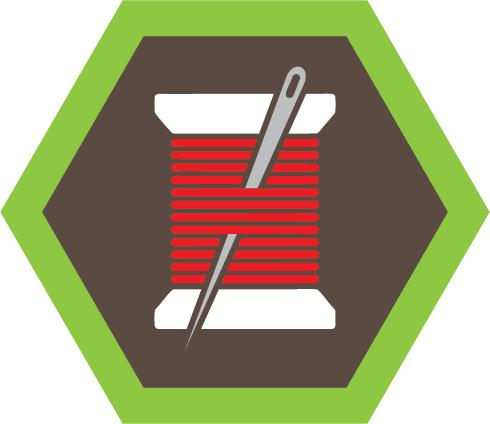

# Sewing & Needlework Merit Badge

## Overview

**Test Lab Merit Badge**, Verify current status at [Scouts BSA Test Lab](https://www.scouting.org/skills/merit-badges/test-lab/).

## Requirements

- (1) **Safety.** Explain to your counselor the potential hazards you may encounter when sewing and how to avoid them. When using a sewing machine or rotary cutter, always obtain your parent or guardian and counselor’s permission.

  **Resources:** [The Sewcial Experiment Video!: Hand Sewing Tools & Safety](https://youtu.be/_7ms3poMc98?si=aas-IiQkRqGh8PQF)

- (2) **Hand Sewing.** Do the following:
  - (a) Assemble a basic sewing and repair kit and explain the purpose of each item.
    **[Official BSA Sewing Kits – Artifact of the Week 20211008](https://www.youtube.com/watch?v=wKhZbj7Qrz0)** (b) Thread a needle and tie a quilter’s or tailor’s knot in a piece of fabric.
    **[HOW TO THREAD A NEEDLE FOR HAND SEWING A tutorial for modern and historic sewing](https://youtu.be/2cZ9MrpmLf4?si=_Z034M1PM6NaS3KC)** **[How to tie a Tailor’s Knot for hand sewing](https://youtu.be/uZfxHOa5-6Y?si=WhrcGeSRUurdrsiB)** (c) Demonstrate the following sewing techniques, including when and why each is used:
    (1) Running stitch (2) Back stitch (3) Hem stitch (4) Whip stitch. **[Learn to Hand Sew! Three Stitches You Can’t Sew Without](https://youtu.be/oE1LnH8egMk?si=QKcfKITVM4FUNTzj)** **[Hand Sewing Whipstitch (Stitch Lessons) | @laurenfairwx](https://youtu.be/3lTAiUY69K8?si=uHpMYfOkFtShV4l2)** (d) Sew a patch on your uniform or other fabric.
    **[How to Sew a Patch onto Anything](https://youtu.be/fWlDFDmzNp0)** (e) Sew a button onto an item.
    **[How to Sew on a Button to Any Garment](https://youtu.be/G52t0Aq6dJI?si=tyg2oZR0Ha8opEtl)** (f) Upcycle by practicing visible mending to patch a piece of clothing or material.
    **[Visible Mending: 10 Basic Principles to Get You Started Mending Your Clothes](https://youtu.be/IKlKEbkbX_M?si=rogpcMxw4hwsMuGc)** **[Nine Ways to Patch Holes in Clothes. Amazing Embroidery Stitches For Beginners /Guide to Sewing](https://youtu.be/1QnTMc4H8ig?si=1Pif8CWJo_FdIS1E)**

- (3) Choose ONE of the following options and complete each requirement:
  - A. **Machine Sewing**
    (a) Provide a brief overview of the evolution of the sewing machine **[The History of Sewing Machines Documentary](https://youtu.be/pyP8Q6Xv1ng?si=fmeGdHOZgilVvZ8X)** (b) Read your machine manual and do the following:
    (1) Explain the parts of a sewing machine and their functions. **[Understanding the Basic Parts of a Sewing Machine](https://www.youtube.com/watch?v=tzf4BZ7zNC0)** (2) Thread the machine and the bobbin. **[How to Thread a Sewing Machine for Absolute Beginners](https://youtu.be/fzlT-SOqxZY?si=gTe790PtBm6UYz4e)** (3) Explain how to properly clean and oil the machine and change the needle. **[How to Clean a Sewing Machine: A Step By Step Guide – Hailey Stitches](https://haileystitches.com/how-to-clean-a-sewing-machine-a-step-by-step-guide/)** (c) Identify other tools you will need for machine sewing. Demonstrate the following sewing techniques, including when and why each is used: ****[List of Basic Sewing Tools](https://youtu.be/WHlrqFQA_u4?si=ZTCAlUfoB5jh3U3g)****
    (1) Pinning **[How To Pin Your Fabric For Sewing](https://youtu.be/VFz20O_sTMw?si=LhEYE-xbrF5iyFWp)** (2) Sewing in a straight line **[How To: Sew in a Straight Line (Sewing for Beginners)](https://youtu.be/meVu_3Iv-3U?si=NKgMyCcjenfm1XIs)** (3) Back stitch **[How to Backstitch On A Sewing Machine](https://youtu.be/WmfbvS784CI)** (4) Basting stitch **[What Is a Baste Stitch and Why Should You Use It?](https://youtu.be/932s5gAhJHg)** (5) Gathering stitch **[How to Gather Fabric with a Sewing Machine: A Beginner Sewing Tutorial](https://youtu.be/a4s1pKb9wKE?si=zFcY3sDxQgow7l3G)** (6) Unpicking or seam ripping. **[HOW TO DO UNPICKING AND SEAM RIPPING? – Is there a difference? And what’s the red ball for anyway?](https://youtu.be/bwfHiDE6kss?si=n12K3AAl3_BoHnpe)** (d) Do the following using a sewing machine:
    (1) Sew a Scout patch on your uniform or other fabric. **[How to Sew a Patch on the Sleeve of Scrubs or Shirt](https://youtu.be/Rogxb__0GjI?si=Et7Dz-taE8MsuTtb)** (2) Repair a tear or small hole in fabric using a patch or darning technique. **[How to Repair Holes in Jeans and Other Fabrics](https://youtu.be/dXvFmoqfXEc?si=27pwLphw4aT9uq_4)** **[How to: Repairs Pants with Hand Stitch (Super Simple) | Tailor Series](https://youtu.be/0dMp1YXaSM8?si=CL9t87Lt688lnyA0)** (e) Sew ONE item from this list using a pattern, using THREE or more techniques from requirement 3(c):
    (1) Drawstring backpack **[Drawstring Backpack](https://youtu.be/sJmqKhv2nWs?si=1zkVkFf3u3akiMRy)** (2) Camp utensil holder **[How to Sew a Utensil Roll](https://youtu.be/GSYhN0nHmls)** (3) Storage bag for tent stakes or school supplies **[DIY drawstring pouches, easy sew.](https://youtu.be/jylJvQMKRLI?si=rSULAs0RsG_S8g7j)** (4) Pillowcase **[How to sew a pillowcase | Sewing Tutorial with Angela Wolf](https://youtu.be/yMoJWSmZI-U?si=22E1fmewy7TUDBGb)** (5) An item of your own choosing, approved in advance by your counselor. B.**Knitting**
    (a) Provide a brief overview of the history of knitting. **[How Knitting Transformed The Ancient World](https://youtu.be/JOxF_7LplGE?si=7Iq1NQ65mZSPjuLM)** **[Spies, Socks, & Soldiers // The Fascinating History of Wartime Knitting](https://youtu.be/XCQVJfEdO6k?si=4KXrd9Xkl7-zrDS-)** (b) Explain the tools used when knitting. Demonstrate the ability to read a pattern, including deciphering symbols. **[Knitting Supplies for Beginners | Essential Tools You Actually Need to Start Knitting](https://youtu.be/rbEsyps7v6Q?si=zgVVGPRZfd0PiAWd)** **[How to Read a Knitting Pattern](https://www.craftyarncouncil.com/standards/how-to-read-knitting-pattern)** (c) Using knitting needles, demonstrate how to tie a slip knot, cast on and bind off. **[Knitting Help – Slow Motion Slip Knot](https://youtu.be/Mf6MxSDIfaA?si=eVzX8OduVD-MOOfs)** **[Knitting Help – Slow-Motion Cast-On](https://youtu.be/iHZy0-tXUtU?si=E13XEX8prDl0xbFQ)** **[Knitting Help – Slow Motion Bind-Off](https://youtu.be/VrcZDngom_E?si=IYjO1tKHn7BUDSav)** (d) Demonstrate the following stitches:
    (1) Knit stitch **[Knitting Help – Slow Motion Knit Stitch](https://youtu.be/OPDbHdhKvng?si=Yg6fXVaiLAoCZL6F)** (2) Purl stitch. **[Knitting Help – Slow Motion Purl Stitch](https://youtu.be/b3JpVdB6MAU?si=UmXkIyCicTQOLPUE)** (e) Knit a small item such as a dishcloth, scarf, or an item of your own choosing, approved in advance by your counselor, using ONE of the following stitch patterns with at least two colors of yarn:
    (1) Garter stitch **[Garter Stitch for Beginners (worked slowly)](https://youtu.be/UoDKx9g0EFw?si=-iIm-QT-So8gu3v7)** (2) Stockinette stitch **[Stockinette Stitch for Beginners – Learn to Knit](https://youtu.be/rlaC5C5nJR8?si=VVaXVAXWc5Ck9AAR)** (3) Ribbing. [**Learn the English Rib Stitch**](https://www.youtube.com/watch?v=u__L0q-Ap8U) **[Learn to Knit a Dishcloth](https://youtu.be/F6t1upQeNAE?si=-P-f2Yr6v4mXFGvU)** **[How to knit a scarf evenly: 5 tips | Knitting Tutorial with Stefanie Japel](https://youtu.be/6-5HHme5zFs?si=qWPR6AvTTXK9rP3m)** C.**Crochet**
    (a)Provide a brief overview of the history of crochet OR the history of Amigurumi. **[CROCHET’S SECRET HISTORY REVEALED: EPIC Full History from the ANCIENTS to TODAY’S TRENDS](https://youtu.be/dHgbptcqziM?si=fkpZYhlMPve_b-Cn)** **[Where Did Amigurumi Come From❓ A History of Crocheted & Knitted Toys 💓](https://youtu.be/okOZnJksA9Y?si=mHHY6vzZUDWSLlWG)** (b) Explain the tools used when crocheting. Demonstrate the ability to read a pattern, including deciphering symbols. **[Supplies Needed for Crochet – The Beginner’s Guide to Crochet – Lesson One](https://youtu.be/paRgZbyQ-co?si=c-fT21WCDz3mpt63)** **[https://www.craftyarncouncil.com/standards/how-to-read-crochet-pattern](https://www.craftyarncouncil.com/standards/how-to-read-crochet-pattern)** (c) Demonstrate how to tie a slip knot and how to hold a crochet hook and yarn to crochet. **[How to Hold a Crochet Hook and Yarn – The Beginner’s Guide to Crochet – Lesson Two](https://youtu.be/xKdp1ycZI5I?si=w1VOq5A82KeuX6nA)[Knitting Help – Slow Motion Slip Knot](https://youtu.be/Mf6MxSDIfaA?si=eVzX8OduVD-MOOfs)** (d) Demonstrate the following stitches in a small practice piece:
    (1) Single crochet **[Crochet for Knitters – Slow Motion Single Crochet](https://www.youtube.com/watch?v=PdpfodLDWbE)** (2) Double crochet **[Crochet for Knitters – Slow Motion Double Crochet](https://youtu.be/6gk79wDP50I?si=-kDZsWGUBlvttTNg)** (3) Half-double crochet. **[Crochet for Knitters – Slow Motion Half Double Crochet](https://youtu.be/Wf1t33SAWm4?si=H6iNYeZ52FCp0wZk)** (e) Crochet a small item such as a dishcloth, scrub, or an item of your own choosing, approved in advance by your counselor, using at least two colors of yarn. **[How to Change Yarn in the Middle of a Crochet Project | Crochet Tutorial](https://youtu.be/kObezncg4jY?si=WBdx_u1Jy92LiTCn)** **[30-minute Crochet Projects](https://easycrochet.com/30-minute-crochet-projects-for-beginners/)** **[Crocheted Dish Cloths (Free Pattern)](https://youtu.be/vdLd9SPpI6w)** D.**Hand Embroidery**
    (a) Provide a brief overview of the history of hand embroidery. **[HISTORY of EMBROIDERY – From King Tut to the 21st Century – Domestika](https://youtu.be/it89FMRuwS0?si=Xdkd4OEQeXaipTCd)** (b) Explain the tools used in hand embroidery. **[Embroidery for beginners – Basic tools](https://youtu.be/sX9-_kJ-qgM?si=WBNJR80K4oTVw9OG)** (c) Embroider a small sampler of your own design or from a purchased kit or embroider a temporary patch for your uniform. Include SIX of the following basic stitches: running stitch, back stitch, stem stitch, chain stitch, surface couching, blanket stitch, herringbone stitch, chevron stitch, feather stitch, weave stitch, seed stitch, French knots, fishbone stitch, satin stitch, cross stitch. **[Backside of 15 Basic Stitches](https://youtu.be/hoQMv_n7Jio?si=03jGeZpGFDzjk0KZ)** E.**Appliqué**
    (a) Provide a brief overview of the history of hand appliqué. **[A Brief History of Appliqué](https://theappliquesociety.org/A-Brief-History-of-Applique)** (b) In a small sample, demonstrate how to do appliqué by hand using the following methods: needle turn or freezer paper using an invisible (ladder) stitch or blanket stitch. **[Needle Turn Appliqué for Beginners](https://youtu.be/gAo4NG53rVs?si=u8Jkw4hfuLMm83Jn)** **[Freezer Paper Appliqué](https://youtu.be/TlBj8DAp-Jk?si=pk_9NlgOHIyfje3Z)** **[The Invisible Stitch for Appliqué](https://youtu.be/X2e2hP-Hdg8?si=MNTU9vH7JgHhmbKa)** **[How to do Blanket Stitch Around Appliqué Using a Sewing Machine](https://youtu.be/5z_UHuuJriw?si=Cl72_MsldAMwt807)** (c) In a small sample, demonstrate machine appliqué using a raw edge fusible technique and a blanket stitch. **[Tips and Tricks for Fusible Appliqué](https://youtu.be/gqsyj0nQZoA?si=No_RMgOh464r03Ug)** **[Sizzle Quilt: Machine appliqué with a Blanket Stitch](https://youtu.be/MOTs-73YZhs?si=5FaXKBexKgR_He4Q)** (d) Appliqué a design onto a T-shirt by hand or machine or reverse appliqué a shape by hand sewing. **[How to](https://youtu.be/jtNlfbrj1Ps?si=n47rP1GnkoO5BlmZ)[appliqué](https://youtu.be/PW4RKNpiv8U?si=GP1mLSVSdw5L1SMv)[with a sewing machine (sewing on knits)](https://youtu.be/jtNlfbrj1Ps?si=n47rP1GnkoO5BlmZ)** **[How to appliqué on a t-shirt](https://youtu.be/PW4RKNpiv8U?si=GP1mLSVSdw5L1SMv)** **[Appliqué- How to Do Reverse Appliqué](https://youtu.be/vYqDtaHsAK4?si=fkna2G_oeM7XC_UF)** F.**Quilting**
    (a) Research historical quilts and show your counselor examples of types of quilts that interest you. Discuss how they were made. **[The History of Quilting](https://www.youtube.com/watch?v=SGgFsNuvk3E)** **[What is Quilting and Patchwork?](https://createwhimsy.com/projects/what-is-quilting-and-patchwork/)** (b) Explain the tools used when quilting and how to use them safely. Discuss why accuracy is important in traditional quilting. Sew an accurate ¼” seam. **[Essential tools for a beginner quilter](https://youtu.be/yQw4SyiWjQI?si=GQ5u9yXyi_ku4bqi)** **[How to Check your 1/4 Inch seam for Accurate Quilting with On Williams Street](https://youtu.be/GOO2-0lD4pw?si=xVrWfpVEzwHPsGwz)** (c) Using scraps of cotton quilting fabric, sort into light, medium and dark colors. Choose a focus fabric and find a group of fabrics that would work well in a scrap quilt. Demonstrate how the value and scale of a printed fabric can create interest. **[5 Tips for Using Color and Prints in your Quilting](https://youtu.be/LCC6aysaVXk?si=j2ZoPNxl0IO8FtWp)** **[Jen Kingwell ~ Choosing Colours](https://youtu.be/-wx85BU1hO0?si=0_4ZP68ZoBItiMDJ)** (d) Using three copies of a quilting design, color blocks to achieve different quilt designs. Show your counselor your designs and which one is your favorite. **[Quilt Patterns Coloring (PDF)](https://blog.missouriquiltco.com/wp-content/uploads/2020/04/QuiltPatternsColoring.pdf)** (e) Make a small quilt (12” square plus borders):
    (1) Using a rotary cutter, cut fabric into strips and pieces to make a four patch, rail fence block pattern, or design of your choice. Sew together on a machine or by hand using a ¼” seam allowance and press flat. Cut and add borders. **[Quilting for Beginners: Essential Techniques | Quilting Tutorial](https://youtu.be/8fHfmqEI31g?si=ekDqnjyvzCe9gTnV)** **[How to Design a Quilt: No Pattern Needed! | Quilting Tutorial](https://youtu.be/5yL3VeiTQcs?si=2z-DGOLpojI3hT7H)** (2) Make a sandwich with backing and batting. Baste. **[Beginner Quilt Series – How to Layer a Quilt Sandwich and Pin Baste a Quilt](https://youtu.be/hG50jcN2xSE)** (3) Hand quilt with a running stitch or big stitch. **[Hand quilting techniques for beginners (on perle cotton) | Sarah Fielke Craftsy Quilting Tutorial](https://youtu.be/8DXN5Ger_jo?si=XZJ7lFt1h6wH1Z7Y)** **[How to Do Big Stitch Hand Quilting](https://youtu.be/SfoIOv8avMU?si=HyoELuq8g_yeuB1e)** (4) Label your quilt. Explain why this is important. **[The Final Stitch Episode 6: Labeling Your Quilt](https://youtu.be/jYajgujAb0M)** (5) Bind to finish the edge of the quilt. **[The Ultimate Quilt Binding Tutorial with Jenny Doan of Missouri Star (Instructional Video)](https://youtu.be/0vCWpxBRs20?si=EWJtIiYiFuGfVyeS)**

- (4) **Art**. Visit a quilt or textile arts show or museum display either in-person or virtually. Explain to your counselor how they were created.

  **Resources:** [Complete List of Quilt Museums around the World](https://ronatheribbiter.com/quilt-museums-around-the-world/), [https://www.quiltinghub.com/Museums](https://www.quiltinghub.com/Museums)

- (5) **Service.** Discuss with your counselor how sewing and needlework skills might be of service to others. How can they benefit your family, community, church, or school.

  **Resources:** [How to Sew for Charity](https://sewingtrip.com/how-to-sew-for-charity/), [Quilts of Valor®](https://www.qovf.org/), [Project Linus](https://www.projectlinus.org/), [Case for Smiles](https://caseforsmiles.org/get-involved/#sew)

- (6) **Careers**. Do ONE of the following:
  - (a) Identify three career opportunities that would use skills and knowledge in sewing and/or needlework. Pick one and research the training, education, certification requirements, experience, and expenses associated with entering the field. Research the prospects for employment, starting salary, advancement opportunities and career goals associated with this career. Discuss what you learned with your counselor and whether you might be interested in this career. **[Jobs For Sewing](https://interviewguy.com/jobs-for-sewing/)** **[Career – Needleworker](https://theartcareerproject.com/careers/needlework/)** (b) Identify how you might use the skills and knowledge in sewing and/or needlework to pursue a personal hobby. Research the additional training required, expenses, and affiliation with organizations that would help you maximize the enjoyment and benefit you might gain from it. Discuss what you learned with your counselor and share what short-term and long-term goals you might have if you pursued this. **[14 THINGS YOU NEED TO KNOW ABOUT SEWING BEFORE YOU START! – What this sewing hobby REALLY is??](https://youtu.be/jdTdBiDzqtc?si=QIk96DZzW02p61lY)** **[What is Slow Stitching? Mindful Stitch Project Ideas](https://createwhimsy.com/projects/what-is-slow-stitching-mindful-stitch-project-ideas/)**

- (7) **Complete the survey below to complete the test lab requirements**

## Resources

- [Sewing & Needlework merit badge page](https://www.scouting.org/skills/merit-badges/test-lab/sewing-needlework/)

Note: This is an unofficial archive of Scouts BSA Merit Badges that was automatically extracted from the Scouting America website and may contain errors.