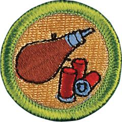

# Shotgun Shooting Merit Badge

## Overview

Learning to shoot is like mastering any other skill — it takes study and practice. The Shotgun Shooting merit badge is an introduction to safely using basic skills to hit the target. Once you have mastered the fundamentals, you can begin to apply them to a variety of shotgun activities.

## Requirements

* (1) Do the following:
    * (a) Explain what a projectile is, and why any device that shoots a projectile at high speed must be handled with care and respect, and used only in approved locations.
    * (b) Explain the basic rules of safe gun handling that apply to all firearms.
    * (c) Describe how you would react if a friend visiting your home asked to see your or your family's firearm.
    * (d) Explain the need for, types, and use of eye protection and hearing protection.
    * (e) Explain the main points of the laws for owning and using guns in your community and state.
    * (f) Explain how hunting is related to the wise use of renewable wildlife resources.
    * (g) Successfully complete a state hunter education course, or obtain a copy of the hunting laws for your state, then do the following:
        * (1) Explain the main points of hunting laws in your state, and any special laws on the use of guns and ammunition, AND
        * (2) List the kinds of wildlife that can be legally hunted in your state.

    * (h) Explain to your counselor the proper hygienic guidelines followed while shooting.
    * (i) List and explain three shotgun sports. Identify places in your community where you could practice these sports, and explain how you can join or be a part of range and target activities.
    * (j) Discuss with your counselor a list of sources you could contact for information on firearms and their use.

* (2) Working under the supervision of a certified National Rifle Association (NRA) Shotgun instructor and a certified range safety officer, at a nationally authorized camp property or at a commercial firearm range (as defined in the Scouting America National Range and Target Activities Manual), do ONE of the following options:
    * Option A—Shotgun Shooting (Modern Shotshell Type).  Do the following:
        * (a) Identify and explain the principal parts of a shotgun, action types, and how they function.
        * (b) Identify and demonstrate the rules for safely storing and handling a shotgun.
        * (c) Identify the parts of a shotgun shell and their functions.
        * (d) Identify the various gauges of shotguns. Explain which you would choose for a particular use and why.
        * (e) Identify the causes of a shotgun's failure to fire, and explain what a misfire, hangfire, and squib fire are. Explain and demonstrate proper preventive measures, and the procedures to follow in response to each.
        * (f) Demonstrate the knowledge, skills, and attitude necessary to safely shoot a shotgun on a range, including understanding and following range procedures and commands.
        * (g) Explain the basic safety rules for cleaning a shotgun, and identify the materials needed.
        * (h) Demonstrate how to clean a shotgun properly and safely.
        * (i) Discuss what points you would consider in selecting a shotgun.
        * (j) Shoot a moving target while following the rules and achieving the required score listed in (k) with a shotgun using the four fundamentals of firing a shot—position, mount, vision, and movement.
        * (k) Shooting score required: Hit at least 12 out of 25 targets (48 percent) in two 25-target groups. The two groups need not be shot in consecutive order. A minimum of 50 shots must be fired. Shooting skill rules:
            * Targets may be thrown by a hand trap, manual mechanical trap, or on any trap or skeet field. If using a hand trap or manual mechanical trap, the trap operator should be at least 5 feet to the right and 3 feet to the rear of the shooter. If throwing left-handed with a hand trap, the trap operator should be at least 5 feet to the left and 3 feet to the rear of the shooter.
            * All targets should be thrown at a reasonable speed and in the same direction.
            * Targets should be generally thrown so as to climb in the air after leaving the trap.
            * Scores may be fired at any time, either in formal competition or in practice, but only under approved supervision and at an approved range as noted in the Scouting America National Range and Target Activities Manual.
            * Modern, age-appropriate, target shotgun models, 12-, 16- or 20-gauge, may be used.
            * Only commercially manufactured ammunition may be used. Reloads may not be used in Scouting America range and target activities.
            * Shooters must shoot in rounds of 25. Rounds need not be shot continuously or on the same day. The term "round" refers to a single series of 25 shots.
            * If using a trap field, shoot station 3 with traps set to throw straightaway targets.
            * If using a skeet field, shoot station 7 low house.

    * (B) Option B—Muzzleloading Shotgun Shooting. Do the following:
        * (a) Discuss with your counselor a brief history of the development of the muzzleloading shotgun.
        * (b) Identify principal parts of muzzleloading shotguns and discuss how they function.
        * (c) Identify and demonstrate the rules for safely storing and handling a muzzleloading shotgun.
        * (d) Identify the various grades of black powder and explain their proper and safe use.
        * (e) Discuss proper safety procedures pertaining to black powder storage.
        * (f) Discuss proper components of a load.
        * (g) Identify proper procedures and accessories used for safely loading a muzzleloading shotgun.
        * (h) Identify the causes of a muzzleloading shotgun's failure to fire, and explain what a misfire, hangfire, and squib fire are. Explain and demonstrate proper preventive measures, and the procedures to follow in response to each.
        * (i) Demonstrate the knowledge, skills, and attitude necessary to safely shoot a muzzleloading shotgun on a range, including understanding and following range procedures and commands.
        * (j) Explain the basic safety rules for cleaning a muzzleloading shotgun, and identify the materials needed.
        * (k) Demonstrate how to clean a muzzleloading shotgun properly and safely.
        * (l) Discuss what points you would consider in selecting a muzzleloading shotgun.
        * (m) Shoot a moving target while following the rules and achieving the required score listed in (n) with a muzzleloading shotgun using the four fundamentals of firing a shot—position, mount, vision, and movement.
        * (n) Shooting score required: Hit at least 5 out of 15 targets in each of two 15-target groups. The two groups need not be shot in consecutive order. A minimum of 30 shots must be fired. Shooting skill rules:
            * Targets may be thrown by a hand trap, manual mechanical trap, or on any trap or skeet field. If using a hand trap or manual mechanical trap, the trap operator should be at least 5 feet to the right and 3 feet to the rear of the shooter. If throwing left-handed with a hand trap, the trap operator should be at least 5 feet to the left and 3 feet to the rear of the shooter.
            * All targets should be thrown at a reasonable speed and in the same direction.
            * Targets should be generally thrown so as to climb in the air after leaving the trap.
            * Scores may be fired at any time, either in formal competition or in practice, but only under approved supervision and at an approved range as noted in the Scouting America National Range and Target Activities Manual.
            * A 10 gauge or smaller muzzleloading rifle in appropriate size for the participant may be used. Matchlock, wheellock, or flintlock firearms are not approved.
            * Standard clay targets customarily used for trap and skeet are to be used.
            * On a standard trap field, the shooter should be positioned 8 yards behind the trap house.
            * The trap should be set to throw only straightaway targets.
            * If using a skeet field, shoot station 7 low house.

* (3) Identify how you could apply the skills and knowledge of safe and responsible use of firearms you learned in this merit badge to pursue a career or personal hobby.  Research the additional training and experience you would need, expenses you may incur, and the affiliation with organizations that could help you maximize the positive impact and enjoyment you gain from it.  Discuss what you learned with your counselor, and share what short-term and long-term goals you might have if you pursued this.

## Resources

- [Shotgun Shooting merit badge page](https://www.scouting.org/merit-badges/shotgun-shooting/)
- [Shotgun Shooting merit badge PDF](https://filestore.scouting.org/filestore/Merit_Badge_ReqandRes/Pamphlets/Shotgun%20Shooting.pdf) ([local copy](files/shotgun-shooting-merit-badge.pdf))
- [Shotgun Shooting merit badge pamphlet](https://www.scoutshop.org/shotgun-shooting-merit-badge-pamphlet-650743.html)

Note: This is an unofficial archive of Scouts BSA Merit Badges that was automatically extracted from the Scouting America website and may contain errors.