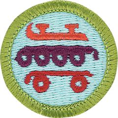

# Skating Merit Badge

## Overview

This merit badge introduces Scouts to the exciting world of ice skating, roller skating, in-line skating, and skateboarding. In addition to being an enjoyable leisure activity that promotes fitness, there are a variety of athletic careers in skating.

## Requirements

* NOTE:  The official merit badge pamphlets are now free and downloadable  [HERE](https://filestore.scouting.org/filestore/Merit_Badge_ReqandRes/Pamphlets/Skating.pdf) or can be purchased at the [Scout Shop.](https://www.scoutshop.org/)
* (1) Do the following:
    * (a) Explain to your counselor the most likely hazards associated with skating and what you should do to anticipate, help prevent, mitigate, and respond to these hazards.
    * (b) Show that you know first aid for injuries or illnesses that could occur while skating, including hypothermia, frostbite, lacerations, abrasions, fractures, sprains and strains, concussions, blisters, heat-related reactions, and shock.

* (2) Working under the supervision of an experienced adult, do ONE of the following options.
    * Option A—Ice Skating
        * (a) Do the following:
            * (1) Give general safety and courtesy rules for ice skating. Discuss preparations that must be taken when skating outdoors on natural ice. Explain how to make an ice rescue.
            * (2) Discuss the parts and functions of the different types of ice skates.
            * (3) Describe the proper way to carry ice skates.
            * (4) Describe how to store ice skates for long periods of time, such as seasonal storage.

        * (b) Do the following:
            * (1) Skate forward at least 40 feet and come to a complete stop. Use either a two-foot snowplow stop or a one-foot snowplow stop.
            * (2) After skating forward, glide forward on two feet, then on one foot, first right and then left.
            * (3) Starting from a T position, stroke forward around the test area, avoiding the use of toe picks if wearing figure skates.

        * (c) Do the following:
            * (1) Glide backward on two feet for at least two times the skater's height.
            * (2) Skate backward for at least 20 feet on two skates.
            * (3) After gaining forward speed, glide forward on two feet, making a turn of 180 degrees around a cone, first to the right and then to the left.

        * (d) Do the following:
            * (1) Perform forward crossovers in a figure-eight pattern.
            * (2) Explain to your counselor the safety considerations for participating in an ice-skating race.
            * (3) Perform a hockey stop.

    * Option B—Roller Skating
        * (a) Do the following:
            * (1) Give general safety and etiquette rules for roller skating.
            * (2) Discuss the parts and functions of the roller skate.
            * (3) Describe five essential steps to good skate care.

        * (b) Do the following:
            * (1) Skate forward with smooth, linked strokes on two feet for at least 100 feet in both directions around the rink and demonstrate proper techniques for stopping.
            * (2) Skate forward and glide at least 15 feet on one skate, then on the other skate.

        * (c) Do the following:
            * (1) Perform the forward crossover.
            * (2) Skate backward for at least 40 feet on two skates, then for at least 15 feet on one skate.
            * (3) Skate forward in a slalom pattern for at least 40 feet on two skates, then for at least 20 feet on one skate.
            * (4) Skate backward in a slalom pattern for at least 15 feet on two skates.

        * (d) Do the following:
            * (1) Shuttle skate once around the rink, bending twice along the way without stopping.
            * (2) Perform a series of two consecutive spins on skates, OR hop, skip, and jump on skates for at least 10 feet.

        * (e) Do the following:
            * (1) Race on a speed track, demonstrating proper technique in starting, cornering, passing, and pacing.
            * (2) Perform the limbo under a pole placed at least chest-high, OR shoot-the-duck under a waist-high pole and rise while still on one foot.
            * (3) Perform the stepover.
            * (4) While skating, dribble a basketball the length of the floor, then return to your starting position, OR push a hockey ball with a stick around the entire rink in both directions.

    * Option C—In-Line Skating
        * (a) Do the following:
            * (1) Give general and in-line skating safety rules and etiquette.
            * (2) Describe the parts and functions of the in-line skate.
            * (3) Describe the required and recommended safety equipment.
            * (4) Describe four essential steps to good skate care.

        * (b) Do the following:
            * (1) Skate forward with smooth, linked strokes on two feet for at least 100 feet.
            * (2) Skate forward and glide at least 15 feet on one skate, then on the other skate.
            * (3) Stop on command on flat pavement using the heel brake.

        * (c) Do the following:
            * (1) Perform the forward crossover.
            * (2) Perform a series of forward, linked swizzles for at least 40 feet.
            * (3) Skate backward for at least 40 feet in a series of linked, backward swizzles.
            * (4) From a strong pace, perform a lunge turn around an object predetermined by your counselor.
            * (5) Perform a mohawk.

        * (d) Do the following:
            * (1) Perform a series of at least four one-footed downhill slaloms on pavement with a gentle slope.
            * (2) Describe how to pass a pedestrian or another skater from behind.
            * (3) Describe at least three ways to avoid an unforeseen obstacle while skating.
            * (4) Describe two ways to get on and off a curb, and demonstrate at least one of these methods.

    * Option D—Skateboarding
        * (a) Explain the following to your counselor:
            * (1) History and evolution of skateboarding
            * (2) Benefits of skateboarding (physical fitness, balance, coordination, perseverance, and creativity)
            * (3) Purpose of skateboarding safety and protective gear (helmets, knee pads, elbow pads, wrist guards).

        * (b) Explain the following to your counselor:
            * (1) Rules and regulations of skateparks
            * (2) Understanding skatepark zones (street, bowl, and ramp)
            * (3) Right-of-way and respect for others
            * (4) Communication signals and warnings.

        * (c) Do the following:
            * (1) Explain skateboard anatomy (deck, trucks, wheels, bearings)
            * (2) Build a board by assembling all pieces (deck, wheels, trucks, bearing, and grip tape) in the proper order
            * (3) Explain skateboard maintenance (cleaning, tightening bolts, and replacing parts)

        * (d) Demonstrate the following skateboarding skills:
            * (1) Stance and foot placement (regular and goofy)
            * (2) Pushing and balance
            * (3) Turning and carving
            * (4) Braking and stopping techniques
            * (5) Ollies (basic and variations).

        * (e) Demonstrate a total of three skateboarding tricks from the following types:
            * (1) Flatland tricks
            * (2) Flip and shove-it tricks
            * (3) Grind and slide tricks
            * (4) Air, grab, bowl and ramp tricks
            * (5) Footplant tricks
            * (6) Balance tricks.

## Resources

- [Skating merit badge page](https://www.scouting.org/merit-badges/skating/)
- [Skating merit badge PDF](https://filestore.scouting.org/filestore/Merit_Badge_ReqandRes/Pamphlets/Skating.pdf) ([local copy](files/skating-merit-badge.pdf))
- [Skating merit badge pamphlet](https://www.scoutshop.org/skating-merit-badge-pamphlet-650744.html)

Note: This is an unofficial archive of Scouts BSA Merit Badges that was automatically extracted from the Scouting America website and may contain errors.