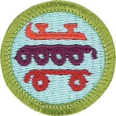

# Skating Merit Badge

## Overview

This merit badge introduces Scouts to the exciting world of ice skating, roller skating, in-line skating, and skateboarding. In addition to being an enjoyable leisure activity that promotes fitness, there are a variety of athletic careers in skating.

## Requirements

- (1) Do the following:
  - (a) Explain to your counselor the most likely hazards associated with skating and what you should do to anticipate, help prevent, mitigate, and respond to these hazards.

    **Resources:** [Skateboard Safety (website)](https://www.scouting.org/health-and-safety/safety-moments/skateboard-safety/)
  - (b) Show that you know first aid for injuries or illnesses that could occur while skating, including hypothermia, frostbite, lacerations, abrasions, fractures, sprains and strains, concussions, blisters, heat-related reactions, and shock.

    **Resources:** [Skating Injuries - Types and Prevention (website)](https://www.icliniq.com/articles/first-aid-and-emergencies/skating-injuries)

- (2) Working under the supervision of an experienced adult, do ONE of the following options.
  - **Option A—Ice Skating.** Do ALL of the following:

    **Resources:** [How to Play Figure Skating (video)](https://youtu.be/-53axkfHUHk), [How to Ice Skate (video)](https://youtu.be/8uDfC7sZ7ag)
  - (1) Explain the general safety and courtesy guidelines for ice skating.
  - (2) Discuss preparations that must be taken when skating outdoors on natural ice. Explain how to make an ice rescue.

    **Resources:** [How To Know if Ice Is Safe To Walk On (video)](https://youtu.be/KmYeulVH8IE), [Ice Safety (website)](https://dnr.wisconsin.gov/Education/OutdoorSkills/IceSafety), [Test Ice Thickness (video)](https://youtu.be/BWLvW-d5jBY), [How to Save Someone Who Falls Through Ice (video)](https://youtu.be/yVXJQq41tTA)
  - (3) Discuss the parts and functions of the different types of ice skates.

    **Resources:** [Figure Skates vs. Hockey Skates (video)](https://youtu.be/H6hUVU57Wpk)
  - (4) Describe the proper way to carry ice skates at the rink and for travel.
  - (5) Describe how to store ice skates for long periods of time, such as seasonal storage.

    **Resources:** [How Do I Store My Skates Correctly? (video)](https://youtu.be/xCibThdzynI), [Care for Your Ice Skates (website)](https://www.skatepro.ca/en/a65.htm)
  - (6) Skate forward at least 40 feet and come to a complete stop. Use either a two-foot snowplow stop or a one-foot snowplow stop.

    **Resources:** [Snowplow Stop (video)](https://youtu.be/rhQY1_bTjVs)
  - (7) After skating forward, glide forward on two feet, then on one foot, first right and then left.

    **Resources:** [Forward Stroking (video)](https://youtu.be/-7QqRz2EZAM)
  - (8) Starting from a T position, stroke forward around the test area, avoiding the use of toe picks if wearing figure skates.

    **Resources:** [Forward From a T Position (video)](https://youtu.be/-7QqRz2EZAM&t=516)
  - (9) Glide backward on two feet for at least two times the skater's height.

    **Resources:** [Skate Backward (video)](https://youtu.be/dZsfWfYxqzw)
  - (10) Skate backward for at least 20 feet on two skates.
  - (11) After gaining forward speed, glide forward on two feet, making a turn of 180 degrees around a cone, first to the right and then to the left.

    **Resources:** [Turns Around a Cone (video)](https://youtu.be/Lm1PXq9iFog)
  - (12) Perform forward crossovers in a figure-eight pattern.

    **Resources:** [How To Do Back Crossovers in a Figure 8 (video)](https://youtu.be/krBVgF52z8M)
  - (13) Explain to your counselor the safety considerations for participating in an ice-skating race.

    **Resources:** [How Speed Skaters Stay Safe on the Ice (website)](https://healthcare.utah.edu/healthfeed/2022/02/how-speed-skaters-stay-safe-ice), [Safety Tips: Ice Skating (website)](https://kidshealth.org/en/parents/safety-ice-skating.html)
  - (14) Perform a hockey stop.

    **Resources:** [Perform a Hockey Stop (video)](https://youtu.be/nIfU38nAYYk)
  - **Option B—Roller Skating.** Do ALL of the following:
  - (1) Explain the general safety rules and etiquette guidelines for roller skating.

    **Resources:** [Getting Started with Roller Skating (video)](https://youtu.be/eXzKkXQCY_Q)
  - (2) Discuss the parts and functions of a roller skate and their functions.
  - (3) Describe five essential steps to good roller skate care.
  - (4) Skate forward with smooth, linked strokes on two feet for at least 100 feet in both directions around the rink and demonstrate proper techniques for stopping.

    **Resources:** [Skating Forward (video)](https://youtu.be/znYKw5GQZVA)
  - (5) Skate forward and glide at least 15 feet on one skate, then on the other skate.
  - (6) Perform a forward crossover.

    **Resources:** [Skating Crossovers (video)](https://youtu.be/VrgT9TPLANY)
  - (7) Skate backward for at least 40 feet on two skates, then for at least 15 feet on one skate.

    **Resources:** [Roller Skating Backwards (video)](https://youtu.be/c7MLviMbw6A)
  - (8) Skate forward in a slalom pattern for at least 40 feet on two skates, then for at least 20 feet on one skate.
  - (9) Skate backward in a slalom pattern for at least 15 feet on two skates.
  - (10) Shuttle skate once around the rink, bending twice along the way, without stopping.
  - (11) Perform a series of two consecutive spins on skates, OR hop, skip, and jump on skates for at least 10 feet.

    **Resources:** [Roller Skating Two-Foot Spins (video)](https://youtu.be/d6Z91xZXNxE)
  - (12) Perform a stepover.
  - (13) While skating, dribble a basketball at least 40 feet, then back to your starting position, OR push a hockey ball with a stick at least 40 feet, then back to your starting position.
  - **Option C—In-Line Skating.** Do ALL of the following:
  - (1) Explain the general safety rules and courtesy guidelines for in-line skating.
  - (2) Describe the parts of an in-line skate and their functions.

    **Resources:** [Types and Parts of Inline Skates (video)](https://youtu.be/dKYpuWcZ_Ak)
  - (3) Describe the required and recommended safety equipment for in-line skating.

    **Resources:** [Safety Gear for In-Line Skating (video)](https://youtu.be/z10SQgx_kRA), [Putting on Your Protective Gear (video)](https://youtu.be/GF4fs9-zMq8)
  - (4) Explain four essential steps to good in-line skate care.

    **Resources:** [Maintaining and Caring for Your In-Line Skates (video)](https://youtu.be/67xp-AyQb3g), [Cleaning Your In-Line Skates (video)](https://youtu.be/Jcery4HP7_s)
  - (5) Skate forward with smooth, linked strokes on two feet for at least 100 feet.

    **Resources:** [Skating Forward (video)](https://youtu.be/fg1eMFnl61U)
  - (6) Skate forward and glide at least 15 feet on one skate, then on the other skate.

    **Resources:** [Gliding on One Skate (video)](https://youtu.be/iwtS9vr4r-Y)
  - (7) Stop on command on flat pavement using the heel brake.

    **Resources:** [Braking with In-Line Skates (video)](https://youtu.be/phN9uBIXkAw)
  - (8) Perform a forward crossover.

    **Resources:** [How to Turn on In-Line Skates (video)](https://youtu.be/RMIRnNr-PeQ), [5 Steps to the Perfect Crossover (video)](https://youtu.be/2-ULGoMvk24)
  - (9) Perform a series of forward, linked swizzles for at least 40 feet.

    **Resources:** [Forward Swizzles (video)](https://youtu.be/TbNlbqClkGQ)
  - (10) Skate backward for at least 40 feet in a series of linked, backward swizzles.

    **Resources:** [Backward Swizzles (video)](https://youtu.be/t3dO_3vh0Ig)
  - (11) From a strong pace, perform a lunge turn around an object predetermined by your counselor.

    **Resources:** [Maneuvering Around Objects (video)](https://youtu.be/__N7lV59GMI)
  - (12) Perform a mohawk.

    **Resources:** [Perform a Mohawk (video)](https://youtu.be/ytPUoplawVU)
  - (13) Perform a series of at least four one-footed downhill slaloms on pavement with a gentle slope.

    **Resources:** [One-Footed Slalom (video)](https://youtu.be/mzA573nx7W8)
  - (14) Describe how to pass a pedestrian or another skater from behind.
  - (15) Describe at least three ways to avoid an unforeseen obstacle while skating.

    **Resources:** [In-Line Skating Safety (video)](https://youtu.be/NP5w-A5aRSc)
  - (16) Describe two ways to get on and off a curb, and demonstrate at least one of these methods.

    **Resources:** [Maneuvering Curbs (video)](https://youtu.be/3hq3sID5emE)
  - **Option D—Skateboarding.** Do ALL of the following:

    **Resources:** [Jamboree - The Park (video)](https://youtu.be/2MEZdB-qooU)
  - (1) Explain the history and evolution of skateboarding.

    **Resources:** [How Has Skateboarding Changed Over the Years (video)](https://youtu.be/m4AQtoDBC00), [The Wild History of Skateboarding (video)](https://youtu.be/f9JWlMZa0GE), [The Evolution of Skateboard Tricks! (video)](https://youtu.be/w1mm3zDNyNI)
  - (2) Describe the benefits of skateboarding (physical fitness, balance, coordination, perseverance, and creativity)

    **Resources:** [Benefits of Skateboarding (video)](https://youtu.be/VAh62ff8rys), [Physics of Skateboarding (video)](https://youtu.be/6bu_9sI7QTI)
  - (3) Explain the safety rules and courtesy guidelines for skateboarding, including right-of-way and communication signals and warnings.

    **Resources:** [Skate Park Safety Rules (video)](https://youtu.be/Yw9bBDZ2kUo), [How to Ride Skateparks for Beginners (video)](https://youtu.be/zTVb4bmoiw0), [Skatepark Terrain (video)](https://youtu.be/qrq6KlaIe8Y?si=4ljJ-qZ2IAeG-tPe), [How to Ride Safely on a Skateboard (video)](https://player.vimeo.com/video/903371803)
  - (4) Explain the protective gear needed to skate safely, including helmet, knee pads, elbow pads, and wrist guards, and show how to wear them correctly.

    **Resources:** [Skateboarding Safety (website)](https://www.scouting.org/health-and-safety/safety-moments/skateboard-safety/)
  - (5) Describe the two main styles of skateboarding (street and vert), and describe common skatepark features (ramps, manual pad, rails, spine, etc.).
  - (6) Explain skateboard anatomy (deck, trucks, wheels, hardware, etc.).

    **Resources:** [How to Select a Skateboard (video)](https://player.vimeo.com/video/901305105)
  - (7) Build a board by assembling all pieces (deck, wheels, trucks, hardware, and grip tape) in the proper order.

    **Resources:** [How to Assemble a Skateboard (video)](https://youtu.be/A6E403WMOXk)
  - (8) Explain skateboard maintenance (cleaning, adjusting bolts, and replacing parts).

    **Resources:** [How to Maintain Your Skateboard (website)](https://www.skatexs.com/blogs/news/9432593-skateboard-maintenance-for-beginners)
  - (9) Explain the difference between regular and goofy stance, and demonstrate your preferred stance.

    **Resources:** [Goofy vs. Regular Stance (video)](https://youtu.be/fdSzhc7HXJ0)
  - (10) Demonstrate how to push, cruise, and carve on flat ground.

    **Resources:** [How to Push on a Skateboard (video)](https://player.vimeo.com/video/901305608), [How to Turn on a Skateboard (video)](https://player.vimeo.com/video/901305658)
  - (11) Show at least two braking and stopping techniques.

    **Resources:** [How to Stop a Skateboard (video)](https://youtu.be/gLikGjxWCUQ?si=-VfkhrC8oTh1LEvf)
  - (12) Do a basic ollie and at least one variation.

    **Resources:** [How to Ollie on Skateboard (video)](https://player.vimeo.com/video/901305845)
  - (13) Show how to drop-in from coping.
  - (14) Demonstrate THREE skateboarding tricks from the following types:
  - (a) Flat ground tricks

    **Resources:** [Flatland Tricks (video)](https://youtu.be/-LwtQJFqNOA), [How to Manual on Skateboard (video)](https://player.vimeo.com/video/901305720), [How to Throwdown on Skateboard (video)](https://player.vimeo.com/video/901305789), [How to 180 on a Skateboard (video)](https://player.vimeo.com/video/901305968)
  - (b) Flip and shove-it tricks

    **Resources:** [Flip a Skateboard (video)](https://youtu.be/MDkVYN6Rk_I), [Shove-It (video)](https://youtu.be/fBAW51ilpLw)
  - (c) Grind and slide tricks

    **Resources:** [Grind Tricks (video)](https://youtu.be/SKrntystOnE), [Doing a Slide (video)](https://youtu.be/IPDoNdZvGxk)
  - (d) Air and grab tricks

    **Resources:** [Frontside Air (video)](https://youtu.be/4tz-HFSoEZY), [Grab Tricks (video)](https://youtu.be/UEYsZH49H_o)
  - (e) Footplant tricks.

    **Resources:** [How to Boneless (video)](https://youtu.be/wUZpFX0CS1g)

## Resources

- [Skating merit badge page](https://www.scouting.org/merit-badges/skating/)
- [Skating merit badge PDF](https://filestore.scouting.org/filestore/Merit_Badge_ReqandRes/Pamphlets/Skating.pdf) ([local copy](files/skating-merit-badge.pdf))
- [Skating merit badge pamphlet](https://www.scoutshop.org/skating-merit-badge-pamphlet-650744.html)
- [Skating merit badge workbook PDF](http://usscouts.org/mb/worksheets/Skating.pdf)
- [Skating merit badge workbook DOCX](http://usscouts.org/mb/worksheets/Skating.docx)

Note: This is an unofficial archive of Scouts BSA Merit Badges that was automatically extracted from the Scouting America website and may contain errors.