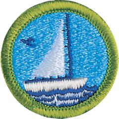

# Small-Boat Sailing Merit Badge

## Overview

Sailing is one of the most enjoyable pastimes on the open water. The quiet and peacefulness of the water can provide a pleasant break from everyday life. However, smooth sailing requires paying careful attention to safety.

## Requirements

* (1) Do the following:
    * (a) Explain to your counselor the most likely hazards you may encounter while participating in small-boat sailing activities, and what you should do to anticipate, help prevent, mitigate, and respond to these hazards.
    * (b) Review prevention, symptoms, and first-aid treatment for the following injuries or illnesses that can occur while sailing: blisters, cold-water shock and hypothermia, dehydration, heat-related illnesses, sunburn, sprains, and strains.
    * (c) Discuss the Scouting America Safety Afloat policy. Tell how it applies to small-boat sailing activities.

* (2) Before doing the following requirements, successfully complete the Scouting America swimmer test.
* (3) Describe the boat you will be using for the sailing requirement, naming all of the major parts and the function of those parts. Note: The skills may be demonstrated on any boat available to the Scout; sailboards are not acceptable. While no specific sail plan is recommended, it is suggested that the craft be smaller than 20 feet. The boat must be capsizable and have the capability of sailing to windward.
* (4) Before going afloat, do the following:
    * (a) Discuss the nine points of the Scouting America Safety Afloat plan.
    * (b) Explain the rules of the road in general and any specific rules or laws that apply to your area or state.
    * (c) Explain how water conditions, the hazards of weather, and heavy winds can affect both safety and performance in sailing.
    * (d) Discuss the warning signs of inclement weather and what to do should heavy winds develop or a storm approach.
    * (e) Prepare a typical float plan.
    * (f) Discuss the proper clothing, footwear, and personal gear required for small-boat sailing in warm weather and in cool weather. Explain how choosing the proper clothing, footwear, and personal gear will help keep you comfortable and safe while sailing.

* (5) Discuss with your counselor how to identify the wind direction and wind indicators. Explain the importance of this task before setting sail.
* (6) Following the Scouting America Safety Afloat plan, show that you and a buddy can sail a boat properly. Do the following:
    * (a) Prepare a boat for sailing, including a safety inspection.
    * (b) Get underway from a dock, mooring, or beach.
    * (c) Properly set sails for a round-trip course approved by your counselor that will include running, beating, and reaching-the basic points of sail. While sailing, demonstrate good helmsmanship skills.
    * (d) Change direction by tacking; change direction by jibing.
    * (e) Demonstrate getting out of irons.
    * (f) Demonstrate the safety position.
    * (g) Demonstrate capsize procedures and the rescue of a person overboard. Note: Capsize procedures should be conducted under the close supervision of the counselor. A rescue boat should be standing by to assist, if necessary, and to tow the capsized craft to shore. Self-bailing boats are acceptable for this requirement. Extreme care should be taken to avoid personal injury and damage to the boat or equipment.
    * (h) Demonstrate the procedure to take after running aground.
    * (i) Accept a single line or side tow and maneuver the craft being towed safely for 20 boat lengths.
    * (j) Upon returning to the dock, mooring, or beach, properly secure all equipment, furl or stow sails, and prepare the craft for unattended docking or beaching overnight or longer.

* (7) Demonstrate a working knowledge of marlinespike seamanship. Do the following:
    * (a) Show how to tie a square (reef) knot, clove hitch, two half hitches, bowline, cleat hitch, and figure-eight knot. Demonstrate the use of each.
    * (b) Show how to heave a line, coil a line, and fake down a line.
    * (c) Discuss the kinds of lines used on sailboats and the types of fibers used in their manufacture. Explain the advantages and disadvantages of each.

* (8) Describe how you would care for and maintain a sailboat and its gear throughout the year.
* (9) With your counselor, review sailing terminology and the points of sail. Discuss various types of sailboats in use today and explain their differences.

## Resources

- [Small-Boat Sailing merit badge page](https://www.scouting.org/merit-badges/small-boat-sailing/)
- [Small-Boat Sailing merit badge PDF](https://filestore.scouting.org/filestore/Merit_Badge_ReqandRes/Pamphlets/Small%20Boat%20Sailing.pdf) ([local copy](files/small-boat-sailing-merit-badge.pdf))
- [Small-Boat Sailing merit badge pamphlet](https://www.scoutshop.org/bsa-small-boat-sailing-merit-badge-pamphlet-661049.html)

Note: This is an unofficial archive of Scouts BSA Merit Badges that was automatically extracted from the Scouting America website and may contain errors.