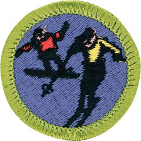

# Snow Sports Merit Badge

## Overview

Skiing and snowboarding are the fastest and most thrilling ways to travel on foot in snow country. These sports also provide the physical benefits of fresh air, rhythmic action, and strenuous exercise. Many games and contests give snow sports variety and added rewards.

## Requirements

- (1) Do the following:
  - (a) Explain to your counselor the hazards you are most likely to encounter while participating in snow sport activities, and what you should do to anticipate, help prevent, mitigate, and respond to these hazards.
  - (b) Discuss first aid and prevention for the types of injuries or illnesses that could occur while participating in snow sports, including hypothermia, frostbite, shock, dehydration, sunburn, concussion, fractures, bruises, sprains, and strains. Tell how to apply splints.

- (2) Do the following:
  - (a) Explain why every snow sport participant should be prepared to render first aid in the event of an accident.
  - (b) Explain the procedure used to report an accident to the local ski patrol or local emergency personnel.

- (3) Explain the international trail-marking system.

- (4) Discuss the importance of strength, endurance, and flexibility in snow sports. Demonstrate exercises and activities you can do to get fit for the option you choose in requirement 7.

- (5) Present yourself properly clothed and equipped for the option you choose in requirement 7. Discuss how the clothing you have chosen will help keep you warm and protected.

- (6) Do the following:
  - (a) Explain the elements of the *Your Responsibility Code* that is in effect at the location whehre you will ski, snowboard, or snowshoe. Explain why each person must follow this code.
  - (b) Explain the *SMART Style* safety program. Tell why it is important and how it applies to participants at snow sport venues like terrain parks and pipes.
  - (c) Explain the precautions pertaining to avalanche safety, including the responsibility of individuals regarding avalanche safety.

- (7) Do ONE of the following options:
  - **Option A—Downhill (Alpine) Skiing.** Do ALL of the following:

    **Note:** Generally, a gentle slope will be a trail designated by a green circle, a slightly steeper slope will be a green circle or blue square trail, and an intermediate slope will be a blue square trail. However, your counselor should determine what type of hill is most suited to your skill level and allows you to demonstrate each of the required skills.
  - (1) Show how to wax and maintain your skis and use/maintain your release bindings. Explain the international DIN standard and what it means to skiers.
  - (2) Explain the American Teaching System and a basic snowskiing progression.
  - (3) Discuss the different types of Alpine skis. Demonstrate two ways to carry skis and poles safely and easily.
  - (4) Demonstrate how to ride one kind of lift and explain how to ride two others.
  - (5) On a gentle slope, demonstrate some of the beginning maneuvers learned in skiing. Include the straight run, gliding wedge, wedge stop, sidestep, and herringbone maneuvers.
  - (6) On slightly steeper terrain,show linked wedge turns.
  - (7) On a moderate slope, demonstrate five to 10 christies.
  - (8) Make a controlled run down an intermediate slope.
  - (9) Demonstrate the ability to ski in varied conditions, including changes in pitch and snow conditions. Maintain your balance and ability to turn.
  - (10) Name the major ski organizations in the United States and explain their functions.
  - **Option B—Cross-Country (Nordic) Skiing.** DO ALL of the following:
  - (1) Show your ability to select, use, and maintain equipment for cross-country skiing in safety and comfort.
  - (2) Explain the reasons for common rules, including no walking on ski trails, one-way ski direction, no pets, and no skiing on snowmobile trails.
  - (3) Discuss classic, skating, touring, and telemark skis.
  - (4) Discuss the basic principles of waxing for cross-country ski touring.
  - (5) Discuss the differences between cross-country, backcountry/ski touring, ski mountaineering, and downhill/telemark skiing.
  - (6) List the items you would take on a one-day ski tour.
  - (7) Demonstrate the proper use of a topographic map and compass.
  - (8) On a gentle, packed slope, show some basic ways to control speed and direction. Include the straight run, traverse, side slip, step turn, wedge stop, and wedge turn maneuvers.
  - (9) On a cross-country trail, demonstrate effective propulsion by showing proper weight transfer form ski to ski, pole timing, rhythm, flow, and glide.
  - (10) Demonstrate your ability, on a 4-mile tour, to cope with an average variety of snow conditions.
    **Note:** Adaptive skiers may complete a 1-mile tour with prior approval from their counselor.
  - (11) Demonstrate several methods of dealing with steep hills or difficult conditions. Include traverses and kick turns going uphill and downhill, sidesteps, and pole drag.
  - **Option C—Snowboarding.** Do ALL of the following:

    **Note:** Generally, a gentle slope will be a trail designated by a green circle, a slightly steeper slope will be a green circle or blue square trail, and an intermediate slope will be a blue square trail. However, your counselor should determine what type of hill is most suited to your skill level and allows you to demonstrate the required skills.
  - (1) Discuss forward-fall injuries.
  - (2) Show your ability to select the correct equipment for snowboarding and to use it for safety and comfort.
  - (3) Show how to use and maintain your own bindings, and explain the use of the different binding methods. Explain the need for leashes.
  - (4) Discuss the four types of snowboards. Demonstrate how to carry a snowboard easily and safely.
  - (5) Demonstrate how to ride one kind of lift and explain how to ride two others.
  - (6) Demonstrate the basic principles of waxing a snowboard.
  - (7) Do the following:
  - (a) On a gentle slope, demonstrate beginning snowboarding maneuvers. Show basic ways to control speed and direction. Include the sideslipping maneuver.
  - (b) On slightly steeper terrain, show traversing.
  - (8) On a moderate slope, demonstrate an ollie, a nose-end grab, and a wheelie.
  - (9) Make a controlled run down an intermediate slope.
  - (10) Demonstrate your ability to ride in varied conditions, including changes in pitch, snow conditions, and moguls. Maintain your balance and ability to turn.
  - (11) Name the major snowboarding organizations in the United States and explain their functions.
  - **Option D—Snowshoeing.** Do ALL of the following:
  - (1) Name the parts of a snowshoe.
  - (2) Explain how to choose the correct size of snowshoe.
  - (3) Describe the different types of snowshoes and their specialized uses. Discuss factors to consider when choosing a snowshoe.
  - (4) Explain how to properly care for and maintain snowshoes.
  - (5) List the items you would take on a one-day snowshoe hike.
  - (6) Describe areas that are best for snowshoeing. Discuss some advantages and dangers of backcountry snowshoeing.
  - (7) Discuss the benefits of snowshoeing.
  - (8) Demonstrate the most efficient ways to break trail, climb uphill, travel downhill and traverse a slope.
  - (9) Demonstrate your ability, on a 2-mile snowshoe hike, to cope with an average variety of snow conditions.

    **Note:** Adaptive skiers may complete a 1-mile hike with prior approval from their counselor.
  - (10) Demonstrate the proper use of a topographic map and compass.

## Resources

- [Snow Sports merit badge page](https://www.scouting.org/merit-badges/snow-sports/)
- [Snow Sports merit badge PDF](https://filestore.scouting.org/filestore/Merit_Badge_ReqandRes/Pamphlets/Snow%20Sports.pdf) ([local copy](files/snow-sports-merit-badge.pdf))
- [Snow Sports merit badge pamphlet](https://www.scoutshop.org/mbp-snow-sports-656882.html)
- [Snow Sports merit badge workbook PDF](http://usscouts.org/mb/worksheets/Snow-Sports.pdf)
- [Snow Sports merit badge workbook DOCX](http://usscouts.org/mb/worksheets/Snow-Sports.docx)

Note: This is an unofficial archive of Scouts BSA Merit Badges that was automatically extracted from the Scouting America website and may contain errors.