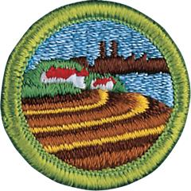

# Soil and Water Conservation Merit Badge

## Overview

Conservation isn’t just the responsibility of soil and plant scientists, hydrologists, wildlife managers, landowners, and the forest or mine owner alone. It is the duty of every person to learn more about the natural resources on which our lives depend so that we can help make sure that these resources are used intelligently and cared for properly.

## Requirements

- (1) Do the following:
  - (a) Tell what soil is. Tell how it is formed.

    **Resources:** [The Dirt on Soil (video)](https://www.pbs.org/video/soil-video-short-zfxcrn/), [Formation of Soil (video)](https://youtu.be/YZ_D1ANF-E0?si=6lNRN2ODpZ7pe872)
  - (b) Describe three kinds of soil. Tell how they are different.

    **Resources:** [Types of Soil (video)](https://youtu.be/G0JcVe_-yu0?si=WuJclD25JrEA4AMg)
  - (c) Name the three main plant nutrients in fertile soil. Tell how they can be put back when used up.

    **Resources:** [The Three Most Important Nutrients for Plant Growth (video)](https://youtu.be/zgppw6fJOlw)

- (2) Do the following:
  - (a) Define soil erosion.

    **Resources:** [Soil Basics: Erosion (video)](https://youtu.be/DRkw5kOZsc8?si=Gq7gY0l0JDMjxhFD)
  - (b) Tell why soil erosion is important and how it affects you.

    **Resources:** [Why Soil Conservation is Important to Human Agriculture? (video)](https://youtu.be/BuEdKEh2buI)
  - (c) Name three kinds of soil erosion. Describe each.
  - (d) Take pictures of or draw two kinds of soil erosion.

    **Resources:** [Soil Erosion: Causes, Impacts, and Sustainable Solutions (website)](https://ardasclasses.com/blog/soil-erosion-causes-impacts-and-sustainable-solutions/)

- (3) Do the following:

  **Resources:** [What is Soil conservation (video)](https://youtu.be/YGu_09HH-Xo)

  - (a) Tell what is meant by conservation practices.
  - (b) Describe the effect of three kinds of erosion-control practices.
  - (c) Take pictures of or draw three kinds of erosion-control practices.

    **Resources:** [Soil Erosion: Causes, Impacts and Sustainable Solutions (website)](https://ardasclasses.com/blog/soil-erosion-causes-impacts-and-sustainable-solutions/)

- (4) Do the following:
  - (a) Explain what a watershed is.

    **Resources:** [What is a Water Shed (video)](https://youtu.be/gVdq4pWUiQM), [Watersheds, Rivers and Floodplains (video)](https://youtu.be/ButQspZX2yA?si=TgRhRG8uoKpe4oS3), [How (and Why) to Find Your Watershed (video)](https://youtu.be/kqwYulqfC9k)
  - (b) Outline the smallest watershed that you can find on a contour map.
  - (c) Outline, as far as the map will allow, the next larger watershed that also has the smallest one in it.
  - (d) Explain what a river basin is. Tell why all people living in a river basin should be concerned about land and water use in the basin.

    **Resources:** [River Basins (video)](https://youtu.be/x7lBi6OaFMo?si=Z2hmQJEjQjmIlQvv)
  - (e) Explain what an aquifer is and why it can be important to communities.

    **Resources:** [What is an Aquifer (video)](https://youtu.be/g7R0yLX0V9E)

- (5) Do the following:
  - (a) Make a drawing to show the hydrologic cycle.

    **Resources:** [The Water (Hydrologic) Cycle (video)](https://youtu.be/FzYjPpxP-Cw)
  - (b) Demonstrate at least two of the following actions of water in relation to soil: percolation, capillary action, precipitation, evaporation, and transpiration.

    **Resources:** [Capillary Rise (video)](https://youtu.be/5waNTa2b-yg), [Soil Capillary Action Demonstration (video)](https://youtu.be/0Hcp2UGkbj4?si=7U9FAlP5XbSnUVha), [Soil Percolation Experiment (video)](https://youtu.be/CBmDlbFOZKU)
  - (c) Explain how removal of vegetation will affect the way water runs off a watershed.

    **Resources:** [How Vegetation Protects Soil (video)](https://youtu.be/wa9MTy_lSpY)
  - (d) Tell how uses of forest, range, and farmland affect usable water supply.

    **Resources:** [Rangeland Management and Water Supply (video)](https://youtu.be/PQf0gdomgGg?si=MNPoiCVV6Cc3QQlQ)
  - (e) Explain how industrial use affects water supply.

    **Resources:** [Reimagining Industrial Water for Sustainable Impact (video)](https://youtu.be/xeTGV3e1QB8?si=rxKeNygqQnzccQd2)

- (6) Do the following:

  **Resources:** [Water Pollution and How We Can Reduce It (video)](https://youtu.be/4Q8dL8RtQM0), [H2-Oh No! Water Pollution 101 (video)](https://www.youtube.com/shorts/mgtpMLsAds0)

  - (a) Tell what is meant by water pollution.
  - (b) Describe common sources of water pollution and explain the effects of each.
  - (c) Explain the terms: primary water treatment, secondary waste treatment, and biochemical oxygen demand.

    **Resources:** [How Does Wastewater Treatment Work? (video)](https://youtu.be/cUFKay8VPqo)
  - (d) Make a drawing showing the principles of complete waste treatment.

- (7) Do TWO of the following:
  - (a) Make a trip to TWO of the following places. Write a report of more than 500 words about the soil and water and energy conservation practices you saw.
  - (1) An agricultural experiment

    **Resources:** [Alabama's "Old Rotation" Experiment (website)](https://encyclopediaofalabama.org/article/alabamas-old-rotation-experiment/)
  - (2) A managed forest or woodlot, range, or pasture

    **Resources:** [Visit to Managed International Paper Forest (video)](https://youtu.be/1iTvc_8AFVc)
  - (3) A wildlife refuge or a fish or game management area

    **Resources:** [Visit to Tennessee National Wildlfe Refuge (video)](https://youtu.be/7CynjbXAT24?si=NAvtBGsad_beRE5i)
  - (4) A conservation-managed farm or ranch
  - (5) A managed watershed

    **Resources:** [Watershed Forestry (Massachusetts) (video)](https://youtu.be/wniaQsuelWs)
  - (6) A waste-treatment plant

    **Resources:** [How Chicago Cleans 1.4 Billion Gallons Of Wastewater Every Day (video)](https://youtu.be/P4l-4ehUqhc)
  - (7) A public drinking water treatment plant
  - (8) An industry water use installation

    **Resources:** [Water Use in the Paper Industry (video)](https://youtu.be/qaeXBpag72Q), [How Data Centers Optimize Energy and Water for Cooling Solutions (video)](https://youtu.be/ufJcrXrVaBI)
  - (9) A desalinization plant

    **Resources:** [Carlsbad Desalinization Plant Tour (video)](https://youtu.be/e1pq3Ni7Fko)
  - (b) Plant 100 trees, bushes, and/or vines for a good purpose.
  - (c) Seed an area of at least one-fifth acre for some worthwhile conservation purposes, using suitable grasses or legumes alone or in a mixture.
  - (d) Study a soil survey report. Describe the things in it. Using tracing paper and a pen, trace over any of the soil maps, and outline an area with three or more different kinds of soil. List each kind of soil by full name and map symbol.

    **Resources:** [Web Soil Survey Tutorial (video)](https://youtu.be/lKFc_96UZ7Q)
  - (e) Make a list of places in your neighborhood, camps, school ground, or park that have erosion, sedimentation, or pollution problems. Describe how these could be corrected through individual or group action.
  - (f) Carry out any other soil and water conservation project approved by your counselor.

## Resources

- [Soil and Water Conservation merit badge page](https://www.scouting.org/merit-badges/soil-and-water-conservation/)
- [Soil and Water Conservation merit badge PDF](https://filestore.scouting.org/filestore/Merit_Badge_ReqandRes/Pamphlets/Soil%20and%20Water%20Conservation.pdf) ([local copy](files/soil-and-water-conservation-merit-badge.pdf))
- [Soil and Water Conservation merit badge pamphlet](https://www.scoutshop.org/soil-water-conservation-merit-badge-pamphlet-649768.html)
- [Soil and Water Conservation merit badge workbook PDF](http://usscouts.org/mb/worksheets/Soil-and-Water-Conservation.pdf)
- [Soil and Water Conservation merit badge workbook DOCX](http://usscouts.org/mb/worksheets/Soil-and-Water-Conservation.docx)

Note: This is an unofficial archive of Scouts BSA Merit Badges that was automatically extracted from the Scouting America website and may contain errors.