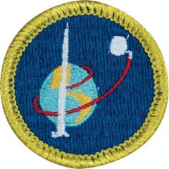

# Space Exploration Merit Badge

## Overview

Discover the why and how we explore space. Learn about current and historic space systems along with how they work. Design a future station to survive on other worlds. Gain hands-on experience in building and launching model rockets. Finish your studies learning about the careers that make space exploration possible.

## Requirements

* (1) Tell the purpose of space exploration and include the following:
    * (a) Historical reasons
    * (b) Immediate goals in terms of specific knowledge
    * (c) Benefits related to Earth resources, technology, and new products
    * (d) International relations and cooperation.

* (2) Design a collector's card, with a picture on the front and information on the back, about your favorite space pioneer. Share your card and discuss four other space pioneers with your counselor.
* (3) Build, launch, and recover a model rocket. Make a second launch to accomplish a specific objective. Identify and explain the following rocket parts: Safety Note: Rocket must be built to meet the safety code of the National Association of Rocketry. See the "Model Rocketry" chapter of the Space Exploration merit badge pamphlet.   Alternative requirement: If local laws prohibit launching model rockets, do the following activity: Make a model of a NASA rocket. Explain the functions of the parts. Give the history of the rocket.Identify and explain the following rocket parts:
    * (a) Body tube
    * (b) Engine mount
    * (c) Fins
    * (d) Igniter
    * (e) Launch lug
    * (f) Nose cone
    * (g) Payload
    * (h) Recovery system
    * (i) Rocket engine.

* (4) Discuss and demonstrate each of the following:
    * (a) The law of action-reaction
    * (b) How rocket engines work
    * (c) How satellites stay in orbit
    * (d) How satellite pictures of Earth and pictures of other planets are made and transmitted.

* (5) Do TWO of the following:
    * (a) Discuss with your counselor a robotic space exploration mission and a historic crewed mission. Tell about each mission's major discoveries, its importance, and what was learned from it about the planets, moons, or regions of space explored.
    * (b) Using articles from the internet, photographs and text, create a blog, website, or slide show about a current planetary mission or use magazine photographs, news clippings, and articles from the internet to make a scrapbook about a current planetary mission.
    * (c) Design a robotic mission to another planet, moon, comet, or asteroid that will return samples of its surface to Earth. Name the planet, moon, comet, or asteroid your spacecraft will visit. Show how your design will cope with the conditions of the environments of the planet, moon, comet, or asteroid.

* (6) Describe the purpose, operation, and components of ONE of the following:
    * (a) Space shuttle or any other crewed orbital vehicle, whether government-owned (U.S. or foreign) or commercial
    * (b) International Space Station.

* (7) Design an inhabited base located within our solar system, such as Titan, asteroids, or other locations that humans might want to explore in person. Make drawings or a model of your base. In your design, consider and plan for the following:
    * (a) Source of energy
    * (b) How it will be constructed
    * (c) Life-support system
    * (d) Purpose and function.

* (8) Discuss with your counselor two possible careers in space exploration that interest you. Find out the qualifications, education, and preparation required and discuss the major responsibilities of those positions.

## Resources

- [Space Exploration merit badge page](https://www.scouting.org/merit-badges/space-exploration/)
- [Space Exploration merit badge PDF](https://filestore.scouting.org/filestore/Merit_Badge_ReqandRes/Pamphlets/Space%20Exploration.pdf) ([local copy](files/space-exploration-merit-badge.pdf))
- [Space Exploration merit badge pamphlet](https://www.scoutshop.org/space-exploration-merit-badge-pamphlet-654567.html)

Note: This is an unofficial archive of Scouts BSA Merit Badges that was automatically extracted from the Scouting America website and may contain errors.