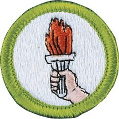

# Sports Merit Badge

## Overview

Millions of people participate in sports every year. For some the appeal is the close friendships that come with being part of a team. Some revel in the joy of victory and lessons of defeat. For some, the personal fitness is so important that exercise becomes a daily need. And still others desire the feeling of achievement, that feeling of measurable improvement that comes with dedication to a sport.

## Requirements

* Note: The activities used to fulfill the requirements for the Sports  merit badge may not be used to help fulfill requirements for other  merit badges.
* (1) Do the following:
    * (a) Explain to your counselor the most likely risks you may encounter while participating in sports and what you should do to anticipate, help prevent, mitigate, and respond to these risks.
    * (b) Show that you know first aid or understand the treatment for injuries that could occur while participating in sports, including sprains; strains; muscle cramps; contusions; abrasions; blisters; dehydration; heat reactions; fractures; injured teeth; head, neck, and back injuries; and concussions.

* (2) Explain the following:
    * (a) The importance of the physical exam
    * (b) The importance of maintaining good health habits for life (such as exercising regularly), and how the use of tobacco products, alcohol, and other harmful substances can negatively affect your health and your performance in sports activities
    * (c) The importance of maintaining a healthy diet.

* (3) Discuss the following:
    * (a) The importance of warming up and cooling down
    * (b) The importance of weight training
    * (c) What an amateur athlete is and the differences between an amateur and a professional athlete
    * (d) The attributes (qualities) of a good sport, the importance of sportsmanship, and the traits of a good team leader and player who exhibits Scout spirit on and off the playing field.

* (4) Select TWO of the following sports and discuss with your counselor how you will complete the requirements in 5(a) through 5(h) for each sport: badminton, baseball, basketball, bowling, cross-country, diving, field hockey, flag football, flag team, golf, gymnastics, ice hockey, lacrosse, soccer, softball, spirit/cheerleading, swimming, tackle football, table tennis, tennis, track and field, volleyball, water polo, and/or wrestling. Your counselor may approve in advance other recognized sports, but not any sport that is prohibited by Scouting America.  The sports you choose must include regular practice sessions and at least four structured, officiated, scored games, meets, or contests against other competitive individuals or organized teams during the period of participation.
* (5) Do the following:
    * (a) With guidance from your counselor, establish a suitable personal training program that you will follow throughout your competition season (or for three months).
    * (b) Create a chart or other tracking system, and document your training, practice, and development during this time.
    * (c) Demonstrate proper technique to play each sport effectively and avoid injury.
    * (d) List and describe the equipment needed for each sport, including protective equipment and any specialized clothing.
    * (e) List and explain the rules and proper etiquette of each sport.
    * (f) Draw and explain a diagram of the playing area for each sport.
    * (g) Participate in each sport as a competitive individual or as a member of an organized team for one season (or for three months).
    * (h) At the end of the season, share your completed chart with your counselor and discuss how your participation in the sports you chose has affected you mentally and physically.

* (6) Do ONE of the following:
    * (a) Identify three career opportunities that would use skills and knowledge related to a sport. Pick one and research the training, education, certification requirements, experience, and expenses associated with entering the field. Research the prospects for employment, starting salary, advancement opportunities and career goals associated with this career. Discuss what you learned with your counselor and whether you might be interested in this career.
    * (b) Identify how you might use skills and knowledge related to a sport to pursue a personal hobby and/or healthy lifestyle. Research the additional training required, expenses, and affiliation with organizations that would help you maximize the enjoyment and benefit you might gain from it. Discuss what you learned with your counselor and share what short-term and long-term goals you might have if you pursued this.

## Resources

- [Sports merit badge page](https://www.scouting.org/merit-badges/sports/)
- [Sports merit badge PDF](https://filestore.scouting.org/filestore/Merit_Badge_ReqandRes/Pamphlets/Sports_2023.pdf) ([local copy](files/sports-merit-badge.pdf))
- [Sports merit badge pamphlet](https://www.scoutshop.org/bsa-sports-merit-badge-pamphlet-boy-scouts-of-america-659869.html)

Note: This is an unofficial archive of Scouts BSA Merit Badges that was automatically extracted from the Scouting America website and may contain errors.