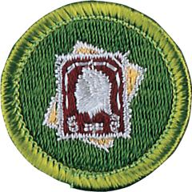

# Stamp Collecting Merit Badge

## Overview

The world’s most popular hobby, stamp collecting is enjoyed by millions throughout the world. Through this hobby. you can experience history: postage stamps are like tiny windows that introduce the people of the world to the country’s leaders, customs, history, products, and environment.

## Requirements

* (1) Do the following: Resource:  [Stamp Collecting (video)](https://youtu.be/Bu6vw5qlO3M?si=2ly00w2ou8AHx4LO)
    * (a) Discuss how you can better understand people, places, institutions, history, and geography as a result of collecting stamps. Resources: [Stamp Collecting Is for Old People (Just Kidding) (video)](https://youtu.be/mp07V-_-lc0?si=qw61WgakvzvCy7sz) [Stamps: A World of Fun (video)](https://youtu.be/FRMsUTbLK4U?si=vFyVadEM1Zd9Ww75)
    * (b) Briefly describe some aspects of the history, growth, and development of the United States postal system. Tell how it is different from postal systems in other countries. Resources: [A Chaotic History of the US Postal Service | Illustrated U.S. History (video)](https://youtu.be/aZ9j5t25CaU?si=b2xn0FgNumDoiiNU) [History of US Mail - From the Beginning (video)](https://youtu.be/U8ioOqupzmo?si=UlX_1ztm7NDn3yyL)

* (2) Define topical stamp collecting.  Name and describe three other types of stamp collections. Resources:  [What to Collect? (website)](https://stamps.org/learn/getting-started/what-to-collect)  [Topical Stamp Collecting (website)](https://www.linns.com/content/collector-resources/collecting-basics/topical-stamp-collecting )
* (3) Show at least ONE example of each of the following: Resource:  [Beginner's Guide to Stamp Collecting - Key Terms (video)](https://youtu.be/Z4iqhT2yfN8?si=FuJGCx8crtaeEDeW)
    * (a) Perforated and imperforate stamps Resources: [American Perforate and Imperforate Stamps (video)](https://youtu.be/H1xxRY_ysR8?si=sLQR28tpc50LtyTS) [A Quick History of US Imperforate Stamps (video)](https://youtu.be/FFr1VyNHG6g?si=X1ERB1Hg0TjshndA)
    * (b) Mint and used stamps Resource: [The Characteristics of Used Stamps Can Affect How You Collect (website)](https://www.linns.com/news/postal-updates-page/stamp-collecting-basics/2014/july/the-characteristics-of-used-stamps-can-affect-how-you-collect.html)
    * (c) Sheet, booklet, and coil stamps Resource: [America's First Airmail Coil Stamp (video)](https://youtu.be/W-ZrlWDJM_s?si=BL_EPOHtnbxHbzEl)
    * (d) Numbers on plate block, booklet, coil, or marginal markings Resource: [First US Commemorative Stamp Booklet (video)](https://youtu.be/q16VF0GoEeM?si=Aqq-jz_Mw_EqLBt2)
    * (e) Overprint and surcharge Resources: [Precancels, Overprints, and Occupations (video)](https://youtube.com/shorts/_aGpp0N9XaM?si=AQmz7Hwg5H9wwxka) [Overprints on Stamps (video)](https://youtube.com/shorts/nKd9o-eGp20?si=h_FRvsJTYIFug4RO)
    * (f) Metered mail Resources: [What is Metered Mail? (video)](https://youtu.be/epE2ugDNbGE) [Postage Meter Stamp Basics (website)](https://www.meterstampsociety.com/basics/)
    * (g) Definitive, commemorative, semipostal, and airmail stamps Resources: [A Crash Course on U.S. Stamp Categories (video)](https://youtu.be/qVZm1aZlcHI?si=dPrhFCKwEd8dRCrl) [A Quick History of US Definitive Stamps (video)](https://youtu.be/_4Gu-yHkFuw?si=B-7AJXgbNPMkuSYr) [A Quick History of US Commemorative Stamp (video)](https://youtu.be/Djn6erAUtfM?si=wyNHfk67Z09ktc8Z) [A Quick History of US Airmail Stamps (video)](https://youtu.be/yrc5yk1sbOU?si=2wKly428qLgu8WK7)
    * (h) Cancellation and postmark Resource: [Postmarks and Cancels (video)](https://youtu.be/9i06SxrZ0tQ?si=l8SujsCw07O-5ymi)
    * (i) First day cover Resource: [Collecting Stamps On Cover (video)](https://youtu.be/7IHlZxJouGc?si=aC__tsUPMMKT9OOP)
    * (j) Postal stationery (aerogramme, stamped envelope, and postal card). Resource: [4 Helpful Stamp Collecting Tips for Beginners (video)](https://youtube.com/shorts/vdXeCjAFtng?si=4lDNQZtcCqOoyfgr)

* (4) Do the following:
    * (a) Demonstrate the use of ONE standard catalog for several different stamp issues. Explain why catalog value can vary from the corresponding purchase price. Resources: [What is Grading In Stamp Collecting? (video)](https://youtu.be/xlmqU1LOoAw?si=1uEac-awB-qJ8JjJ) [Stamp Collecting Basics - The Scott Catalogue: More Than Just Stamp Values (Pt 1) (video)](https://youtu.be/fjnm2Val5UQ?si=C_AUKlkD-vV9Nir3) [Stamp Collecting Basics - The Scott Catalogue: Reading Stamp Listings (Pt 2) (video)](https://youtu.be/_-m6ctmETJ8?si=6DamNPvgEw7dmThC) [Scott Stamp catalog (website)](https://www.amosadvantage.com/stamp-guides/understanding-the-scott-catalogue-listings?srsltid=AfmBOoqte-RSdjk3HCWRZaloAtUI6Paw1_kCOXQeFaMd4VOzwe-axbCh)
    * (b) Explain the meaning of the term condition as used to describe a stamp. Show examples that illustrate the different factors that affect a stamp's value. Resource: [Stamp Collecting Basics - The Scott Catalogue (video)](https://youtu.be/fjnm2Val5UQ?si=C_AUKlkD-vV9Nir3)

* (5) Demonstrate the use of at least THREE of the following stamp collector's tools:
    * (a) Stamp tongs Resources: [Stamp Collecting Tools Ep3 - Top 3 Everyday Use Tools for the Philatelist (video)](https://www.youtube.com/watch?v=d-Id1hb4F3I.) [Stamp Collecting Tools - Talking Tongs - Best Practices & Features of Tongs for Philatelic Use (video)](https://youtu.be/NWD7JyRKXj0?si=mACiqtjaYKMdNC5C)
    * (b) Water and tray Resource: [How to Soak Postage Stamps off Paper (video)](https://youtu.be/xbdFwdo7gW8?si=GiMrdGKX3twCE_rl)
    * (c) Magnifiers Resource: [Stamp Collecting Tools Ep3 - Top 3 Everyday Use Tools for the Philatelist (video)](https://www.youtube.com/watch?v=d-Id1hb4F3I.)
    * (d) Hinges and stamp mounts Resource: [How to Trim Self-Adhesive Stamps for Mounts (video)](https://youtu.be/_HT-sU7NHdI?si=X14V2fIh0yn2ndZd)
    * (e) Perforation gauge Resource: [How to Use a Perforation Gauge (video)](https://youtu.be/4hsQRQnEKqw?si=KuygYUWGMtP_szqj)
    * (f) Glassine envelopes and cover sleeves Resource: [Even Stamp Collectors Need the Right Tools (video)](https://www.linns.com/insights/even-stamp-collectors-need-the-right-tools-.html)
    * (g) Watermark fluid. Resource: [How to Find Watermarks on Stamps (video)](https://youtu.be/Ury0mawE7m4?si=ctCOkAPh6V_GB22X)

* (6) Do the following: Resource:  [How Do You Mount Your Stamps in an Album (video)](https://www.youtube.com/watch?v=WvQGoi62i9U)
    * (a) Show a stamp album and how to mount stamps with or without hinges. Show at least ONE page that displays several stamps. Resource: [How to Trim Self-Adhesive Stamps for Mounts (video)](https://youtu.be/_HT-sU7NHdI?si=X14V2fIh0yn2ndZd)
    * (b) Discuss at least THREE ways you can help to preserve stamps, covers, and albums in first-class condition. Resource: [3 Attractive Ways to Store and Display Your Stamp Collection (video)](https://youtu.be/i6sIwSc3jYs?si=UdDB47GrWSNvSdqa)

* (7) Do TWO of the following:
    * (a) Design a stamp, cancellation, or cachet. Resources: [Creativity in Cachets (video)](https://youtu.be/sz84x5n22wY?si=GpQuXf6hM3BWDrC8) [Pictorial Postmarks (video)](https://youtu.be/GW5b6RJpLCg?si=QmKSTvjWRPRmJncK) [What Makes a Good Stamp Design (PDF)](https://fws.gov/sites/default/files/documents/duck-stamp-what-makes-a-good-stamp-design.pdf)
    * (b) Visit a post office, stamp club, or stamp show with an experienced collector. Explain what you saw and learned. Resources: [Visiting a Stamp Show (video)](https://youtu.be/5bImEro1G30?si=nz4q-uxDtxbHqgXZ) [The Great American Stamp Show 2024 Wrap Up! (video)](https://youtu.be/Gtpcz8eCdSU?si=qkd88rX16c3iYwPv) [The Great American Stamp Show 2025 (video)](https://youtu.be/867c5dwUzp0?si=F9Lz9rgw2RRY3Zv1)
    * (c) Write a review of an interesting article from a stamp newspaper, magazine, book, or website (with your parent or guardian's permission). Resource: [Linn's Stamp News (website)](https://www.linns.com/)
    * (d) Research and report on a famous stamp-related personality or the history behind a particular stamp. Resource: [History through Cachets (video)](https://youtu.be/v-9uGTbE49w?si=lfIIkUTytsVgA5DT)
    * (e) Describe the steps taken to produce a stamp. Include the methods of printing, types of paper, perforation styles, and how they are gummed. Resource: [Stamp Production (video)](https://youtu.be/G7iAscgzEp4?si=98JeDgk8avgA00Ih)
    * (f) Prepare a two- to three-page display involving stamps. Using ingenuity, as well as clippings, drawings, etc., tell a story about the stamps , and how they relate to history, geography, or a favorite topic of yours. Resource: [Have Lasting Fun: How to Create an Exhibit and Enter It Into a Show (website)](https://www.linns.com/insights/have-lasting-fun--how-to-create-an-exhibit-and-enter-it-into-a-s.html)

* (8) Mount and show, in a purchased or homemade album, ONE of the following: Resource:  [How to Make Your Own Stamp Album Pages!  (video)](https://youtu.be/5N18BN6HZ4I?si=9QwToD12oZ0KVS5S)
    * (a) A collection of 250 or more different stamps from at least 15 countries
    * (b) A collection of a stamp from each of 50 different countries, mounted on maps to show the location of each
    * (c) A collection of 100 or more different stamps from either one country or a group of closely related countries
    * (d) A collection of 75 or more different stamps on a single topic. (Some interesting topics are Scouting, birds, insects, the Olympics, sports, flowers, animals, ships, holidays, trains, famous people, space, and medicine). Stamps may be from different countries.
    * (e) A collection of postal items discovered in your mail by monitoring it over a period of 30 days. Include at least five different types listed in requirement 3.

## Resources

- [Stamp Collecting merit badge page](https://www.scouting.org/merit-badges/stamp-collecting/)
- [Stamp Collecting merit badge PDF](https://filestore.scouting.org/filestore/Merit_Badge_ReqandRes/Pamphlets/Stamp%20Collecting.pdf) ([local copy](files/stamp-collecting-merit-badge.pdf))
- [Stamp Collecting merit badge pamphlet](https://www.scoutshop.org/stamp-collecting-merit-badge-pamphlet-662439.html)

Note: This is an unofficial archive of Scouts BSA Merit Badges that was automatically extracted from the Scouting America website and may contain errors.