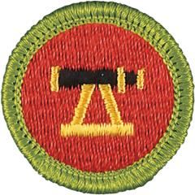

# Surveying Merit Badge

## Overview

While earning this merit badge, Scouts will discover how land is measured and how it is described so that others can know where boundary lines are. They will have a chance to use some fine measuring instruments, apply advanced mathematics, operate computing equipment, and create a survey map.

## Requirements

* NOTE:  The official merit badge pamphlets are now free and downloadable  [HERE](https://filestore.scouting.org/filestore/Merit_Badge_ReqandRes/Pamphlets/Surveying.pdf) or can be purchased at the [Scout Shop.](https://www.scoutshop.org/)
* (1) Show that you know first aid for the types of injuries that could occur while surveying, including cuts, scratches, snakebite, insect stings, tick bites, heat and cold reactions, dehydration. Explain to your counselor why a surveyor should be able to identify the poisonous plants and poisonous animals that are found in your area.
* (2) Do the following:
    * (a) Set an instrument over one of the corners of a five-sided lot laid out by your counselor and sighting one of the other corners for reference and, using radial measurement methods, record the angle turned and the distance measured to each of the remaining corners, as directed by your counselor. Record the angle and distance to five topographic features (trees, shrubs, rocks, etc.) near your work area.
    * (b) Measure to three of the same points with GPS measurement and compare the distances between the points measured.

* (3) From the field notes gathered for requirement 2, and using a protractor and scale, plot the points you measured and draw to scale a map of your survey which includes a north arrow, scale bar, title, date and a diagram of the lot you measured. Submit a neatly drawn copy.
* (4) Use one of the corner markers from requirement 2 as a benchmark with an assumed elevation of 100 feet. Using a level and rod, collect and record measurements, and determine the elevation of the other four corner markers.
* (5) Get a copy of the deed to a piece of property approved by your counselor, from the local courthouse or title agency. Discuss with your counselor the different parts of the deed and their importance.
* (6) Discuss emerging surveying technology such as drones and laser scanning and the strengths and weaknesses of each.
* (7) Tell what GPS is; discuss with your counselor the importance of GPS and how it is changing the field of surveying.
* (8) Discuss the importance of surveying with a licensed surveyor. Also discuss  the various types of surveying and mapping, and applications of surveying technology to other fields. Discuss career opportunities in surveying and related fields. Discuss the qualifications and preparation for such a career.

## Resources

- [Surveying merit badge page](https://www.scouting.org/merit-badges/surveying/)
- [Surveying merit badge PDF](https://filestore.scouting.org/filestore/Merit_Badge_ReqandRes/Pamphlets/Surveying.pdf) ([local copy](files/surveying-merit-badge.pdf))
- [Surveying merit badge pamphlet](https://www.scoutshop.org/surveying-merit-badge-pamphlet-654568.html)
- [Surveying merit badge workbook PDF](http://usscouts.org/mb/worksheets/Surveying.pdf)
- [Surveying merit badge workbook DOCX](http://usscouts.org/mb/worksheets/Surveying.docx)

Note: This is an unofficial archive of Scouts BSA Merit Badges that was automatically extracted from the Scouting America website and may contain errors.