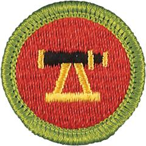

# Surveying Merit Badge

## Overview

While earning this merit badge, Scouts will discover how land is measured and how it is described so that others can know where boundary lines are. They will have a chance to use some fine measuring instruments, apply advanced mathematics, operate computing equipment, and create a survey map.

## Requirements

- (1) Show that you know first aid for the types of injuries that could occur while surveying, including cuts, scratches, snakebite, insect stings, tick bites, heat and cold reactions, dehydration. Explain to your counselor why a surveyor should be able to identify the poisonous plants and poisonous animals that are found in your area.

  **Resources:** [How to Treat Cuts & Scrapes | First Aid Training   (video)](https://youtu.be/L77rERL64zc?si=3OoxbYxRfSOm5dX7%20%20), [Snake Bites (website)](https://www.scouting.org/health-and-safety/safety-moments/snake-bites/), [Bites or Stings of Insects and Arachnids  (video)](https://youtu.be/qP2ETKAOPWo?si=_tmXRhrdNV5cbQRn%20), [Heat and Cold Emergencies - How to Treat Dehydration  (video)](https://youtu.be/3q0s8uKfE8I?si=9vjG5zfeGQpDo3mv), [First Aid Training - St John Ambulance (video)](https://youtu.be/DXo5hmiFQmQ?si=pAKne0eAc6FdMZOo)

- (2) Do the following:
  - (a) Set an instrument over one of the corners of a five-sided lot laid out by your counselor and sighting one of the other corners for reference and, using radial measurement methods, record the angle turned and the distance measured to each of the remaining corners, as directed by your counselor. Record the angle and distance to five topographic features (trees, shrubs, rocks, etc.) near your work area.

    **Resources:** [Total Station Basic Setup | 3 Minute Surveying Tips with Tony (video)](https://youtu.be/O3ZmSdbzkvs?si=amJ6NzQSU3OAHe8F)
  - (b) Measure to three of the same points with GPS measurement and compare the distances between the points measured.

    **Resources:** [GPS Surveying for Beginners - the Easy Land Surveying (video)](https://youtu.be/5p39acElZAU?si=98GYeFh3eCA-jNs8)

- (3) From the field notes gathered for requirement 2, and using a protractor and scale, plot the points you measured and draw to scale a map of your survey which includes a north arrow, scale bar, title, date and a diagram of the lot you measured. Submit a neatly drawn copy.

  **Resources:** [Drawing Diagrams of Legal Descriptions (Basic Example) (video)](https://youtu.be/ttvoWB2TNok?si=mMX_gPRmrIGw96ZY)

- (4) Use one of the corner markers from requirement 2 as a benchmark with an assumed elevation of 100 feet. Using a level and rod, collect and record measurements, and determine the elevation of the other four corner markers.

  **Resources:** [Calculate Elevation & Grade with a Builders Level (video)](https://youtu.be/UDuYrsxHmrA?si=IV8K7mULkWQKU43P)

- (5) Get a copy of the deed to a piece of property approved by your counselor, from the local courthouse or title agency. Discuss with your counselor the different parts of the deed and their importance.

- (6) Discuss emerging surveying technology such as drones and laser scanning and the strengths and weaknesses of each.

  **Resources:** [Photogrammetry vs LiDAR - Which Is BETTER? (video)](https://youtu.be/NF2k8e6kvUY?si=QEKCX3GJuHW_wtkX)

- (7) Tell what GPS is; discuss with your counselor the importance of GPS and how it is changing the field of surveying.

  **Resources:** [How GPS Is Revolutionizing Surveying Accuracy (website)](https://topostreets.com/how-gps-is-revolutionizing-surveying-accuracy/), [How Does GPS Work? | The Secret Genius of Modern Life | BBC Earth Science (video)](https://youtu.be/KItEcCJfHAs?si=ta74Ncw563CCpist)

- (8) Identify three career opportunities that would use skills and knowledge in surveying. Pick one and research the training, education, certification requirements, experience, and expenses associated with entering the field. Research the prospects for employment, starting salary, advancement opportunities and career goals associated with this career. Discuss what you learned with your counselor and whether you might be interested in this career.

  **Resources:** [Careers in Surveying and Mapping (Video)](https://youtu.be/4V14pXYyIuo?si=-R9CyC9I8ZVvi9-D)

## Resources

- [Surveying merit badge page](https://www.scouting.org/merit-badges/surveying/)
- [Surveying merit badge PDF](https://filestore.scouting.org/filestore/Merit_Badge_ReqandRes/Pamphlets/Surveying.pdf) ([local copy](files/surveying-merit-badge.pdf))
- [Surveying merit badge pamphlet](https://www.scoutshop.org/surveying-merit-badge-pamphlet-654568.html)
- [Surveying merit badge workbook PDF](http://usscouts.org/mb/worksheets/Surveying.pdf)
- [Surveying merit badge workbook DOCX](http://usscouts.org/mb/worksheets/Surveying.docx)

Note: This is an unofficial archive of Scouts BSA Merit Badges that was automatically extracted from the Scouting America website and may contain errors.