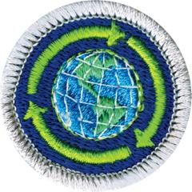

# Sustainability Merit Badge

## Overview

**Eagle required**

Learn to reduce waste and teach sustainable practices to others so you can help conserve Earth’s resources with the Sustainability Merit Badge. Scouts will develop and implement a plan to reduce their water usage, household food waste, and learn about the sustainability of different energy sources, including fossil fuels, solar, wind, nuclear, hydropower, and geothermal.

## Requirements

- (1) Describe the meaning of sustainability in your own words. Explain the importance of sustainability to society and how you can contribute to fulfilling the needs of current generations without compromising the needs of future generations.

  **Resources:** [What is Sustainability (video)](https://www.youtube.com/watch?v=zx04Kl8y4dE), [Introduction to Sustainability (video)](https://youtu.be/k6jUaaQNY28?si=lLm_GCjG4LjRhh6Z)

- (2) **Water.** Do ONE of the following and discuss with your counselor:

  **Resources:** [The Water Cycle - Weather and Climate (video)](https://youtu.be/r2dnUvP1JgM?si=59-npTckyjYd3wmJ), [The Water Cycle (video)](https://www.youtube.com/watch?v=ZzY5-NZSzVw)

  - (a) Evaluate your household water usage. If available, review water bills from the past year and evaluate the seasonal changes in water use. Identify three ways to help reduce water consumption.

    **Resources:** [How We Use Water (video)](https://www.youtube.com/watch?v=dEmYud2wGlc)
  - (b) Explain why water is necessary in our lives. Create a diagram to show how your household gets its clean water from a natural source and what happens with the water after you use it. Tell two ways to preserve your community's access to clean water in the future.

    **Resources:** [How Do We Get Clean Drinking Water? (video)](https://youtu.be/PEKXB3N6g3I?si=bSEBW551c3IzPidg), [Facts About Water (video)](https://www.youtube.com/watch?v=paUYby1kbMs)
  - (c) Different areas of the world are affected by either too much (flooding) or too little (drought) water. Explore whether either or both affect where you live. Identify three water conservation or flood mitigation practices (successful or unsuccessful) that have been tried where you live or in an area of the world that interests you.

    **Resources:** [Science Behind Drought (video)](https://youtu.be/Do6cC05LuDs?si=oRn79Edqb-E9F_J1), [Assessing Drought in the United States (video)](https://youtu.be/i7F6QwRqyVI?si=_jFf3kUQjQp_hDrO), [Understanding Floods (video)](https://youtu.be/ivUKLr8q4sE?si=rPVt3EUFGBO_niMp)

- (3) **Food.** Do ONE of the following and discuss with your counselor:

  **Resources:** [Matter and Energy in Food Webs (video)](https://youtu.be/qIgL05zOx5U?si=T5n5awJMxxmXV0Hw), [Food and Energy in Organisms (video)](https://youtu.be/wPhjCn9kq5M?si=Bo_JNmkBG0G63dyi)

  - (a) Explore the sustainability of different types of plant-based, animal-based and aquaculture food. Identify where four different foods (such as milk, eggs, tuna fish, avocados, or ketchup) come from and how they are processed and transported from the source to you.

    **Resources:** [Exploring Food Sustainability (video)](https://youtu.be/PyiVf26C5pc?si=SIH9gYgrBwPT_JsX), [Food Sustainability Basics (video)](https://youtu.be/luIQGJIo_Wc?si=3uN9tXUqJ9QyNYoZ), [Food Systems Innovation (video)](https://youtu.be/VzE1wDkXNIw)
  - (b) Identify four factors that limit the availability of food in different regions of the world. Discuss how each factor influences the sustainability of worldwide food supplies. Share three ways individuals, families, or your community can create their own food sources.

    **Resources:** [Food Security (video)](https://www.youtube.com/watch?v=YF18lUXUIk4), [The 23 Food Regions of the World (video)](https://www.youtube.com/watch?v=vGOtOkrBcMA)
  - (c) Develop a plan to reduce your household food waste in a sustainable manner. Establish a baseline and then track and record your results for two weeks.

    **Resources:** [5 Food Waste Reduction Tips for Your Home (video)](https://www.youtube.com/watch?v=waMsKjl8HkM), [Food Waste Reduction at Home (video)](https://www.youtube.com/watch?v=DxdhK0R-fuA)

- (4) **Community.** Do ONE of the following and discuss with your counselor:

  **Resources:** [Impacts of Urbanization (video)](https://www.youtube.com/watch?v=2C7F_2OpRT8), [What Happens When We Band Together? (video)](https://www.youtube.com/watch?v=nJO2C2Hk7J8)

  - (a) Create a sketch depicting how you would design a sustainable community and be prepared to explain how the housing, work locations, shops, schools, and transportation systems affect energy, pollution, natural resources, and the economy of the community.

    **Resources:** [Designing a Sustainable Community (video)](https://www.youtube.com/watch?v=RBQiRx6VP7o), [Creating a Sustainable Community (video)](https://www.youtube.com/watch?v=fWdUuvpBtLc)
  - (b) Identify one unsustainable practice in your community and develop a written plan to fix it.

    **Resources:** [Sustainable Communities (video)](https://www.youtube.com/watch?v=VrBrpSTwPK8), [Community Sustainability (video)](https://www.youtube.com/watch?v=lgEsYPxqdkA)
  - (c) Identify five sustainability factors in housing and rate your own home's sustainability against these factors.

    **Resources:** [Environmental Footprint Calculator (website)](https://carbon-calculator.climatehero.org/)

- (5) **Energy.** Do ONE of the following and discuss with your counselor:

  **Resources:** [Energy Resources (video)](https://www.youtube.com/watch?v=G2lQFo69_hc)

  - (a) Learn about the sustainability of different energy sources, including coal, gas, geothermal, hydro power, nuclear, petroleum, solar, and wind. Identify three common energy sources in the United States and describe how the production and consumption of each of these energy sources affects sustainability.

    **Resources:** [Renewable Energy (video)](https://youtu.be/1kUE0BZtTRc?si=Wfjrw3hn4Qnh1VNO), [Carbon Footprint (video)](https://www.youtube.com/watch?v=a9yO-K8mwL0)
  - (b) List eight ways your family consumes energy, such as gas appliances, electricity, heating systems or cooling systems, and transportation. For one home- and one transportation-related energy use, list three ways to help reduce consumption, reduce your carbon footprint, and be a better steward of this resource.

    **Resources:** [Your Carbon Footprint (video)](https://www.youtube.com/watch?v=J_iDcKDAwbA)
  - (c) List five ways you and your family could reduce energy consumption in your home, such as adjusting your thermostat, window shades, opening windows, reducing hot-water temperature, and minimizing water consumption. Identify the benefits and risks of each idea and implement if possible.

    **Resources:** [Save Energy (video)](https://www.youtube.com/watch?v=AKcfc2WXIWY)

- (6) **Stuff.** Do ONE of the following and discuss with your counselor:

  **Resources:** [Decluttering (video)](https://youtu.be/DecAW0FfpLc?si=NNUXSvXGSp6mza6j), [Why Do We Have So Much Stuff? (video)](https://www.youtube.com/watch?v=KtWlmbDsx-U)

  - (a) Create a list of 15 items of your personal "stuff." Classify each item as an essential need (such as soap) or a desirable want (such as a video game). Identify any excess "stuff" you no longer need, working with your family, if possible. Donate, repurpose, or recycle those items you can.
  - (b) List five ways having too much "stuff" affects you, your family, your community, AND the world. For each of the five ways, consider the following aspects: the financial impact, time spent, maintenance, health, storage, and waste generation. Identify practices that can be used to avoid accumulating too much "stuff."
  - (c) Research the impact waste has on the environment (land, water, air). Find out what the trash vortex is and how it was formed. Explain the number system for plastic recyclables and which plastics are more commonly recycled. Identify the average lifespan of one electronic device in your household, and whether it can be recycled in whole or part.

    **Resources:** [Pacific Garbage Patch (video)](https://www.youtube.com/watch?v=dtaNqGyHkNE), [Know Your Plastics (video)](https://www.youtube.com/watch?v=_qTelxi3MjU), [Recycling E-Waste (video)](https://www.youtube.com/watch?v=HmEhTIMfZiI)

- (7) Do TWO of the following and discuss with your counselor:
  - (a) The United Nations lists 17 Sustainable Development Goals. These include Zero Hunger, Clean Water and Sanitation, Affordable and Clean Energy, Sustainable Cities and Community, Responsible Consumption and Production, Climate Action, Life Below Water, and Life on Land. Pick one of these eight and summarize the goal and its current and future impact on you, your family, community, and the world.

    **Resources:** [Sustainable Development Goals (video)](https://www.youtube.com/watch?v=M-iJM02m_Hg), [Sustainable Goals (video)](https://www.youtube.com/watch?v=RpqVmvMCmp0), [Clean Water Goal (video)](https://www.youtube.com/watch?v=LCKsU4bPFOQ)
  - (b) Identify how the planetary life-support systems (soil, climate, freshwater, atmospheric, nutrient, oceanic, ecosystems, and species) support life on Earth and interact with one another. Share what happens to the planet's sustainability when these systems are disrupted by natural events or human activity.

    **Resources:** [Planetary Cycles (video)](https://www.youtube.com/watch?v=6j5iHvYBIcg), [Earth's Systems (video)](https://www.youtube.com/watch?v=BnpF0ndXk-8), [4 Spheres of Earth (video)](https://www.youtube.com/watch?v=gWHE4ug1xpc)
  - (c) Identify how product life cycles (the cycle of design, sourcing, production, use, and disposal or reuse) influence current and future sustainability. Choose one common product to demonstrate how the full product life cycle would apply.

    **Resources:** [Product Life Cycle Assessment (video)](https://www.youtube.com/watch?v=-9JRowyICbo), [Life Cycle Assessment Principles (video)](https://www.youtube.com/watch?v=r0ucT1KRiO4), [Product Life Cycles (video)](https://www.youtube.com/watch?v=u4_evHxlUr4)
  - (d) Learn how the world's population affects the sustainability of Earth. Discuss three human activities that may contribute to putting Earth at risk, now and in the future.

    **Resources:** [Population Affects Resources (video)](https://www.youtube.com/watch?v=V2_LxCLwO2E&t=18s), [How Population Growth Impacts the Planet (video)](https://www.youtube.com/watch?v=mRcxGJcBDVo), [Population affects Sustainability (video)](https://www.youtube.com/watch?v=evp4qGJIqEs)
  - (e) Explain the term species (plant or animal) decline. Share the human activities that contribute to species decline, what can be done to help reverse the decline, and its impact on a sustainable environment.

    **Resources:** [Should We Let Pandas Go Extinct? (video)](https://www.youtube.com/watch?v=VEMtc1w4z6c), [Extinction Explained (video)](https://www.youtube.com/watch?v=2N8VkDcIhIk), [Stop Extinction! (video)](https://www.youtube.com/watch?v=dbCR0KSU52g)
  - (f) Find a world map that shows the pattern of temperature change for a period of at least 100 years. Identify three factors that scientists believe affect the global weather and temperature. Discuss how climate change impacts sustainability of food, water, or other resources.

    **Resources:** [Global Warming From 1880 to 2022 (video)](https://www.youtube.com/watch?v=LwRTw_7NNJs), [Global Temps Since 1850 (video)](https://www.youtube.com/watch?v=DqHKQZGwtw4), [Timelapse of Planet Changes (video)](https://www.youtube.com/watch?v=uFlLDcppwpI)

- (8) Do the following:
  - (a) On a campout or other outdoor Scouting activity that you attend, make notes on the sustainability practices you and your fellow Scouts practice. Observe transportation, forestry, soil conservation, water resources, habitat, buildings, campsites, and sanitation. Share what you observed and learned with your counselor.

    **Resources:** [Sustainable Camping Tips (Packing & Hiking) (video)](https://www.youtube.com/watch?v=plsDrKpN5dM), [What Does LNT Means to Scouts (video)](https://www.youtube.com/watch?v=oTs29BZzf8U)
  - (b) Discuss with your counselor how living by the Scout Oath, Scout Law, Leave No Trace Seven Principles and the Outdoor Code in your daily life helps promote sustainability.

    **Resources:** [Camping Tricks: The Scout Turn Around Rule LNT (video)](https://www.youtube.com/watch?v=kc59VSGN-dg), [Leave No Trace - and There's a Song! (video)](https://www.youtube.com/watch?v=6_jz421duVg%20)
  - (c) Identify 5 behavioral changes that you and your family can make to improve the sustainability of your household. Share and discuss each with your counselor.

    **Resources:** [Sustainability in Your Life (video)](https://www.youtube.com/watch?v=kZIrIQDf1nQ), [10 Ways to Take Care of the Environment (video)](https://www.youtube.com/watch?v=X2YgM1Zw4_E)

- (9) Learn about career opportunities in the sustainability field. Pick one and find out the education, training, and experience required. Discuss what you have learned with your counselor and explain why this career might interest you.

  **Resources:** [Career Paths in Sustainability (video)](https://www.youtube.com/watch?v=u1uQk7UVuvA), [Green Jobs- Building for the Future (video)](https://www.youtube.com/watch?v=EDA_oLZKITo), [Sustainability Careers (video)](https://www.youtube.com/watch?v=mdVG6glfYi8)

## Resources

- [Sustainability merit badge page](https://www.scouting.org/merit-badges/sustainability/)
- [Sustainability merit badge PDF](https://filestore.scouting.org/filestore/Merit_Badge_ReqandRes/Pamphlets/Sustainability.pdf) ([local copy](files/sustainability-merit-badge.pdf))
- [Sustainability merit badge pamphlet](https://www.scoutshop.org/sustainability-merit-badge-pamphlet-662441.html)
- [Sustainability merit badge workbook PDF](http://usscouts.org/mb/worksheets/Sustainability.pdf)
- [Sustainability merit badge workbook DOCX](http://usscouts.org/mb/worksheets/Sustainability.docx)

Note: This is an unofficial archive of Scouts BSA Merit Badges that was automatically extracted from the Scouting America website and may contain errors.