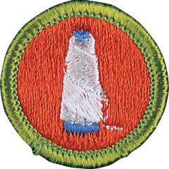

# Textile Merit Badge

## Overview

People use countless fibers and fabrics in their everyday lives: clothes, carpets, curtains, towels, sheets, upholstered furniture. Add to that list boat sails, book bindings, bandages, flags, sleeping bags, mailbags, airbags, seat belts, backpacks, parachutes, umbrellas, basketball nets, and more.

## Requirements

* NOTE:  The official merit badge pamphlets are now free and downloadable  [HERE](https://filestore.scouting.org/filestore/Merit_Badge_ReqandRes/Pamphlets/Textile.pdf) or can be purchased at the [Scout Shop.](https://www.scoutshop.org/)
* (1) Discuss with your counselor the importance of textiles. Explain the terms fiber, fabric, and textile. Give examples of textiles you use every day. Resource: [Textiles: What Are They? Where Do They Come From? (video)](https://youtu.be/7-fLaXF6kOs?si=VNaU9JCXzi2FZEq7)
* (2) Do the following:
    * (a) Get swatches of two natural fiber fabrics (100 percent cotton, linen, wool or silk; no blends). Get swatches of two synthetic fiber fabrics (nylon, polyester, acrylic, olefin, or spandex). Get a sample of one cellulosic fabric (rayon, acetate or lyocell).
    * (b) Give the origin, major characteristics, and general content of each type of fiber obtained for 2(a). Explain the difference between a cellulosic manufactured fiber and a synthetic manufactured fiber. Resource: [Natural vs Synthetic Fibers (Which to Choose and Why) (video)](https://youtu.be/cRLPUAPCfuo)
    * (c) Describe the main steps in making raw fiber into yarn, and yarn into fabric. Resources: [From Cotton to Yarn (video)](https://youtu.be/vFaNiTlHeCY) [Weaving Process (video)](https://youtu.be/NIt9SGk55b4) [Knitting Process (video)](https://youtu.be/yRXuKFy89Mg) [Complete Process of Textile Manufacturing Fiber to Complete Garments (video)](https://youtu.be/5nUjGNDImIk)
    * (d) Assume you will soon buy a new garment or other textile item. Tell your counselor what fiber or blend of fibers you want the item to be, and give reasons for your choice.

* (3) Do TWO of the following:
    * (a) Visit a textile plant, textile products manufacturer or textile school or college. Report on what you saw and learned.
    * (b) Weave a belt, headband, place mat or wall hanging. Use a simple loom that you have made yourself. Resource: [How to Make a Cardboard Loom (website)](https://www.theweavingloom.com/how-to-make-a-cardboard-loom/)
    * (c) With a magnifying glass, examine a woven fabric, a nonwoven fabric, and a knitted fabric. Sketch what you see. Explain how the three constructions are different. Resource: [Woven vs. Knit vs. Non-Woven Fabrics | Textile Talk w/ A Thrifty Notion (video)](https://youtu.be/2Q_04oCLZVs)
    * (d) Make a piece of felt. Resource: [Wet Felting Tutorial for Beginners (video)](https://youtu.be/3IxCDkh-evs)
    * (e) Make two natural dyes and use them to dye a garment or a piece of fabric. Resources: [Natural Dyes From Plants and Vegetables | DIY Eco-Friendly Dyes | Homeschool with Everyday Food (video)](https://youtu.be/jHpPuvibjZ8) [Short Tie Dye Demo - No Narration (video)](https://www.youtube.com/shorts/J6Ib3Ehy_pw?feature=share) [Short Tie Dye Demo - With Narration (video)](https://www.youtube.com/shorts/Oeth97r7VCw?feature=share)
    * (f) Waterproof a fabric. Resources: [A Simple DIY Way to Waterproof Anything (video)](https://youtu.be/y83uXupu5tY) [DIY Seam Seal (video)](https://youtu.be/UlHfbltn6hI)
    * (g) Demonstrate how to identify fibers, using microscope identification or the breaking test. Resource: [Identification of Basic Textile Fibers by Polarized Light Microscopy (video)](https://youtu.be/BbeZvRi3eUI)

* (4) Explain the meaning of 10 of the following terms: warp, harness, heddle, shed, aramid, spandex, sliver, yarn, spindle, distaff, loom, cellulose, sericulture, extrusion, carbon fibers, spinneret, staple, worsted, nonwoven, greige goods. Resource: [Loom and Weaving Terminology (video)](https://youtu.be/QNEB-fjMauc?si=zEm50ZTr7PgymZCE)
* (5) List the advantages and disadvantages of natural plant fibers, natural animal fibers, cellulosic manufactured fibers, and synthetic manufactured fibers. Identify and discuss at least four ecological concerns regarding the production and care of textiles. Resource: [The Ultimate Fabric Guide - The Differences Between Natural vs Synthetic vs Semi-Synthetic Fibers (video)](https://youtu.be/lcq9tPI-W-c?si=7pT187LPR6ZCW2c0)
* (6) Explain to your counselor, either verbally or in a written report, five career possibilities in the textile industry. Tell about two positions that interest you the most and the education, cost of training and specific duties those positions require. Resources: [Careers in the Fashion & Textiles Industry (video)](https://youtu.be/uumtJp43Kfg?si=lOoILqksN5TWYQjK) [Want to Work in the Textiles Industry? (video)](https://youtu.be/Z-WValUr6z8) [Textile Engineering Careers (video)](https://www.youtube.com/shorts/rClr3NSF-CM?feature=share) [Day in the Life of a Textile Engineer (video)](https://youtu.be/Ify9Fo2IhB4)

## Resources

- [Textile merit badge page](https://www.scouting.org/merit-badges/textile/)
- [Textile merit badge PDF](https://filestore.scouting.org/filestore/Merit_Badge_ReqandRes/Pamphlets/Textile.pdf) ([local copy](files/textile-merit-badge.pdf))
- [Textile merit badge pamphlet](https://www.scoutshop.org/textile-merit-badge-pamphlet-650746.html)
- [Textile merit badge workbook PDF](http://usscouts.org/mb/worksheets/Textile.pdf)
- [Textile merit badge workbook DOCX](http://usscouts.org/mb/worksheets/Textile.docx)

Note: This is an unofficial archive of Scouts BSA Merit Badges that was automatically extracted from the Scouting America website and may contain errors.