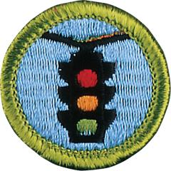

# Traffic Safety Merit Badge

## Overview

Staying safe in traffic wherever you live is getting more difficult all the time, as more and more people take to the road. Earning the Traffic Safety merit badge and will give Scouts some crucial tools to stay safer, when driving a car on a highway, riding a bike across town, or jogging across a busy street.

## Requirements

- (1) **Preventing Impaired Driving.** Do the following:
  - (a) Explain why a distracted driver must not operate a motor vehicle. List five common distractions, explain how driver distractions contribute to traffic accidents, and tell how drivers can minimize distractions.

    **Resources:** [Distracted Driving (video)](https://youtu.be/zWdfeE2YsNc)
  - (b) Explain why a driver impaired by alcohol, drugs, or other substances must not operate a motor vehicle. Describe how alcohol, cold medications, and prescription and illegal drugs affect driving abilities. For the state where you live, find out what is the legal blood alcohol concentration and what are the consequences for driving while intoxicated or driving under the influence. Find out what the open-container law is in your state.

    **Resources:** [The Deadly Truth About Drinking and Driving (video)](https://youtu.be/6uH75bY8Gd0), [Blood Alcohol Content & Driving: What You Need to Know (video)](https://youtu.be/1cs2t3SiSNw)
  - (c) Explain why a fatigued driver must not operate a motor vehicle. Describe how drivers must plan to be alert for safely transporting families, friends, Scouts, and themselves.

    **Resources:** [Recognizing Fatigue—Warning Signs (video)](https://youtu.be/YhK2VLGYMng?si=YdLr0d7mJ020XzSV), [Driver Tiredness, Fatigue, and Road Safety (video)](https://youtu.be/fVl88Q5DJ2w)
  - (d) Describe mistakes that new drivers make, how those mistakes increase their risk of collisions, how drivers can reduce this risk, and how driving behavior affects automobile insurance rates.

    **Resources:** [7 Common Mistakes New Drivers Make—and How to Avoid Them (website)](https://studentdrivercarmagnets.com/blogs/news/common-driving-mistakes), [Most Common Driving Mistakes to Avoid (video)](https://youtu.be/Arrgxna3L2E)

- (2) **Vehicle Safety.** Do the following:
  - (a) Demonstrate how to wear a lap and shoulder belt properly. Explain why it is important for the driver and all passengers, including children sitting in age-appropriate seats, to always wear their seat belts.

    **Resources:** [How to Wear a Seat Belt Properly (video)](https://youtu.be/Cq1auN7xtlo), [Car Seat Safety (video)](https://youtu.be/TPGjlzUenL0)
  - (b) List five safety features found in motor vehicles besides occupant restraint systems. Describe each safety feature, how each works, and how each contributes to safety.

    **Resources:** [10 Car Safety Features That Every Car Must Have (video)](https://youtu.be/D2kM8gEoGYY)

- (3) **Auto Maintenance and Safety Checkups.** With adult supervision and using a vehicle that you have access to, do the following:
  - (a) Demonstrate that all driving lights and signaling lights are clear and operational. Show where the switches are for these lights. Explain how drivers use lights to drive safely and courteously and to communicate with other drivers.

    **Resources:** [Types of Car Lights & Their Purposes (video)](https://youtu.be/8FW-7dfAIwQ)
  - (b) Explain issues that might affect the driver's ability to see through the front, rear, and side windows. Demonstrate with a smear-and-clear test if the windshield wiper blades will clear the windshield completely or need to be replaced. Describe instances in good and bad weather when windshield wipers are important to safe driving.

    **Resources:** [How to Check Your Wipers (video)](https://youtu.be/MmA6Cbn5vH8)
  - (c) Demonstrate how to find the vehicle's recommended tire pressures, how to check tire pressures, and how to check for adequate tire tread depth. Explain why proper tire pressure and tread depth are important to traction, stopping distances, tire wear, and fuel economy.

    **Resources:** [How to Check Your Tires (video)](https://youtu.be/2Tcvmp4Cqao)
  - (d) Check the vehicle for tools needed to change a flat tire or to use tire sealant to fix a puncture. Demonstrate you know how to change a flat tire and how to use tire sealant.

    **Resources:** [Tire Inflator and Sealant Kit (video)](https://youtu.be/X3kjWwCENX4)
  - (e) In a location away from traffic hazards, mark off the reaction distances and braking distances that a car will travel as it makes an emergency stop at 25, 55, and 70 miles per hour on level dry and level wet pavement. Discuss how these distances change for normal and impaired drivers, for day and night driving, and for weather conditions. **Note:** Use the graphics template in the *Traffic Safety* merit badge pamphlet or one approved by your counselor to set up this demonstration.

    **Resources:** [Stopping Distance Table and Graphs (PDF)](https://filestore.scouting.org/filestore/Merit_Badge_ReqandRes/Requirement%20Resources/Traffic%20Safety/Stopping%20Distances%20Table%20and%20Graphs.pdf?_t=1764661254), [Thinking, Braking, and Stopping Distances (video)](https://youtu.be/ZLHgYgEAPhY), [Stopping Distance Demonstration (video)](https://youtu.be/3mDp0k8Nfjc?si=Zoy8bAbLADxtlsz3)

- (4) **Traffic Safety and the Law.** Do the following:
  - (a) Describe at least three examples of traffic laws that apply to drivers of motor vehicles and to bicyclists.

    **Resources:** [Bicycle Rules of the Road (video)](https://youtu.be/TAwv_BPBAnc)
  - (b) Explain procedures and etiquette a driver should follow if a law enforcement officer stops their vehicle.

    **Resources:** [Traffic Stop Etiquette (video)](https://youtu.be/twTVubwyp4E?si=asTzoxN88uwMYZ1T)
  - (c) Explain procedures that drivers should follow if they are involved in a car accident.

    **Resources:** [What to Do After a Car Accident (video)](https://youtu.be/ljjGN6xST_A?si=P4u_Sc1h6nF6rsnL)
  - (d) Name the three documents that drivers are required by law to carry whenever they operate a motor vehicle.

    **Resources:** [Three Documents You Should Always Have in Your Car (website)](https://www.thirdcoastautos.com/blog/what-paperwork-should-you-keep-in-your-car)

- (5) **Road Designs and Signs.** Do the following:
  - (a) Explain how road designs for intersections, medians, and road shoulders contribute to traffic safety. Discuss safety features of interstate highways.

    **Resources:** [How Highways Are Designed and Built (video)](https://youtu.be/SdYilULmeAc)
  - (b) Explain how color and shape help drivers recognize and understand the information presented on traffic and roadway signs. Explain the purpose of different types of signs, signals, and pavement markings.

    **Resources:** [Understanding Road Signs  (video)](https://youtu.be/KxrfkcDAgsY), [Traffic Signals (video)](https://youtu.be/Hj87mH_a4jk), [Pavement Markings (video)](https://youtu.be/Lq3p5i9g9c0)

- (6) **Sharing the Road.** Do the following:
  - (a) Describe the difference in nighttime visibility between a properly lit bicycle and rider (or a pedestrian) wearing reflective material and a bicycle and rider with no lights (or a pedestrian) dressed in dark clothing without reflective material.

    **Resources:** [Bike Safety - Sharing the Road (video)](https://youtu.be/zm_uXZJnCSk), [The Basics of Bicycle Safety (video)](https://youtu.be/DJc18FiARLc?si=tV7T0fXYYDHGVdmm), [What to Do to Make Driving at Night Safer (video)](https://youtu.be/uYhwXwVDlF0?si=3M13qEkL7YbemovD)
  - (b) Name at least four safety measures that pedestrians, including hikers, should follow as they walk along or across streets or roadways.

    **Resources:** [The Basics of Pedestrian Safety (video)](https://youtu.be/Lsv1TSy8JbA?si=Yv-ODDQIlOvnSNbC)
  - (c) Name at least four safety measures that drivers of motor vehicles should follow if they approach a school bus making its stops at pick-up and drop-off locations.

    **Resources:** [Driving Safety 101: School Bus Safety (video)](https://youtu.be/XSYE2z3LCUI)
  - (d) Discuss the risks associated with blind spots on cars and trucks and how drivers can prevent lane change crashes.

    **Resources:** [Blind Spots Lessons (video)](https://youtu.be/bkX_NSCM0Hw), [Lane Changes (video)](https://youtu.be/H0EA2RD-w2c)

- (7) **Traffic, Your Community, and You.** Do ONE of the following:
  - (a) Interview a traffic law enforcement officer or a traffic safety professional in your community to identify what three traffic safety problems the officer is most concerned about. Discuss with your counselor possible ways to solve one of those problems.

    **Resources:** [Engineering and Inspector Careers (video)](https://youtu.be/l39mAUI868w?si=zf_CZPPFbjbUstOW), [Women in Road Safety Careers (video)](https://youtu.be/5UQaWsVS4Ww?si=-wXVuWGizEMaz7dZ)
  - (b) Write a personal traffic safety pledge, addressing three of your most concerning issues relating to traffic safety. Discuss your pledge with your counselor.

    **Resources:** [Take the Pledge (website)](https://www.t-driver.com/pledge/), [Parent-Teen Driving Agreement (website)](https://www.healthychildren.org/English/ages-stages/teen/safety/Pages/teen-driving-agreement.aspx)
  - (c) Initiate and organize an activity or event to demonstrate the importance of traffic safety.

    **Resources:** [Teen Driving Safety Event (video)](https://youtu.be/v8zcyY194jI?si=St3aTOW9HnAHT7oh)

- (8) **Careers.** Explore careers related to traffic safety. Research one career to learn about the training and education needed, costs, job prospects, salary, job duties, and career advancement. Your research methods may include—with your parent or guardian's permission—an internet or library search, an interview with a professional in the field, or a visit to a location where people in this career work. Discuss with your counselor both your findings and what about this profession might make it an interesting career.

  **Resources:** [What It's Like to Work in Traffic Control and Safety in Road Construction (video)](https://youtu.be/RA5GljWCPhQ?si=tzgUiIj2PWhx2-j3), [On The Job: Traffic Signal Technician (video)](https://youtu.be/qcLQd4eTj8A?si=aQ2EYV2mPDoWlf1Q)

## Resources

- [Traffic Safety merit badge page](https://www.scouting.org/merit-badges/traffic-safety/)
- [Traffic Safety merit badge PDF](https://filestore.scouting.org/filestore/Merit_Badge_ReqandRes/Pamphlets/Traffic%20Safety.pdf) ([local copy](files/traffic-safety-merit-badge.pdf))
- [Traffic Safety merit badge pamphlet](https://www.scoutshop.org/traffic-safety-merit-badge-pamphlet-656262.html)
- [Traffic Safety merit badge workbook PDF](http://usscouts.org/mb/worksheets/Traffic-Safety.pdf)
- [Traffic Safety merit badge workbook DOCX](http://usscouts.org/mb/worksheets/Traffic-Safety.docx)

Note: This is an unofficial archive of Scouts BSA Merit Badges that was automatically extracted from the Scouting America website and may contain errors.