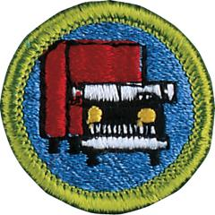

# Truck Transportation Merit Badge

## Overview

Trucking is a large and important industry. No matter where you live, a day is unlikely to go by when you will not see a truck. We use these vehicles to deliver almost every material item we buy. Without trucks, our economy would not work efficiently.

## Requirements

- (1) List the major truck lines serving your town.

- (2) Do the following:
  - (a) Describe the role of truck transportation within commerce (the movement of goods, funds, and information).
  - (b) Describe how trucks fit into a company's supply chain. This could be a manufacturer, importer, wholesaler, or retailer.
  - (c) On paper, map out how goods that are manufactured overseas are transported to a retailer in this country.

- (3) Describe the difference between the gasoline engine and the diesel engine that power trucks. List the advantages of each.

- (4) Visit a truck terminal and complete items 4(a) through 4(e). After your visit, share what you have learned with your counselor.
  - (a) Find out what kind of maintenance program the company follows to help keep its fleet, drivers, and the roadway safe.
  - (b) Find out how dispatchers maintain communication with drivers on the road.
  - (c) Talk with a professional truck driver about safety. Learn about the truck driver's rules of the road for safe driving. List five safe-driving rules every professional truck driver must follow.
  - (d) Review the driver's log and find out what kind of information the log contains.
  - (e) Learn about important federal regulations that help ensure public safety.

- (5) Do the following:
  - (a) Outline the general organization of a trucking company. Describe what each department does.
  - (b) List five positions with trucking companies and describe each one.

- (6) Name five government agencies that work closely with the trucking industry. Describe their role.

- (7) List five different kinds of trucks. Tell the service each provides.

- (8) Assume that you are going to ship by truck 500 pounds of goods (freight class 65) from your town to another town 500 miles away. Your shipment must arrive within three days. Explain in writing:
  - (a) How to prepare the shipment
  - (b) How to compare at least three carriers for time in transit and rates
  - (c) How to choose which carrier to use
  - (d) How to insure the shipment for damages.

- (9) Explain the following terms: bill of lading, ETA, logbook, intermodal, containers, tariff, shippers, carrier, consignee, drayage, and cartage.

- (10) Explore careers related to this merit badge. Research one career to learn about the training and education needed, costs, job prospects, salary, job duties, and career advancement. Your research methods may include—with your parent or guardian's permission—an internet or library search, an interview with a professional in the field, or a visit to a location where people in this career work. Discuss with your counselor both your findings and what about this profession might make it an interesting career.

## Resources

- [Truck Transportation merit badge page](https://www.scouting.org/merit-badges/truck-transportation/)
- [Truck Transportation merit badge PDF](https://filestore.scouting.org/filestore/Merit_Badge_ReqandRes/Pamphlets/Truck%20Transportation.pdf) ([local copy](files/truck-transportation-merit-badge.pdf))
- [Truck Transportation merit badge pamphlet](https://www.scoutshop.org/truck-transportation-merit-badge-pamphlet-35961.html)
- [Truck Transportation merit badge workbook PDF](http://usscouts.org/mb/worksheets/Truck-Transportation.pdf)
- [Truck Transportation merit badge workbook DOCX](http://usscouts.org/mb/worksheets/Truck-Transportation.docx)

Note: This is an unofficial archive of Scouts BSA Merit Badges that was automatically extracted from the Scouting America website and may contain errors.