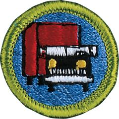

# Truck Transportation Merit Badge

## Overview

Trucking is a large and important industry. No matter where you live, a day is unlikely to go by when you will not see a truck. We use these vehicles to deliver almost every material item we buy. Without trucks, our economy would not work efficiently.

## Requirements

- (1) List the major truck lines serving your town.

  **Resources:** [Search Trucking Companies - Find Carriers By City And State (website)](https://www.quicktransportsolutions.com/quickfreight/loadboard/carrier-searchby-citystate.php)

- (2) Do the following:
  - (a) Describe the role of truck transportation within commerce (the movement of goods, funds, and information).

    **Resources:** [10 Advantages of Road Transport (video)](https://youtu.be/j4EfFO-MAoY)
  - (b) Describe how trucks fit into a company's supply chain. This could be a manufacturer, importer, wholesaler, or retailer.

    **Resources:** [Transportation & Logistics Industry Overview - Introduction (video)](https://youtu.be/kMm-13EdnqA), [How Does Trucking Fit Into the Supply Chain? (video)](https://youtu.be/6ScpuV1aStM), [The Vital Role of Trucks in Transporting Goods: A Comprehensive Overview (website)](https://considerblog.com/transportation/the-vital-role-of-trucks-in-transporting-goods-a-comprehensive-overview.html)
  - (c) On paper, map out how goods that are manufactured overseas are transported to a retailer in this country.

    **Resources:** [Global Supply Chain Management Explained: Key Players, Risks & Incoterms (video)](https://youtu.be/fdg9nhmZuJw)

- (3) Describe the difference between the gasoline engine and the diesel engine that power trucks. List the advantages of each.

  **Resources:** [Diesel vs. Gasoline Engines: Key Differences Explained (video)](https://youtu.be/3G9x6U3VkwQ)

- (4) Visit a truck terminal and complete items 4(a) through 4(e). After your visit, share what you have learned with your counselor.
  - (a) Find out what kind of maintenance program the company follows to help keep its fleet, drivers, and the roadway safe.

    **Resources:** [How To Properly Maintain Fleets? (video)](https://youtu.be/bQcm9irqKIk), [How Trucking Companies Manage Fleet Maintenance Effectively | Part 1 (video)](https://youtu.be/7dXo-RlPc8A), [How Trucking Companies Manage Fleet Maintenance Effectively | Part 2 (video)](https://youtu.be/tGrxcFCukJs)
  - (b) Find out how dispatchers maintain communication with drivers on the road.

    **Resources:** [Communication with Dispatch (video)](https://youtu.be/Pv9-ZKoWNww)
  - (c) Talk with a professional truck driver about safety. Learn about the truck driver's rules of the road for safe driving. List five safe-driving rules every professional truck driver must follow.

    **Resources:** [Top 6 Safety Tips for Truck Drivers (video)](https://youtu.be/poVtx0v1TG4), [Essential Safety Tips, Every Female Trucker Needs to Stay Safe (video)](https://youtu.be/aQi1QlMQv4Q)
  - (d) Review the driver's log and find out what kind of information the log contains.

    **Resources:** [How to Fill Out a Logbook for CDL Drivers (website)](https://www.safetyvideos.com/how-to-fill-out-a-logbook-for-cdl-drivers)
  - (e) Learn about important federal regulations that help ensure public safety.

    **Resources:** [Federal Motor Carrier Safety Administration (FMCSA) - Regulations Overview (website)](https://www.fmcsa.dot.gov/regulations), [Federal Safety Regulations Limit a Long-Haul Truck Driver's Time on the Road (video)](https://youtube.com/shorts/aHI1-vEt2qE), [Federal Regulations Every Truck Driver Should Know! (video)](https://youtube.com/shorts/SpmOiaa64LQ)

- (5) Do the following:
  - (a) Outline the general organization of a trucking company. Describe what each department does.
  - (b) List five positions with trucking companies and describe each one.

    **Resources:** [14 Jobs in the Trucking Industry Other Than Driving (website)](https://www.bestyetexpresstrucking.com/jobs-in-the-trucking-industry/?utm_source=chatgpt.com)

- (6) Name five government agencies that work closely with the trucking industry. Describe their role.

  **Resources:** [Trucking Industry (website)](https://www.osha.gov/trucking-industry/other-federal-agencies)

- (7) List five different kinds of trucks. Tell the service each provides.

  **Resources:** [Different Types of Trucks and Their Uses (video)](https://youtu.be/wMil4tzaOcU)

- (8) Assume that you are going to ship by truck 500 pounds of goods (freight class 65) from your town to another town 500 miles away. Your shipment must arrive within three days. Explain in writing:
  - (a) How to prepare the shipment

    **Resources:** [How to Prepare Freight for Shipping to Avoid Damages (video)](https://youtu.be/xZqB2-jTows?si=AtPDbOqNDr8aWCLi), [How To Ship A Pallet: Preparing A Palletized LTL Freight Shipment Warehousing Tutorial (video)](https://youtu.be/UEaNCBHQVZc?si=UrYkr7yNQgw-6Te3), [How to Package Freight for Shipping (video)](https://youtu.be/478XjiLWg80?si=nplGRI0kARBcrtE9)
  - (b) How to compare at least three carriers for time in transit and rates

    **Resources:** [Mastering Load Board Bookings: A Step-by-Step Guide to Efficient Load Booking (video)](https://youtu.be/CGhqH0849cs), [Truck Dispatcher and Broker Call Simulation - Negotiation Scenario #1 (video)](https://youtu.be/-yppE9CJ2Yk)
  - (c) How to choose which carrier to use
  - (d) How to insure the shipment for damages

    **Resources:** [Understanding Freight Shipping Insurance: A Comprehensive Guide (website)](https://www.flockfreight.com/blog/understanding-freight-shipping-insurance-a-comprehensive-guide?utm_source=chatgpt.com)

- (9) Explain the following terms: bill of lading, ETA, logbook, intermodal, containers, tariff, shippers, carrier, consignee, drayage, and cartage.

  **Resources:** [Decoding Freight Abbreviations, Acronyms and Initialisms (video)](https://youtu.be/0H0Q0VNLMu4?si=91WiYyuzDzCTWV2r), [What's That? Bill of Lading (BOL) (video)](https://youtu.be/cSp3ryfdyFM?si=rPSekMOLuDdcueKb), [What's That? Intermodal & Multimodal (video)](https://youtu.be/GSWxDr6mt8c?si=b1VrZKtrLyYmUMLm), [What's That? Container vs. Trailer (video)](https://youtu.be/UlstPHRwhA8?si=DJa8Oa9evpW0wc7B)

- (10) Explore careers related to this merit badge. Research one career to learn about the training and education needed, costs, job prospects, salary, job duties, and career advancement. Your research methods may include—with your parent or guardian's permission—an internet or library search, an interview with a professional in the field, or a visit to a location where people in this career work. Discuss with your counselor both your findings and what about this profession might make it an interesting career.

  **Resources:** [What Career Opportunities are in Trucking? A LOT! (video)](https://youtu.be/TJGXJwNyw8U?si=y5Qr4fDUORdf3lZY), [What Life Is Like for a Trucker on the Road | NewsNation (video)](https://youtu.be/CiAbSIXwMSs?si=YT7HzX_P99DskdIn), [How to Become a Truck Dispatcher in 5 Steps? - Beginner Training (video)](https://youtu.be/hbJqSgcQWj8?si=pwS-oHaKebXXdijD), [Logistics Coordinator Job Description (video)](https://youtu.be/MbmX3ZAjHbw?si=ddep_jZOj9FLgQEC), [5 Must Have Skills to earn $10,000 a month as a Truck Dispatcher (video)](https://youtu.be/zVZ3RASiXoA?si=FhUizvScSxHerKZy)

## Resources

- [Truck Transportation merit badge page](https://www.scouting.org/merit-badges/truck-transportation/)
- [Truck Transportation merit badge PDF](https://filestore.scouting.org/filestore/Merit_Badge_ReqandRes/Pamphlets/Truck%20Transportation.pdf) ([local copy](files/truck-transportation-merit-badge.pdf))
- [Truck Transportation merit badge pamphlet](https://www.scoutshop.org/truck-transportation-merit-badge-pamphlet-35961.html)
- [Truck Transportation merit badge workbook PDF](http://usscouts.org/mb/worksheets/Truck-Transportation.pdf)
- [Truck Transportation merit badge workbook DOCX](http://usscouts.org/mb/worksheets/Truck-Transportation.docx)

Note: This is an unofficial archive of Scouts BSA Merit Badges that was automatically extracted from the Scouting America website and may contain errors.