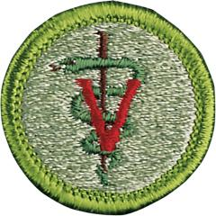

# Veterinary Medicine Merit Badge

## Overview

The field of veterinary medicine in the 21st century is one of the most exciting medical professions in which to work. The skills of a veterinarian are practiced with cutting-edge technology and treatment options, and the profession offers a wide range of career choices.

## Requirements

- (1) Discuss with your counselor the roles a veterinarian plays in the following:
  - (a) Companion or small animal medicine, and equine medicine
  - (b) Food animal or large animal medicine
  - (c) Exotic animal medicine
  - (d) Marine animal medicine (mammal and fish)
  - (e) Poultry medicine
  - (f) Wildlife medicine and aquaculture medicine.

- (2) Discuss with your counselor the roles a veterinarian plays in the following:
  - (a) Public health medicine and zoonotic disease surveillance and control
  - (b) The military
  - (c) Food safety and inspection
  - (d) Laboratory animal medicine and research
  - (e) Teaching and government.

- (3) Describe the training required to become a veterinarian. Where is the veterinary medical college in your state or nearest to you? Describe the prerequisites for applying to veterinary school.

- (4) Tell your counselor what a registered veterinary technician (R.T.V.) or animal health technician (A.H.T.) is. Describe the training required to become an R.V.T. or A.H.T. Where is the school or facility for R.V.T. or A.H.T training in your state or nearest to you? Describe the role an R.V.T. or A.H.T. would play in assisting a veterinarian working in three of the practice types listed in requirement 1.

- (5) Discuss with your counselor the role a veterinarian plays in the human-animal bond.

- (6) Do ONE of the following:
  - (a) Visit a veterinary clinic, hospital, or veterinary referral teaching hospital that does work in one of the practices listed in requirement 1. Spend as much time as you can observing the veterinarians and their staff. Prepare a presentation on what you observed and learned at the facility and share with your counselor.
  - (b) Spend as much time as possible with a veterinarian who works in one of the fields listed in requirement 2. Learn what special training beyond veterinary medical school may have been required for that position. Learn about any special or unusual activities required of this position. Prepare a presentation and share what you have learned about this field of veterinary medicine with your counselor. Include how this field serves the needs of the general public.

- (7) Select one career from any of the lists in requirements 1 or 2. Discuss the following with your counselor:
  - (a) Why would one choose this particular career field?
  - (b) What would you like about this job?
  - (c) What would be the biggest challenges in doing this job?
  - (d) What to you has been the most surprising aspect of this job?
  - (e) What continuing education requirements are required to maintain certification for this job?

## Resources

- [Veterinary Medicine merit badge page](https://www.scouting.org/merit-badges/veterinary-medicine/)
- [Veterinary Medicine merit badge PDF](https://filestore.scouting.org/filestore/Merit_Badge_ReqandRes/Pamphlets/Veterinary%20Medicine.pdf) ([local copy](files/veterinary-medicine-merit-badge.pdf))
- [Veterinary Medicine merit badge pamphlet](https://www.scoutshop.org/veterinarian-medicine-merit-badge-pamphlet-655683.html)
- [Veterinary Medicine merit badge workbook PDF](http://usscouts.org/mb/worksheets/Veterinary-Medicine.pdf)
- [Veterinary Medicine merit badge workbook DOCX](http://usscouts.org/mb/worksheets/Veterinary-Medicine.docx)

Note: This is an unofficial archive of Scouts BSA Merit Badges that was automatically extracted from the Scouting America website and may contain errors.