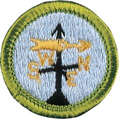

# Weather Merit Badge

## Overview

Meteorology is the study of Earth’s atmosphere and its weather and the ways in which temperature, wind, and moisture act together in the environment. In addition to learning how everyday weather is predicted, Scouts can learn about extreme weather such as thunderstorms, tornadoes, and hurricanes, and how to stay safe.

## Requirements

- (1) Define meteorology. Explain what weather is and what climate is. Discuss how the weather affects farmers, sailors, aviators, and the outdoor construction industry. Tell why weather forecasts are important to each of these groups.

  **Resources:** [What is Meteorology? (video)](https://youtu.be/UKOu9OKvvb4?si=dhC0zfySCYRgQ_Md), [Weather vs Climate (video)](https://youtu.be/6Aigcv7UnTU?si=CUj8ne3OVaoeZB_W)

- (2) Name five dangerous weather-related conditions. Give the safety rules for each when outdoors and explain the difference between a severe weather watch and a warning. Discuss the safety rules with your family.

  **Resources:** [Severe Weather Safety (video)](https://youtu.be/H6icWfyMBNk?si=GmtqrGlxqjA0L4tl), [Know the Difference Between a Watch and a Warning (video)](https://youtu.be/bXWZdKVoII8), [Winter's Hidden Hazard - Cold Weather Health & Safety (video)](https://youtu.be/g3vEkqotiE8?si=cw3WFhC7u4ewKzU2), [Hurricane Preparation and Safety (video)](https://youtu.be/SsTPG8Occv4?si=gNVnhnMLDcnG9sEL)

- (3) Identify at least two sources of weather forecasts that can be used to prepare for hikes, overnight camping, and other outdoor activities. Name two sources of emergency weather warnings both at home and during outdoor Scout functions.

- (4) Explain the difference between high and low pressure systems in the atmosphere. Tell which is related to good and to poor weather. Draw cross sections of a cold front and a warm front , showing the location and movements of the cold and warm air, the frontal slope, the location and types of clouds associated with each type of front, and the location of precipitation.

  **Resources:** [What Are Weather Fronts?  Warm Front, Cold Front? (video)](https://youtu.be/5Cnx5Bzctas?si=bJcnCUw3ysbD99rD), [Weather 101:  High Pressure vs. Low Pressure (video)](https://youtu.be/8mHEry8tSPM?si=_Rx2aPuB2UpvW9o1)

- (5) Tell what causes wind, why it rains, and how lightning and hail are formed.

  **Resources:** [What Creates Weather?  (video)](https://youtu.be/OtHc497jn_U?si=TZ7dkSYs7wj_8P_c), [What Causes Lightning? (video)](https://youtu.be/VqXnN_FQfrc?si=YiUTVTx49LXWtYbO), [What is Hail? (video)](https://youtu.be/6M-ycZLSF1w?si=eMavnw4Y-B1ma5QY)

- (6) Identify and describe clouds in the low, middle, and upper levels of the atmosphere. Relate these to specific types of weather.

  **Resources:** [What Are the Different Types of Clouds? (video)](https://youtu.be/JIkEMBiT6hQ?si=3bZrjTTiTTFmspzQ)

- (7) Draw a diagram of the water cycle and label its major processes. Explain the water cycle to your counselor.

  **Resources:** [Easy Water Cycle Drawing (video)](https://youtu.be/l4h_z1Hy-lE?si=WnRWlOT2aHIX5TGI), [How Does Rain Form and What is the Water Cycle? (video)](https://youtu.be/zBnKgwnn7i4?si=VZrtRmGFKtiaNJCV)

- (8) Identify some human activities that can alter the environment, and describe how they affect the climate and people.

  **Resources:** [10 Human Activities Heavily Impacting Climate Change (video)](https://youtu.be/yS0D9xOlzNc?si=tm7nGt5kuKq9XxhE), [Causes and Effects of Climate Change (video)](https://youtu.be/oD4gvDliieY?si=hdY-Hb4veM6tWsRF)

- (9) Describe how the tilt of Earth's axis helps determine the climate of a region near the equator, near the poles, and across the area in between.

  **Resources:** [Why Do We Have Different Seasons? (video)](https://youtu.be/WgHmqv_-UbQ?si=3s2ISRCkU3Dido89), [Why Do We Have Different Climates Across the Globe? (video)](https://youtu.be/eDVbKrRV-mU?si=l6l6quf6fr2IQ3gl)

- (10) Do ONE of the following:
  - (a) Make one of the following instruments: wind vane, anemometer, rain gauge, hygrometer. Keep a daily weather log for one week using information from this instrument as well as from other sources such as local radio and television stations, NOAA Weather Radio All Hazards, and internet sources (with your parent or guardian's permission). Record the following information at the same time every day: wind direction and speed, temperature, precipitation, and types of clouds. Be sure to make a note of any morning dew or frost. In the log, also list the weather forecasts from radio or television at the same time each day and show how the weather really turned out.
  - (b) Visit a National Weather Service office or talk with a local radio or television weathercaster, private meteorologist, local agricultural extension service officer, or university meteorology instructor. Find out what type of weather is most dangerous or damaging to your community. Determine how severe weather and flood warnings reach the homes in your community.

- (11) Give a talk of at least five minutes to a group (such as your unit or a Cub Scout pack) explaining the outdoor safety rules in the event of lightning, flash floods, and tornadoes. Before your talk, share your outline with your counselor for approval.

- (12) Explore careers related to this merit badge. Research one career to learn about the training and education needed, costs, job prospects, salary, job duties, and career advancement. Your research methods may include—with your parent or guardian's permission—an internet or library search, an interview with a professional in the field, or a visit to a location where people in this career work. Discuss with your counselor both your findings and what about this profession might make it an interesting career.

## Resources

- [Weather merit badge page](https://www.scouting.org/merit-badges/weather/)
- [Weather merit badge PDF](https://filestore.scouting.org/filestore/Merit_Badge_ReqandRes/Pamphlets/Weather.pdf) ([local copy](files/weather-merit-badge.pdf))
- [Weather merit badge pamphlet](https://www.scoutshop.org/weather-merit-badge-pamphlet-650748.html)
- [Weather merit badge workbook PDF](http://usscouts.org/mb/worksheets/Weather.pdf)
- [Weather merit badge workbook DOCX](http://usscouts.org/mb/worksheets/Weather.docx)

Note: This is an unofficial archive of Scouts BSA Merit Badges that was automatically extracted from the Scouting America website and may contain errors.