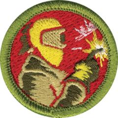

# Welding Merit Badge

## Overview

Welding is the process of joining with a weld – joining or combining similar pieces of metal by heating them with a flame torch or an electric current, then hammering or pressing them together while they are soft. Welding plays a major role in our modern world, and mastery of the skill can lead to exciting career opportunities. Someday, you may have an opportunity to experience exciting new career paths in welding.

## Requirements

- (1) Do the following:
  - (a) Explain to your counselor the hazards you are most likely to encounter while welding, and what you should do to anticipate, help prevent, mitigate, or lessen these hazards.

    **Resources:** [Keep Yourself Safe: 6 Welding Safety Hazards & How To Avoid Them  (video)](https://youtu.be/-oq3mS7EBX8?si=ePEbVQwTrMP92s8X)
  - (b) Show that you know first aid for, and the prevention of, injuries or illnesses that could occur while welding, including electrical shock, eye injuries, burns, fume inhalation, dizziness, skin irritation, and exposure to hazardous chemicals, including filler metals and welding gases.

    **Resources:** [How to Treat Welding Burns (website)](https://weldingheadquarters.com/how-to-treat-welding-burns/?utm_source=chatgpt.com)

- (2) Do the following:
  - (a) With your counselor, discuss general safety precautions and Safety Data Sheets related to welding. Explain the importance of the SDS.

    **Resources:** [Safety Data Sheets Training Video (video)](https://youtu.be/_yWF-w3CwmU?si=RygDv1LH-6pEBP-L)
  - (b) Describe the appropriate safety gear and clothing that must be worn when welding. Then, present yourself properly dressed for welding—in protective equipment, clothing, and footwear.

    **Resources:** [Welding Safety PPE Guide | Must-Have Essentials for Safe Welding Practices (video)](https://youtu.be/YsAmLFF03jI?si=llTGf61a3qyktawl)
  - (c) Explain and demonstrate the proper care and storage of welding equipment, tools, and protective clothing and footwear.

    **Resources:** [A DIY Guide to Maintaining and Storing your Welding Equipment (video)](https://youtu.be/roCt2U2ccaI?si=wpUZM8xiPDdeXA1H), [Safely Use and Care of PPE | ACSA Training | CSTS Clip (video)](https://youtu.be/HrjpCHfbYJE?si=NeeiVkfW-8XJlOKe)

- (3) Explain the terms welding, electrode, slag, and oxidation. Describe the welding process, how heat is generated, what kind of filler metal is added (if any), and what protects the molten metal from the atmosphere.

  **Resources:** [Understanding Common Welding Terms—A Guide for Beginners (website)](https://www.millerwelds.com/resources/article-library/understanding-common-welding-terms-a-guide-for-beginners)

- (4) Name the different mechanical and thermal cutting methods. Choose one method and describe how to use the process. Discuss one advantage and one limitation of this process.

  **Resources:** [How to Cut Steel 5 Different Ways (video)](https://youtu.be/7rCVyRpkyuo?si=vxgtJDrQppVfCSEy)

- (5) Do the following:
  - (a) Select two welding processes, and make a list of the different components of the equipment required for each process. Discuss one advantage and one limitation for each process.

    **Resources:** [4 Types of Welding Explained: MIG vs TIG vs Stick vs Flux Core (video)](https://youtu.be/y-OKi8oSNQ4?si=sTy6oV_X2gC7tqr3)
  - (b) Choose one welding process. Set up the process you have chosen, including gas regulators, work clamps, cables, filler materials, and equipment settings. Have your counselor inspect and approve the area for the welding process you have chosen.

- (6) After successfully completing requirements 1 through 5, use the equipment you prepared for the welding process in 5(b) to do the following:
  - (a) Using a metal scribe or soapstone, sketch your initial onto a metal plate, and weld a bead on the plate following the pattern of your initial.

    **Resources:** [Welding letters and numbers for a casting form (video)](https://youtu.be/UBbdcviujmM?si=NwNeRUjFrwt8rFOU%20)
  - (b) Cover a small plate (approximately 3" x 3" x 1/4") with weld beads side by side.

    **Resources:** [The First Lesson of Welding | Learning to Run Beads (video)](https://youtu.be/g7qgPldYDuY?si=qzhUPLUcxtXtNABM)
  - (c) Tack two plates together in a square groove butt joint.

    **Resources:** [How to Weld a Butt Joint (video)](https://youtu.be/3-ebx3hWu0Q?si=kV-5_qfTM5SZ3BC7)
  - (d) Weld the two plates together from 6(c) on both sides.

    **Resources:** [How to Weld a Butt Joint (video)](https://youtu.be/3-ebx3hWu0Q?si=kV-5_qfTM5SZ3BC7)
  - (e) Tack two plates together in a T joint, have your counselor inspect it, then weld a T joint with fillet weld on both sides.

    **Resources:** [Helpful Tips for Tacking and MIG Welding Fillet Joints (video)](https://youtu.be/zFIdiTJxii4?si=5gysckooa-vsCXmT)
  - (f) Tack two plates together in a lap joint, have your counselor inspect it, then weld a lap joint with fillet weld on both sides.

    **Resources:** [TIG Welding Basics: Lap Joints (video)](https://youtu.be/0AxiCSe-dCQ?si=uoHqPtfJj9LIGrue)

- (7) Do the following:
  - (a) Find out about three career opportunities in the welding industry. Pick one and find out the education, training, and experience required for this profession. Discuss this with your counselor, and explain why the profession might interest you.

    **Resources:** [Should You Become a Welder?—Everything You Need to Know About The Welding Profession (video)](https://youtu.be/tVOvC_e9spA?si=twqMhlBcM9FL64iJ)
  - (b) Discuss the role of the American Welding Society in the welding profession.

    **Resources:** [What Does the American Welding Society Do For Welders? (video)](https://youtu.be/tZaEMO4bPHg?si=deNNIvCoSNCICh4S)

## Resources

- [Welding merit badge page](https://www.scouting.org/merit-badges/welding/)
- [Welding merit badge PDF](https://filestore.scouting.org/filestore/Merit_Badge_ReqandRes/Pamphlets/Welding.pdf) ([local copy](files/welding-merit-badge.pdf))
- [Welding merit badge pamphlet](https://www.scoutshop.org/bsa-welding-merit-badge-pamphlet-661051.html)
- [Welding merit badge workbook PDF](http://usscouts.org/mb/worksheets/Welding.pdf)
- [Welding merit badge workbook DOCX](http://usscouts.org/mb/worksheets/Welding.docx)

Note: This is an unofficial archive of Scouts BSA Merit Badges that was automatically extracted from the Scouting America website and may contain errors.