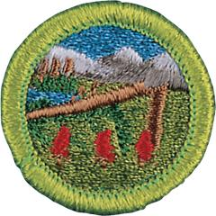

# Wilderness Survival Merit Badge

## Overview

In their outdoor activities, Scouts learn to bring the clothing and gear they need, to make good plans, and do their best to manage any risks. But now and then, something unexpected happens. When things go wrong, the skills of wilderness survival can help make everything right again.

## Requirements

- (1) **Hazards and First Aid.** Do the following:
  - (a) Show or explain first aid for, and prevention of, injuries and conditions that could occur in backcountry settings, including:
  - (1) Dehydration

    **Resources:** [Dehydration: Hiking in the Desert (video)](https://youtu.be/X-N7fALUncM?si=IduV7YMg2FgPfvHv), [Symptoms, and Treatment of Dehydration (website)](https://www.cedars-sinai.org/health-library/diseases-and-conditions/d/dehydration.html)
  - (2) Heatstroke

    **Resources:** [Diagnosis and Treatment of Heat Stroke (video)](https://youtu.be/PpHM4DfPZQU)
  - (3) Hypothermia

    **Resources:** [Recognize the "Umbles"  and Avoid Hypothermia (video)](https://youtu.be/aDAqWLpHXXU), [Hypothermia (video)](https://youtu.be/my6JB41apTw), [Frostbite and Hypothermia (website)](https://health.mo.gov/living/healthcondiseases/hypothermia/index.php)
  - (4) Shock

    **Resources:** [Shock (video)](https://youtu.be/BLfFYFr7sWY), [Shock and Bleeding (video)](https://youtu.be/V4R9GSah93g?si=1QtB6-fDOoselWfZ)
  - (5) Blisters

    **Resources:** [How to Prevent and Treat Blisters (website)](https://www.aad.org/public/everyday-care/injured-skin/burns/prevent-treat-blisters)
  - (6) Eye injuries

    **Resources:** [5 Ways To Safely Remove Something Stuck In Your Eye (video)](https://youtu.be/uJFZPFsHcCE?si=Of3K05cQ2-6Fesii)
  - (7) Ankle and knee sprains

    **Resources:** [First Aid for Ankle Sprains (video)](https://youtu.be/yrvqNh2q6Tc), [Knee Sprains (website)](https://my.clevelandclinic.org/health/diseases/knee-sprain)
  - (8) Bug bites of chiggers, ticks, mosquitoes, and biting gnats

    **Resources:** [Chiggers 101 (video)](https://youtu.be/d6hneOG2RLA), [Preventng and Treating Tick Bites (website)](https://www.aad.org/public/everyday-care/injured-skin/bites/remove-a-tick), [Preventing and Treating Mosquito Bites (website)](https://www.aad.org/public/everyday-care/injured-skin/bites/prevent-treat-bug-bites), [Biting Gnats (video)](https://youtu.be/QazaIwbtZHs?si=Vh6h3kct40JOQtKj)
  - (9) Bee stings

    **Resources:** [How to Treat a Bee Sting (video)](https://www.youtube.com/watch?v=01Po5RTNfhs)
  - (10) Bites of spiders

    **Resources:** [Black Widow and Brown Recluse Spider Bites (video)](https://youtu.be/fiV2bYzWH-o), [Black Widow vs. Brown Recluse Spider Bites (video)](https://www.youtube.com/watch?v=cfh7XOc_hgc)
  - (11) Sting of a scorpion

    **Resources:** [Scorpion Stings—Symptoms and Causes (website)](https://www.mayoclinic.org/diseases-conditions/scorpion-stings/symptoms-causes/syc-20353859)
  - (12) Bite of a wild mammal

    **Resources:** [Treatment of Animal and Human Bites (video)](https://youtu.be/RSJzuk226RI?si=NU3LP-a1tzgH43gf)
  - (13) Bite of a venomous snake.

    **Resources:** [Venomous Snake Bites (website)](https://www.redcross.org/take-a-class/resources/learn-first-aid/venomous-snake-bites)
  - (b) Explain how the Scout Essentials address hazards of survival situations and are basic to a survival kit.

    **Resources:** [Scout Essentials (website)](https://scoutlife.org/outdoors/outdoorarticles/6976/scout-outdoor-essentials-checklist/), [Checklist for a Wilderness Survival Kit (PDF)](https://filestore.scouting.org/filestore/Merit_Badge_ReqandRes/Requirement%20Resources/Wilderness%20Survival/Checklist%20for%20a%20Wilderness%20Survival%20Kit.pdf)
  - (c) Explain how a trip plan could help prevent a wilderness survival situation.

    **Resources:** [How to Plan an Adventure | Plan a Camping Trip (video)](https://youtu.be/79WYqkiExZU?si=sXXRKQGVE-ZNkU1p), [Importance of a Float Plan (website)](https://www.boatsmartexam.com/knowledge-base/article/using-a-trip-plan/)

- (2) **Priorities for Survival.** Explain the importance of each of the seven priorities of survival in a wilderness location.

  **Resources:** [Seven Priorities of Survival (video)](https://youtu.be/eckfD4gfgj0)

- (3) **Avoiding Panic:** Describe ways to avoid panic and to maintain a high level of morale when lost, and explain why this is important.

  **Resources:** [Lost? Stop Panic & Think Clearly. (video)](https://youtu.be/_mt0BtDDImU?si=8AyENe2MLMfV8jiD), [Box Breathing | The Breathing Exercise Used By Navy SEALs (video)](https://youtu.be/UC6HUrneIWI?si=fr6RwZnn6RIBp8rA)

- (4) **First Aid Kits.** Put together a personal first aid kit and a personal survival kit. Show how items in the kits are used.

  **Resources:** [Personal Family Troop First Aid Kit Checklist (PDF)](https://filestore.scouting.org/filestore/Merit_Badge_ReqandRes/Requirement%20Resources/Wilderness%20Survival/Personal%20Family%20Troop%20First%20Aid%20Kit%20Checklist.pdf), [First Aid KIt Checklists (website)](https://scoutlife.org/video-audio/4937/first-aid-kit-buying-guide/), [Scout Essentials for Wilderness Survival (website)](https://troopleader.scouting.org/program-features/wilderness-survival/information/), [Survival Kit List (website)](https://assets.kalkomey.com/hunter/pdfs/maine-survival-kit.pdf)

- (5) **Shelter.** Do the following:
  - (a) Describe the steps you would take to survive in the following exposure conditions:
  - (1) Cold and snowy

    **Resources:** [Cold Weather Survival Skills (video)](https://youtu.be/EsoobhiExJY), [Winter Survival Skills (website)](https://www.wildwoodsurvival.com/survival/winter/index.html)
  - (2) Wet

    **Resources:** [Building Fire in the Rain (video)](https://youtu.be/MmHkiHeoI3U?si=Q306ujTfQ3V2QHP4), [Staying Warm and Dry in Wind and Rain (video)](https://youtu.be/t9NLAIxlWgE?si=prPrtr-kxSBLOsOH), [Camping in the Rain (video)](https://www.youtube.com/watch?v=jzTHvpgHqCo)
  - (3) Hot and dry

    **Resources:** [10 Desert Survival Tips (video)](https://www.youtube.com/watch?v=lIHczx_QlH8)
  - (4) Windy

    **Resources:** [Danger of Wind Chill (video)](https://youtu.be/f4VC0fNMaQc?si=HyjdNU_CeDcZfjSS), [Wind Chill Safety: 5 Tips to Prevent Frostbite (video)](https://youtu.be/Syqj_hZLMlA?si=m-n-6rHoP4fauLIR)
  - (5) At or on the water.

    **Resources:** [What to do if Your Boat Capsizes (website)](https://www.boat-ed.com/indiana/studyGuide/Ending-Up-in-the-Water-Unexpectedly/10101602_35417/)
  - (b) Show that you know the proper clothing to wear while in the outdoors during extremely hot and cold weather and during wet conditions.

    **Resources:** [Packing Lists for Hot and Cold Weather Camping (website)](https://scoutlife.org/outdoors/outdoorarticles/6976/scout-outdoor-essentials-checklist/)
  - (c) Explain how to protect yourself from bears and raccoons.

    **Resources:** [Preventing and Managing Bear Encounters (video)](https://youtu.be/SHZ-prhA7E0), [Keeping Raccoons Away from your Campsite (video)](https://youtu.be/SO1Ax9sBU6I)
  - (d) Describe how to build or find survival shelters in a forest or in snow.

    **Resources:** [Tree Well Shelter (video)](https://youtu.be/mQL4luClk_I), [A Quick Shelter under a Tree (video)](https://www.youtube.com/shorts/x6M8HHRWRTk)
  - (e) Improvise a natural shelter. For the purpose of this demonstration, use techniques that have little negative impact on the environment. Spend a night in your shelter.

    **Resources:** [How to Build a Survival Shelter (video)](https://youtu.be/wTQqrECMkPE)

- (6) **Fire Building.** Using three different methods (other than matches), build and light three fires.

  **Resources:** [4 Emergency Fire Starters (video)](https://youtu.be/bPMKS0qzzSQ?si=-tvEhxuOE9N1D_Iz)

- (7) **Signaling.** Do the following:
  - (a) Explain and show how lost or stranded Scouts could send signals to attract the attention of ground, airborne, or water search teams.

    **Resources:** [How to Signal for Ground Rescue (video)](https://youtu.be/X8j5NC7Bqq4), [Surface to Air Visual and Body Signals (website)](http://www.cap-es.net/zips/gnd2airsignals.PDF), [Distress Signals for Water Emergencies (video)](https://youtu.be/0Y4pG_mN7Ek)
  - (b) Demonstrate how to use a signal mirror.

    **Resources:** [How to Use a Signal Mirror (video)](https://www.youtube.com/shorts/kYN46GuZmpE)
  - (c) Describe from memory five ground-to- air signals and tell what they mean.

- (8) **Water.** Demonstrate three ways to treat water found in the outdoors to prepare it for drinking.

  **Resources:** [Purifying Water (video)](https://youtu.be/tD-Ya2SQk3k), [Melting Snow for Water (website)](https://scoutlife.org/outdoors/scout-essentials/183133/how-to-safely-melt-snow-to-use-as-drinking-water-on-a-camping-trip/)

- (9) **Food.** Explain why it usually is not wise to eat wild plants or wildlife in a wilderness survival situation.

- (10) **Careers.** Do ONE of the following:
  - (a) Explore careers related to this merit badge. Research one career to learn about the training and education needed, costs, job prospects, salary, job duties, and career advancement. With permission of your parent or guardian, your research methods may include an internet or library search, an interview with a professional in the field, or a visit to a location where people in this career work. Discuss with your counselor both your findings and what about this profession might make it an interesting career.

    **Resources:** [Wilderness Jobs (website)](https://wildlandtrekking.com/blog/wilderness-jobs-and-how-to-get-them/), [Unusual Careers in the Wilderness (video)](https://www.youtube.com/shorts/dgSaYZ8xhRw)
  - (b) Explore how you could use knowledge and skills from the Wilderness Survival merit badge to pursue a hobby or to serve as volunteer. Research any training needed, expenses, and organizations that promote or support it. Discuss with your counselor what short-term and long-term goals you might have if you pursue this.

    **Resources:** [Ultralight Backpacking (website)](https://scoutingmagazine.org/2016/08/shed-pounds-pack-using-ultralight-backpacking-strategies/)

## Resources

- [Wilderness Survival merit badge page](https://www.scouting.org/merit-badges/wilderness-survival/)
- [Wilderness Survival merit badge PDF](https://filestore.scouting.org/filestore/Merit_Badge_ReqandRes/Pamphlets/Wilderness%20Survival.pdf) ([local copy](files/wilderness-survival-merit-badge.pdf))
- [Wilderness Survival merit badge pamphlet](https://www.scoutshop.org/wilderness-survival-merit-badge-pamphlet-655688.html)
- [Wilderness Survival merit badge workbook PDF](http://usscouts.org/mb/worksheets/Wilderness-Survival.pdf)
- [Wilderness Survival merit badge workbook DOCX](http://usscouts.org/mb/worksheets/Wilderness-Survival.docx)

Note: This is an unofficial archive of Scouts BSA Merit Badges that was automatically extracted from the Scouting America website and may contain errors.