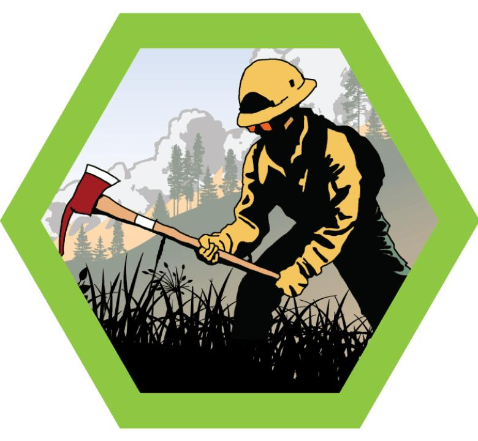

# Wildland Fire Management Merit Badge

## Overview

**Test Lab Merit Badge**, Verify current status at [Scouts BSA Test Lab](https://www.scouting.org/skills/merit-badges/test-lab/).

## Requirements

- (1) **Explain the history of wildland fire, its suppression, prevention and management in America.**

  **Resources:** [YouTube: A History of Wildfire Prevention](https://www.youtube.com/watch?v=ZnabcDAQ1DU), [Wildfire Education | National Interagency Fire Center](https://www.nifc.gov/fire-information/fire-prevention-education-mitigation/wildfire-education)

- (2) **Explain the harm caused by wildfire in the United States. Discuss the negative impacts that wildfire can have on the following resources.**

  **Resources:** [YouTube: A Better Way to Think About Wildland Fires](https://www.youtube.com/watch?v=HeOl2N6iLy0&t=16s), [YouTube: How Are Wildfires Making Us Sick](https://www.youtube.com/watch?v=8mQllQnJrhg), [YouTube: How Wildfires Affect Water Supply](https://www.youtube.com/watch?v=RV_OZ430GAs)

  - (A) Commercial forest products
  - (B) Fish and Wildlife habitat
  - (C) Soil and water
  - (D) Recreation and public use
  - (E) Homes, communities and human resources
  - (F) Air quality and public health

- (3) **Define prescribed fire. Explain how it is used to accomplish the following:**

  **Resources:** [YouTube: Misconceptions and Benefits of Fire](https://www.youtube.com/watch?v=vFPIoH4ML2U), [YouTube: Wildlife That Depends on Fire to Survive](https://www.youtube.com/watch?v=Q8mD-4rexo0), [YouTube: How does Fire Affect Wildlife?](https://www.youtube.com/watch?v=iKRYDp6VpyA), [YouTube: Good Fire: Prescribed Burning](https://www.youtube.com/watch?v=E542gY7uR0s)

  - (A) Fuel reduction
  - (B) Fish and wildlife habitat enhancement
  - (C) Ecosystem restoration
  - (D) Forest regeneration
  - (E) Insect and disease control

- (4) **Explain defensible space and define the term wildland-urban interface. Discuss how homes and communities in the wildland-urban interface can be protected from wildfire.**

  **Resources:** [YouTube: Separating Your Home From Wildfire – The Zones of Defensible Space](https://www.youtube.com/watch?v=isf6COwOXPw)

- (5) **Explain the main causes of wildfire in America. Explain how you can prevent wildfires in your community or on an outing with your unit.**

  **Resources:** [YouTube: Decades 2:20 Wildfire Prevention](https://www.youtube.com/watch?v=uslLV343id4), [YouTube: Wildfire Prevention with Smokey Bear](https://www.youtube.com/watch?v=tUTyDGlJt00), [Bing Videos: What Causes Wildfires? BBC Earth Explore](https://www.bing.com/videos/riverview/relatedvideo?q=how%20does%20lightning%20cause%20wildfires&mid=2B1F243DD98A1EFB30922B1F243DD98A1EFB3092&ajaxhist=0), [Lightning-caused wildfires | National Interagency Fire Center](https://www.nifc.gov/fire-information/statistics/lightning-caused), [10 Tips to Prevent Wildfires | U.S. Department of the Interior](https://www.doi.gov/blog/10-tips-prevent-wildfires)

- (6) **Describe the Fire Triangle. Explain how wildfires can be suppressed by removing each element of the fire triangle.**

  **Resources:** [YouTube: Fire Triangle Explained – How Oxygen, Heat, and Fuel Interact with Wildfire](https://www.youtube.com/watch?v=8WPk15XqN2E)

- (7) **Explain how the fire environment affects wildland fire behavior. Give examples of the influences of weather, topography and fuel. Draw a diagram to illustrate the parts of a wildfire.**

  **Resources:** [YouTube: How to Describe the Behavior and Parts of a Wildfire](https://www.youtube.com/watch?v=b1KvTswZYNA)

- (8) **Explain the following wildland fire suppression tactics and under which conditions they would be used to achieve objectives. Use your own diagrams if necessary.**

  **Resources:** [YouTube: How We Fight Wildfires](https://www.youtube.com/watch?v=9EzcA3KvEsY), [Facebook: The Difference Between a Direct and Indirect Attack – US Forest Service](https://www.facebook.com/watch/?v=378311047476699), [YouTube: Evolution of Fire Management and the Role of Knowledge](https://www.youtube.com/watch?v=W8GHIZAaUaQ), [YouTube: Mop Up Operations on the Mosquito Fire](https://www.youtube.com/watch?v=DNFv_cr8r7I)

  - (A) Direct attack
  - (B) Indirect attack
  - (C) Parallel attack
  - (D) Minimum Impact Suppression Tactics
  - (E) Mop-Up
  - (F) Use of machinery and aircraft
  - (G) Fire management for resource benefit objectives
  - (H) Repair and Restoration

- (9) **Describe 10 tools, equipment or apparatus that are unique to wildland fire suppression and explain how these items are used.**

  **Resources:** [YouTube: West Metro Fire Rescue: Wildland Firefighting Tools](https://www.youtube.com/watch?v=SHXLUEfHlxw), [Wildland Fire Engines](https://www.nps.gov/articles/wildland-fire-engines.htm), [Aircraft | National Interagency Fire Center](https://www.nifc.gov/resources/aircraft), [Dozers](https://www.nifc.gov/resources/equipment/dozers), [Firefighting Equipment](https://www.nifc.gov/resources/equipment)

- (10) **Describe the personal protective equipment used by wildland firefighters. Explain why personal protective equipment and proper training is necessary.**

  **Resources:** [YouTube: Dressed for Fire](https://www.youtube.com/watch?v=a0NtIJMDUD4)

- (11) **Describe the following and explain why each is an important consideration for maintaining personal safety and situational awareness during wildland fire suppression activities.**

  **Resources:** [YouTube: WFSTAR: Standard Firefighting Orders](https://www.youtube.com/watch?v=9WhKKSGl9K0), [Bing Videos: WFSTAR: Watch Out Situations](https://www.bing.com/videos/riverview/relatedvideo?&q=wildfire+watch+out+situations&&mid=DFFACB213049C3BDCB8BDFFACB213049C3BDCB8B&&FORM=VRDGAR), [YouTube WFSTAR: Is Your LCES Adequate](https://www.youtube.com/watch?v=pQACcXe_2Gg)

  - (A) 10 Standard Firefighting Orders
  - (B) 18 Watch Out Situations
  - (C) Lookouts, Communication, Escape Routes and Safety Zones (LCES)

- (12) **List the major government agencies involved with fire suppression in the United States, and the role that these agencies play in fire suppression.**
  - [**About Us | NWCG**](https://www.nwcg.gov/about-us) (*click on Member Agencies Tab*)

- (13) **Draw a diagram of the Incident Command System. Explain the functions of the positions that make up the Command and General Staff.**

  **Resources:** [ICS Organizational Structure and Elements](https://training.fema.gov/emiweb/is/icsresource/assets/ics%20organizational%20structure%20and%20elements.pdf)

- (14) **Learn about three career opportunities in wildland fire. Select one and research the education, training, and experience required for this position. Discuss this position with your counselor, and explain why a career in wildland fire might interest you.**

  **Resources:** [YouTube: Wildland Firefighting & Wildland Fire Ecology Jobs Explained for Beginners](https://www.youtube.com/watch?app=desktop&v=55iglSp3ki0), [YouTube: Wildland Fire Recruiting Video](https://www.youtube.com/watch?v=ZxkeYnEBZzg)

- (15) **Do one of the following:**
  - (A) Develop a fire readiness plan for a wildland area with which you are familiar. The plan should include a map showing available resources, water supplies, natural and manmade barriers, and access. The plan should discuss fuel loads, available fire apparatus, structure protection needs, values at risk, medical and evacuation considerations and potential fire suppression tactics.
  - (B) Visit with a state or federal forestry official or your local fire warden. Discuss the causes of and types of wildland fire that occur in your area. Discuss the prime fire season(s) in your area. Identify the agency responsible for wildland fire suppression in your area. Write a brief report about what you learned during your visit.
  - (C) Conduct a fire wise assessment of a home or a building in the wildland-urban interface, which could include a Scout camp building or facility. Identify potential risks and fire hazards. With your counselor’s approval, complete a project to reduce the wildfire risk and increase the preparedness of the building. Write a brief report about what you did and learned from the assessment and project.
    [**NFPA – Firewise USA®**](https://www.nfpa.org/education-and-research/wildfire/firewise-usa#preparing-homes-for-wildifre)
  - (D) Participate in a fire prevention campaign with your local fire department or forestry agency. Write a brief report about what you did and what you learned from it.

- (16) **Research an historic catastrophic wildland fire incident that has occurred in the United States. Write a report of no less than 500 words describing the incident, the conditions that led to the incident, how the incident was managed, and how the incident could have been prevented. Explain what lessons were learned and how this incident affected future fire suppression policy or suppression tactics. There are many historic fires that can be researched online, here are four examples.**

  **Resources:** [YouTube: The Tillamook Burn forest fire of August, 1933](https://www.youtube.com/watch?v=LatzdMh49ps), [YouTube: The Story Behind the Yellowstone Fires of 1988 | Retro Report | The New York Times](https://www.youtube.com/watch?v=CAgP9fo3f7s), [Bing Videos: The Smoke Jumper Tragedy of Mann Gulch](https://www.bing.com/videos/riverview/relatedvideo?q=lessons+from+Mann+Gulch+fire+&&view=riverview&mmscn=mtsc&mid=421072089F1B4119A030421072089F1B4119A030&&aps=196&FORM=VMSOVR), [Bing Videos: Storm King Mountain Tragedy](https://www.bing.com/videos/riverview/relatedvideo?&q=lessons+from+storm+King+fire&&mid=A9C2B89584AB469FC7F6A9C2B89584AB469FC7F6&&FORM=VRDGAR)

- (17) **Complete the survey below to complete the test lab requirements**

## Resources

- [Wildland Fire Management merit badge page](https://www.scouting.org/skills/merit-badges/test-lab/wildland-fire-management/)

Note: This is an unofficial archive of Scouts BSA Merit Badges that was automatically extracted from the Scouting America website and may contain errors.