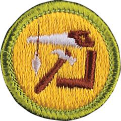

# Woodwork Merit Badge

## Overview

Wood is an amazingly versatile, practical, yet beautiful material. A skilled craftsman can use wood to fashion just about anything. As a woodworker or carpenter, you will find no end of useful, valuable, and fun items you can make yourself, from wood.

## Requirements

- (1) Do the following:
  - (a) Explain to your counselor the most likely hazards you may encounter while participating in woodwork activities, and what you should do to anticipate, help prevent, mitigate, and respond to these hazards. Explain what precautions you should take to safely use your tools.

    **Resources:** [Safety in Woodworking | Woodworking (video)](https://youtu.be/GQkUbdE3VS8?si=EpcwqUnpU9BDS6Cz)
  - (b) Show that you know first aid for injuries that could occur while woodworking, including splinters, scratches, cuts, severe bleeding, and shock. Tell what precautions must be taken to help prevent loss of eyesight or hearing, and explain why and when it is necessary to use a dust mask.

    **Resources:** [The Emergency First Aid Kit for Woodworkers Need! (video)](https://youtu.be/A0EmfREhgRw?si=fh9F6uKkRvb4ogza)
  - (c) Earn the Totin' Chip recognition.

- (2) Do the following:
  - (a) Describe how timber is grown, harvested, and milled. Tell how lumber is cured, seasoned, graded, and sized.

    **Resources:** [How Trees Are Made Into Lumber (video)](https://youtu.be/hOO37pcFg5I?si=K7r13Z-hpu-ZMAxB)
  - (b) Collect and label blocks of six kinds of wood useful in woodworking. Describe the chief qualities of each. Give the best uses of each.

- (3) Do the following:
  - (a) Show the proper care, use, and storage of all working tools and equipment that you own or use at home or school.

    **Resources:** [Tool Maintenance 101: Tips for KeepingYour Woodworking Tools in Top Condition (website)](https://deltamachinery.com/tool-maintenance-101-tips-for-keepingyour-woodworking-tools-in-top-condition/)
  - (b) Sharpen correctly the cutting edges of two different tools.

    **Resources:** [Best Method for Sharpening Your Chisels and Plane Irons (video)](https://youtu.be/2mJZH29bAHI?si=EdoNp283FRVbkTp_)

- (4) Using a saw, plane, hammer, brace, and bit, make something useful of wood. Cut parts from lumber that you have squared and measured from working drawings.

  **Resources:** [Build This Simple Wooden Tool Box - Hand Saw And A Hammer (video)](https://youtu.be/xV6ql13lfjw?si=02XiV7e925ictjOt), [How to Make a Bench Hook (video)](https://youtu.be/3WIjpz9Ut1c?si=ngE7zV5uIDXLN10w)

- (5) Create your own woodworking project. Begin by making working drawings, list the materials you will need to complete your project, and then build your project. Keep track of the time you spend and the cost of the materials.

- (6) Do TWO of the following:
  - (a) Make working drawings of a project needing beveled or rounded edges and build it.

    **Resources:** [Bevels- How to Make Beveled Panels on the Tablesaw (video)](https://youtu.be/l06lCTcOgHQ?si=zFKD2q75qtORQzr), [Rounded Edges- How to Rout Round Corners (video)](https://youtu.be/XztV4yjfFaI?si=8y6bA5TuRF-Tmoyv)
  - (b) Make working drawings of a project needing curved or incised cuttings and build it.

    **Resources:** [Making Arcs & Curves the Easy Way (video)](https://youtu.be/867ho1Pp12U?si=T3zGA7JYZkWODfDv)
  - (c) Make working drawings of a project needing miter, dowel, or mortise and tenon joints and build it.

    **Resources:** [Mitered Mortise & Tenon Joint (video)](https://youtu.be/h0ryuL0DuLE?si=aq-2Jk5UxvEdtZ4F)
  - (d) Make a cabinet, box, or something else with a door or lid fastened with inset hinges.

    **Resources:** [The Special Wooden Box / Invisible Wooden Hinge - Using Basic Tools / Dovetail Joints (video)](https://youtu.be/Syv3JzRXld8?si=LG_MXwk4-tBuDBgK), [An Absurd Number of Wood Box Making Tips & Tricks (video)](https://youtu.be/TazBJ5MSMgc?si=ulffNFnBiQ-I22fi)
  - (e) Help make wooden toys for underprivileged children; OR help carry out a woodworking service project approved by your counselor for a charitable organization.

    **Resources:** [How to Make Wooden Toys for Kids | DIY | Great Home Ideas (video)](https://youtu.be/IwLwNGAxSfg?si=upaHucGcY9scLFYB)

- (7) Talk with a cabinetmaker or finish carpenter. Learn about training, apprenticeships, career opportunities, work conditions, work hours, pay rates, and union organization that woodworking experts have in your area.

  **Resources:** [A Day @ AWC : Careers in the Wood Industry (video)](https://youtu.be/lPTR2xdIz9M?si=pyFe8tLbhOh0zqT3), [Kayleen McCabe - Her Career in Woodworking (video)](https://youtu.be/NBHhOMEs9Sk?si=JNOrbPzgNwLd6TK9), [A Total Beginner's Guide to Woodworking (video)](https://youtu.be/zCNgrOR8FEU?si=U9HEuwvA3fi3iqOn)

## Resources

- [Woodwork merit badge page](https://www.scouting.org/merit-badges/woodwork/)
- [Woodwork merit badge PDF](https://filestore.scouting.org/filestore/Merit_Badge_ReqandRes/Pamphlets/Woodwork.pdf) ([local copy](files/woodwork-merit-badge.pdf))
- [Woodwork merit badge pamphlet](https://www.scoutshop.org/bsa-woodwork-merit-badge-pamphlet-boy-scouts-of-america-659870.html)
- [Woodwork merit badge workbook PDF](http://usscouts.org/mb/worksheets/Woodwork.pdf)
- [Woodwork merit badge workbook DOCX](http://usscouts.org/mb/worksheets/Woodwork.docx)

Note: This is an unofficial archive of Scouts BSA Merit Badges that was automatically extracted from the Scouting America website and may contain errors.