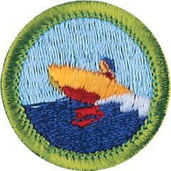

# Motorboating Merit Badge

## Overview

The Motorboating Merit Badge is a fun merit badge for Scouts interested in Sea Scouts. The Motorboating Merit Badge allows Scouts to learn about different types of motorboats and motors, so they can safely navigate the open waters. Scouts will get hands-on experience driving and handling a motorboat while learning about the various types of personal floatation devices and explaining the rules and laws that apply to recreational boating in their communities.

## Requirements

* (1) Do the following:
    * (a) Discuss with your counselor the following hazards you might encounter while motorboating: flammable fuel; carbon monoxide; propellers; collisions; falls overboard; capsize; running aground. Explain what you should do to anticipate, prevent, mitigate and respond to these hazards.
    * (b) Explain first aid for injuries or illnesses that could occur while motorboating, including hypothermia, heat reactions, dehydration, motion sickness, bug bites, blisters.
    * (c) Identify the conditions that must exist before performing CPR on a person, and explain how such conditions are recognized. Demonstrate proper technique for performing CPR using a training device approved by your counselor.

* (2) Do the following:
    * (a) Before doing requirement 5, successfully complete the BSA swimmer test.
    * (b) Name the different types of personal flotation devices (PFDs), and explain when each type should be used. Show how to choose and properly fit a PFD.

* (3) Do the following:
    * (a) Explain inboard, outboard, and inboard/outboard motors, and the uses and advantages of each.
    * (b) Explain the safety procedures and precautions involving handling fuel and engine servicing, and equipment storage and placement.
    * (c) Explain how to winterize a boat motor and tell why this procedure is necessary.
    * (d) Explain the safety procedures and precautions involving swimmers and skiers in the water, passenger positions underway, and boat wakes.

* (4) Show you know safety guidelines for motorboating by doing the following:
    * (a) Review how each item of the BSA Safety Afloat policy applies, including checking the weather prior to and during time on the water, confirming all required equipment is present and functional, and following a float plan.
    * (b) Explain the rules or laws that apply to recreational boating in your area or state. Have a permit to operate a motorboat, if required by the laws of your state. Discuss how you would find information regarding the boating laws in different states.
    * (c) Discuss how hazards of weather and heavy water conditions can affect safety and performance in motorboating.
    * (d) Promise that you will follow Scouting America Safety Afloat guidelines. Explain the meaning of each point.
    * (e) Explain and show the correct use of equipment required by both state and federal regulations to be carried aboard a motorboat.
    * (f) Explain federal and state rules for a ventilation system, and tell why these rules are required
    * (g) Explain the use of lights (sight signals) and sound signals on motorboats.
    * (h) Discuss the common types of anchors used in motorboat-ing and under what conditions each would be preferred. Explain proper anchoring techniques.

* (5) With your counselor or other adults on board, demonstrate proper boat-handling procedures and skills by doing the following:
    * (a) Board and assist others in boarding. Confirm that all passengers on board are wearing properly fitted life jackets.
    * (b) Fuel the boat and complete a safety check.
    * (c) If equipped, attach the engine cut-off switch link and safely start the motor. Get underway from dockside or from a beach launch.
    * (d) Run a course for at least a mile, showing procedures for overtaking and passing slower vessels, yielding right-of-way, passing oncoming traffic, making turns, reversing direction, and using navigation aids.
    * (e) Stop and secure the boat in position on the open water using anchors. Raise and stow the anchor and get underway.
    * (f) Land or dock the boat, disembark, and assist others in doing the same.
    * (g) Moor, dock, or beach the boat and secure all gear.
    * (h) Demonstrate knots used in boating: cleating hitch, bowline, clove hitch, anchor bend, sheet bend.

## Resources

- [Motorboating merit badge page](https://www.scouting.org/merit-badges/motorboating/)
- [Motorboating merit badge PDF](https://filestore.scouting.org/filestore/Merit_Badge_ReqandRes/35920(21)MotorBoating_REQ.pdf) ([local copy](files/motorboating-merit-badge.pdf))
- [Motorboating merit badge pamphlet](None)

Note: This is an unofficial archive of Scouts BSA Merit Badges that was automatically extracted from the Scouting America website and may contain errors.