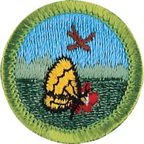

# Nature Merit Badge

## Overview

There is a very close connection between the soil, the plants, and all animal life, including people. Understanding this connection, and the impact we have upon it, is important to preserving the wilderness, as well as to our own well-being as members of the web of nature.

## Requirements

* 
* (1) Name three ways in which plants are important to animals. Name a plant that is protected in your state or region, and explain why it is at risk.Resources:
* (2) Name three ways in which animals are important to plants. Name an animal that is protected in your state or region, and explain why it is at risk.Resource:
* (3) Explain the term "food chain." Give an example of a four-step land food chain and a four-step water food chain.Resources:
* (4) Do all the requirements in FIVE of the following fields:
    * (a) 
        * (1) In the field, identify eight species of birds. Resources:
        * (2) Make and set out a birdhouse OR a feeding station OR a birdbath. List what birds used it during a period of one month. Resources:

    * (b) 
        * (1) In the field, identify three species of wild mammals. Resources:
        * (2) Make plaster casts of the tracks of a wild mammal. Resources:

    * (c) 
        * (1) Show that you can recognize the venomous snakes in your area. Resources:
        * (2) In the field, identify three species of reptiles or amphibians. Resources:
        * (3) Recognize one species of toad or frog by voice; OR identify one reptile or amphibian by eggs, den, burrow, or other signs. Resources:

    * (d) 
        * (1) Collect and identify either in the field or through photographs 10 species of insects or spiders. Photos may be taken with your own equipment or gathered from other sources. Resource:
        * (2) Hatch an insect from the pupa or cocoon; OR hatch adults from nymphs; OR keep larvae until they form pupae or cocoons; OR keep a colony of ants or bees through one season. Resources:

    * (e) 
        * (1) Identify two species of fish native to your area. Resource:
        * (2) Collect four kinds of animal food eaten by fish in the wild. Resource:

    * (f) 
        * (1) Identify five species of mollusks and crustaceans. Resources:
        * (2) Collect, mount, and label six shells. Resources:

    * (g) 
        * (1) In the field, identify 15 species of wild plants. Resource:
        * (2) Do ONE of the following:
            * (a) Collect and label the seeds of six plants OR the leaves of 12 plants. Resources:
            * (b) Photograph the seeds of six plants OR the leaves of 12 plants and create a catalog of your photos. Resources:

    * (h) 
        * (1) Collect and identify three different types of soil that represent soils high in sand, clay and humus. Resource:
        * (2) Collect and identify five different types of rocks from your area. Resources:

* (5) Discuss the importance of the Leave No Trace Seven Principles and the Outdoor Code and how they relate to nature. Explain how you have followed the Leave No Trace Seven Principles and the Outdoor Code while in natural areas during field observation,  specimen collection, and identification.Resources:
* (6) Do the following:
    * (a) Explain what succession is to your counselor. Resources:
    * (b) Visit a natural area (forest, grassland, meadow, water feature) and explain what stage of succession (both plant and animal) the area is in. Talk about what community/succession stages may have been there before and what community/succession stages may replace what you see now. Discuss what disturbances or changes have taken place in the past to create this landscape and what changes may occur in the future to change the landscape further. Resource:

* (7) Do ONE of the following:
    * (a) Identify three career opportunities that would use skills and knowledge in Nature. Pick one and research the training, education, certification requirements, experience, and expenses associated with entering the field. Research the prospects for employment, starting salary, advancement opportunities and career goals associated with this career. Discuss what you learned with your counselor and whether you might be interested in this career. Resources:
    * (b) Identify how you might use the skills and knowledge in Nature to pursue a personal hobby. Research the additional training required, expenses, and affiliation with organizations that would help you maximize the enjoyment and benefit you might gain from it. Discuss what you learned with your counselor and share what short-term and long-term goals you might have if you pursued this. Resources:

## Resources

- [Nature merit badge page](https://www.scouting.org/merit-badges/nature/)
- [Nature merit badge PDF](https://filestore.scouting.org/filestore/Merit_Badge_ReqandRes/Pamphlets/Nature_2024.pdf) ([local copy](files/nature-merit-badge.pdf))
- [Nature merit badge pamphlet](https://www.scoutshop.org/bsa-nature-merit-badge-pamphlet-boy-scouts-of-america-659868.html)

Note: This is an unofficial archive of Scouts BSA Merit Badges that was automatically extracted from the Scouting America website and may contain errors.