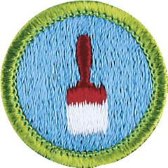

# Painting Merit Badge

## Overview

This merit badge provides an opportunity for Scouts to learn more about painting, including both the artistic and practical aspects.

## Requirements

* (1) Explain the proper safety procedures to follow when preparing surfaces and applying coatings.Resource:
* (2) Do the following:
    * (a) Explain three ways that coatings can improve a surface. Resource:
    * (b) Explain the differences between oil-based paints, acrylic-based paints, and water-based paints. Resources:
    * (c) Explain where you would apply enamel paint, flat paint, wood stain, and varnish, and explain the importance of sheen. Resource:
    * (d) Tell why each is best for these uses.

* (3) Prepare and paint two different surfaces using patching materials or caulking and the proper primers and topcoats. Suggested projects  include an interior or exterior wall, a door, a piece of furniture, a concrete wall or floor, a porch rail, or a fence. Your counselor must preapprove the projects.Resource:
* (4) Prepare and paint an item using harmonizing colors that you have selected using the color wheel in themerit badge pamphlet.Resources:
* (5) Show the right way to use, clean, maintain, and store painting equipment.Resources:
* (6) Explain the importance of ladder safety, personal hygiene, and the use of personal protective equipment when painting.Resources:
* (7) Explain some of the environmental and health issues concerning removing paint, applying paint, and discarding old paint.Resources:
* (8) Find out about career opportunities in the painting craft. Discuss the training and experience required, and explain why this profession might interest you.Resources:

## Resources

- [Painting merit badge page](https://www.scouting.org/merit-badges/painting/)
- [Painting merit badge PDF](https://filestore.scouting.org/filestore/Merit_Badge_ReqandRes/Pamphlets/Painting_2025.pdf) ([local copy](files/painting-merit-badge.pdf))
- [Painting merit badge pamphlet](https://www.scoutshop.org/painting-merit-badge-pamphlet-650872.html)

Note: This is an unofficial archive of Scouts BSA Merit Badges that was automatically extracted from the Scouting America website and may contain errors.