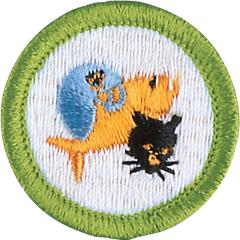

# Pets Merit Badge

## Overview

Pet ownership is a mixture of fun, excitement, responsibility, commitment, expense, and learning. Besides providing a window into the animal world, owning pets gives us opportunities to participate in activities that strengthen the human-animal bond. Pet ownership teaches us about the responsibility we have to the other living beings on this planet, and pets can be just plain fun.

## Requirements

* Note: Work done for other merit badges cannot be used for requirement 1.
* (1) Present evidence that you have cared for a pet for four months. Get approval before you start.
* (2) Write in 200 words or more about the care, feeding, and housing of your pet. Tell some interesting facts about it. Tell why you have this kind of pet. Give local laws, if any, relating to the pet you keep.
* (3) Show that you have read a book or pamphlet, approved by your counselor, about your kind of pet. Discuss with your counselor what you have learned from what you read.
* (4) Do ONE of the following:
    * (a) Show your pet in some pet show.
    * (b) Start a friend raising a pet like yours. Help your friend get a good start.
    * (c) Train a pet in three or more tricks or special abilities.

## Resources

- [Pets merit badge page](https://www.scouting.org/merit-badges/pets/)
- [Pets merit badge PDF](https://filestore.scouting.org/filestore/Merit_Badge_ReqandRes/Pamphlets/Pets_2024.pdf) ([local copy](files/pets-merit-badge.pdf))
- [Pets merit badge pamphlet](https://www.scoutshop.org/scouts-bsa-pets-merit-badge-pamphlet-662417.html)

Note: This is an unofficial archive of Scouts BSA Merit Badges that was automatically extracted from the Scouting America website and may contain errors.