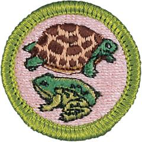

# Reptile and Amphibian Study Merit Badge

## Overview

Kids always have been interested in snakes, turtles, lizards, and alligators, as well as frogs and salamanders. Developing knowledge about these captivating creatures leads to an appreciation for all native wildlife; understanding the life cycle of a reptile or amphibian and keeping one as a pet can be a good introduction to natural history; and knowing about venomous species can help Scouts to be prepared to help in case of an emergency.

## Requirements

* 
* (1) Describe the identifying characteristics of six species of reptiles and four species of amphibians found in the United States. For any four of these, make sketches from your own observations or take photographs. Show markings, color patterns, or other characteristics that are important in the identification of each of the four species. Discuss the habits and habitats of all 10 species.
* (2) Discuss with your counselor the approximate number of species and general geographic distribution of reptiles and amphibians in the United States. Prepare a list of the most common species found in your local area or state.
* (3) Describe the main differences between
    * (a) Amphibians and reptiles
    * (b) Alligators and crocodiles
    * (c) Toads and frogs
    * (d) Snakes and lizards.

* (4) Explain how reptiles and amphibians are an important component of the natural environment. List four species that are officially protected by the federal government or by the state you live in, and tell why each is protected. List three species of reptiles and three species of amphibians found in your local area that are not protected. Discuss the food habits of all 10 species.
* (5) Compare how reptiles reproduce to how amphibians reproduce.
* (6) From observation, describe how snakes move forward. Describe the functions of the muscles, ribs, and belly plates.
* (7) Describe in detail six venomous snakes and the one venomous lizard found in the United States. Describe their habits and geographic range. Tell what you should do in case of a bite by a venomous species.
* (8) Do ONE of the following:
    * (a) Take custody of one or more reptiles or amphibians in a manner approved by your counselor. Maintain one or more reptiles or amphibians for at least a month. Record food accepted, eating methods, changes in coloration, shedding of skins, and general habits; or keep the eggs of a reptile from the time of laying until hatching; or keep the eggs of an amphibian from the time of laying until their transformation into tadpoles (frogs) or larvae (salamanders). Whichever you chose, keep records of and report to your counselor how you cared for your animal/eggs/larvae to include lighting, habitat, temperature and humidity maintenance and any veterinary care requirements. Unless you are the long-term owner, at the conclusion of this study, turn the animal(s) over to another responsible party approved by your counselor.
    * (b) Choose a reptile or amphibian that you can observe or foster at a local zoo, aquarium, nature center, local rescue, or other such exhibit (such as your classroom or school). Study the specimen weekly for a periods of three months. At each visit, sketch the specimen in its captive habitat and note any changes in its coloration, shedding of skins, and general habits and behavior. Discuss with your counselor how the animal you observed was cared for to include its housing and habitat, how the lighting, temperature, and humidity were maintained, and any veterinary care requirements.  Find out, either from information you locate on your own or by talking to the caretaker, what this species eats and what are its native habitat and home range, preferred climate, average life expectancy, and natural predators. Also identify any human-caused threats to its population and any laws that protect the species and its habitat. After the observation period, share what you have learned with your counselor.

* (9) Do TWO of the following:
    * (a) Identify at night three kinds of toads or frogs by their voices. Imitate the song of each for your counselor. Stalk each with a flashlight and discover how each sings and from where.
    * (b) Identify by sight eight species of reptiles or amphibians.
    * (c) Using visual aids, give a brief talk to a small group on three different reptiles and amphibians.

* (10) Tell five superstitions or false beliefs about reptiles and amphibians and give a correct explanation for each. Give seven examples of unusual behavior or other true facts about reptiles and amphibians.

## Resources

- [Reptile and Amphibian Study merit badge page](https://www.scouting.org/merit-badges/reptile-and-amphibian-study/)
- [Reptile and Amphibian Study merit badge PDF](https://filestore.scouting.org/filestore/Merit_Badge_ReqandRes/Pamphlets/Reptile%20Amphibian_2023.pdf) ([local copy](files/reptile-and-amphibian-study-merit-badge.pdf))
- [Reptile and Amphibian Study merit badge pamphlet](https://www.scoutshop.org/reptile-amphibian-merit-badge-pamphlet-660198.html)

Note: This is an unofficial archive of Scouts BSA Merit Badges that was automatically extracted from the Scouting America website and may contain errors.