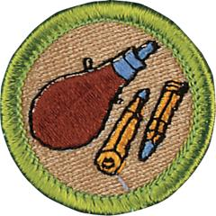

# Rifle Shooting Merit Badge

## Overview

The Rifle Shooting merit badge shows you how a rifle works, how to handle it safely, and how to care for it. There is much more to shooting than squeezing the trigger. Once you have learned the fundamentals of rifle shooting, you can begin to apply them to various rifle-shooting sports and activities.

## Requirements

* (1) Do the following:
    * (a) Explain what a projectile is, and why any device that shoots a projectile at high speed must be handled with care and respect, and used only in approved locations.
    * (b) Explain the basic rules of safe gun handling that apply to all firearms.
    * (c) Describe how you would react if a friend visiting your home asked to see your or your family's firearm.
    * (d) Explain the need for, types, and use of eye protection and hearing protection.
    * (e) Explain the main points of the laws for owning and using guns in your community and state.
    * (f) Explain how hunting is related to the wise use of renewable wildlife resources.
    * (g) Successfully complete a state hunter education course, or obtain a copy of the hunting laws for your state, then do the following:
        * (1) Explain the main points of hunting laws in your state, and any special laws on the use of guns and ammunition, AND
        * (2) List the kinds of wildlife that can be legally hunted in your state.

    * (h) Explain to your counselor the proper hygienic guidelines followed while shooting.
    * (i) Identify places in your community where you can join or be a part of range and target activities.
    * (j) Discuss with your counselor a list of sources you could contact for information on firearms and their use.

* (2) Working under the supervision of a certified National Rifle Association (NRA) Rifle instructor and a certified range safety officer, at a nationally authorized camp property or at a commercial firearm range (as defined in the Scouting America National Range and Target Activities Manual), do ONE of the following options:
    * (A) Option A: Rifle Shooting (Modern Cartridge Type)
        * (a) Identify the three main parts of a rifle, and tell how they function.
        * (b) Identify and demonstrate the rules for safely storing and handling a rifle.
        * (c) Identify the two types of cartridges, their parts, and how they function.
        * (d) Explain to your counselor what a misfire, hangfire, and squib fire are, and explain the procedures to follow in response to each.
        * (e) Explain and demonstrate the five fundamentals of shooting a rifle: aiming, breath control, hold control, trigger control, and follow-through.
        * (f) Demonstrate the knowledge, skills, and attitude necessary to safely shoot a rifle on a range, including understanding and following range procedures and commands.
        * (g) Explain the basic safety rules for cleaning a rifle, and identify the materials needed.
        * (h) Demonstrate how to clean a rifle properly and safely.
        * (i) Discuss what points you would consider in selecting a rifle.
        * (j) Using a bolt-action .22 caliber rimfire rifle, and shooting from a benchrest or supported prone position at 50 feet, fire five groups (three shots per group) that can be touched by a quarter. Using these targets, explain how to adjust sights to zero a rifle.
        * (k) Adjust sights to center the group on the target and fire five groups (five shots per group). In the event that your instructor determines it is not practical to adjust the sights—for instance, on a borrowed rifle—you may explain (rather than doing) how to adjust the sights, and then fire five groups (five shots per group) in which all shots can be touched by a quarter. According to the target used, each shot in the group must meet the following minimum score: A-32 targets: 9; A-17 or TQ-1 targets: 7; A-36 targets: 5.

    * (B) Option B: Air Rifle Shooting (BB or Pellet)
        * (a) Identify the three main parts of an air rifle, and explain how they function.
        * (b) Identify and demonstrate the rules for safely storing and handling an air rifle.
        * (c) Identify the two most common types of air rifle ammunition.
        * (d) Explain and demonstrate the five fundamentals of shooting an air rifle: aiming, breath control, hold control, trigger control, and follow-through.
        * (e) Demonstrate the knowledge, skills, and attitude necessary to safely shoot on a range, including understanding and following range procedures and commands.
        * (f) Explain the basic safety rules for cleaning an air rifle, and identify the materials needed.
        * (g) Demonstrate how to clean an air rifle properly and safely.
        * (h) Discuss what points you would consider in selecting an air rifle.
        * (i) Using a BB gun or pellet rifle and shooting from a benchrest or supported prone position at 15 feet for BB guns or 33 feet for pellet rifles, fire five groups (three shots per group) that can be touched by a quarter.
        * (j) Adjust sights to center the group on the target and fire five groups (five shots per group). In the event that your instructor determines it is not practical to adjust the sights—for instance, on a borrowed air rifle—you may explain (rather than doing) how to adjust the sights, and then fire five groups (five shots per group) in which all shots can be touched by a quarter. According to the target used, each shot in the group must meet the following minimum score: BB rifle at 15 feet (or 5 meters) using TQ-5 targets: 8; Pellet rifle at 25 feet using TQ-5 targets: 8; Pellet rifle at 33 feet (or 10 meters) using AR-1 targets: 6.

    * (C) Option C: Muzzleloading Rifle Shooting
        * (a) Discuss with your counselor a brief history of the development of muzzleloading rifles.
        * (b) Identify principal parts of muzzleloading rifles and discuss how they function.
        * (c) Identify and demonstrate the rules for safely storing and handling a muzzleloading rifle.
        * (d) Identify the various grades of black powder and explain their proper and safe use.
        * (e) Discuss proper safety procedures pertaining to black powder storage.
        * (f) Discuss proper components of a load.
        * (g) Identify proper procedures and accessories used for safely loading a muzzleloading rifle.
        * (h) Identify the causes of a muzzleloading rifle's failure to fire, and explain what a misfire, hangfire, and squib fire are. Explain and demonstrate proper preventive measures, and the procedures to follow in response to each.
        * (i) Demonstrate the knowledge, skills, and attitude necessary to safely shoot a muzzleloading rifle on a range, including understanding and following range procedures and commands.
        * (j) Explain the basic safety rules for cleaning a muzzleloading rifle, and identify the materials needed.
        * (k) Demonstrate how to clean a muzzleloading rifle properly and safely.
        * (l) Discuss what points you would consider in selecting a muzzleloading rifle.
        * (m) Using a muzzleloading rifle of .45 or .50 caliber and shooting from a benchrest or supported prone position, fire three groups (three shots per group) at 50 feet that can be covered by the base of a standard-size soft drink can.
        * (n) Adjust the sights to center the group on the target and fire three groups (five shots per group). In the event that your instructor determines it is not practical to adjust the sights—for instance, on a borrowed muzzleloading rifle—you may explain (rather than doing) how to adjust the sights, and then fire three groups (five shots per group) in which all shots can be covered by the base of a standard-size soft drink can. According to the target used, each shot in the group must meet the following minimum score: at 25 yards using NRA A-23 or NMLRA 50-yard targets: 7; at 50 yards using NRA A-25 or NMLRA 100-yard targets: 7.

* (3) Identify how you could apply the skills and knowledge of safe and responsible use of firearms you learned in this merit badge to pursue a career or personal hobby.  Research the additional training and experience you would need, expenses you may incur, and the affiliation with organizations that could help you maximize the positive impact and enjoyment you gain from it.  Discuss what you learned with your counselor, and share what short-term and long-term goals you might have if you pursued this.

## Resources

- [Rifle Shooting merit badge page](https://www.scouting.org/merit-badges/rifle-shooting/)
- [Rifle Shooting merit badge PDF](https://filestore.scouting.org/filestore/Merit_Badge_ReqandRes/Rifle_Shooting.pdf) ([local copy](files/rifle-shooting-merit-badge.pdf))
- [Rifle Shooting merit badge pamphlet](None)

Note: This is an unofficial archive of Scouts BSA Merit Badges that was automatically extracted from the Scouting America website and may contain errors.