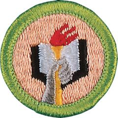

# Scholarship Merit Badge

## Overview

Working on the Scholarship merit badge provides Scouts with a great opportunity to become more successful in school. They will learn how to improve their skills in the classroom, develop good study habits, and master techniques for writing reports and taking tests.

## Requirements

* (1) Do ONE of the following:
    * (a) Show that you have had an average grade of B or higher (80 percent or higher) for one term or semester. Resource:
    * (b) Show that for one term or semester you have improved your school grades over the previous period.  Resource:

* (2) Do TWO of the following:
    * (a) Make a list of educational places located where you live (other than schools). Visit one, and report on how you used the place for self-education.  Resource:
    * (b) With your counselor's and your parent or guardian's approval, interview two professionals (other than teachers or other professionals at your school) with established careers. Find out where they were educated, what training they received, and how their education and training have helped prepare them for the career they have chosen. Find out how they continue to educate themselves. Discuss what you find out with your counselor. Resource:
    * (c) Using a daily planner, show your counselor how you keep track of assignments and activities, and discuss how you manage your time. Resources:
    * (d) Discuss the advantages and disadvantages of the different methods of research available to you for school assignments, such as the library, books and periodicals, and the internet. Resources:

* (3) Get a note from the principal of your school (or another school official named by the principal) that states that during the past year your behavior, leadership, and service have been satisfactory.If you are home-schooled or your school environment does not include a principal, you may obtain a note from a counterpart such as your parent or guardian.
* (4) Do ONE of the following:
    * (a) Show that you have taken part in an extracurricular school activity, and discuss with your counselor the benefits of participation and what you learned about the importance of teamwork.  Resource:
    * (b) Discuss your participation in a school project during the past semester where you were a part of a team. Tell about the positive contributions you made to the team and the project.  Resources:

* (5) Do ONE of the following:
    * (a) Write a report of 250 to 300 words about how the education you receive in school will be of value to you in the future and how you will continue to educate yourself in the future.  Resource:
    * (b) Write a report of 250 to 300 words about two careers that interest you and how specific classes and good scholarship in general will help you achieve your career goals.  Resource:

## Resources

- [Scholarship merit badge page](https://www.scouting.org/merit-badges/scholarship/)
- [Scholarship merit badge PDF](https://filestore.scouting.org/filestore/Merit_Badge_ReqandRes/Pamphlets/Scholarship_2024.pdf) ([local copy](files/scholarship-merit-badge.pdf))
- [Scholarship merit badge pamphlet](https://www.scoutshop.org/scholarship-merit-badge-pamphlet-650740.html)

Note: This is an unofficial archive of Scouts BSA Merit Badges that was automatically extracted from the Scouting America website and may contain errors.