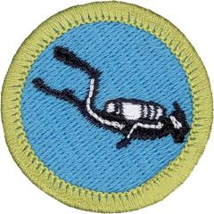

# Scuba Diving Merit Badge

## Overview

Explore a whole new environment under the sea with the Scuba Diving Merit Badge. Be Prepared to handle diving-related injuries and illnesses, learn the importance of diving responsibly, study underwater ecosystems, and wrap it all up by earning your open-water diving certification.

## Requirements

* (1) Do the following:
    * (a) Show that you know first aid for injuries or illnesses that could occur while scuba diving, including hypothermia, hyperventilation, squeezes, decompression illness, nitrogen narcosis, motion sickness, fatigue, overexertion, heat reactions, dehydration, injuries by aquatic life, and cuts and scrapes.
    * (b) Identify the conditions that must exist before performing CPR on a person, and explain how to recognize such conditions. Demonstrate the proper technique for performing CPR using a training device approved by your counselor.

* (2) Before completing requirements 3 through 6, earn the Swimming merit badge.
* (3) Discuss the Scuba Diver's Code with your counselor, and explain the importance of each guideline to a scuba diver's safety.
* (4) Earn an Open Water Diver Certification from a scuba organization recognized by the Scouting America scuba policy.
* (5) Explain what an ecosystem is, and describe four aquatic ecosystems a diver might experience.
* (6) Find out about three career opportunities in the scuba industry. Pick one and find out the education, training, and experience required for this profession. Discuss this with your counselor, and explain why this profession might interest you.

## Resources

- [Scuba Diving merit badge page](https://www.scouting.org/merit-badges/scuba-diving/)
- [Scuba Diving merit badge PDF](https://filestore.scouting.org/filestore/Merit_Badge_ReqandRes/Scuba_Diving.pdf) ([local copy](files/scuba-diving-merit-badge.pdf))
- [Scuba Diving merit badge pamphlet](None)

Note: This is an unofficial archive of Scouts BSA Merit Badges that was automatically extracted from the Scouting America website and may contain errors.