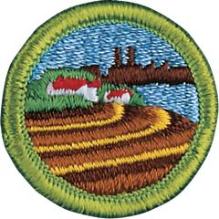

# Soil and Water Conservation Merit Badge

## Overview

Conservation isn’t just the responsibility of soil and plant scientists, hydrologists, wildlife managers, landowners, and the forest or mine owner alone. It is the duty of every person to learn more about the natural resources on which our lives depend so that we can help make sure that these resources are used intelligently and cared for properly.

## Requirements

* (1) Do the following:
    * (a) Tell what soil is. Tell how it is formed.
    * (b) Describe three kinds of soil. Tell how they are different.
    * (c) Name the three main plant nutrients in fertile soil. Tell how they can be put back when used up.

* (2) Do the following:
    * (a) Define soil erosion.
    * (b) Tell why soil erosion is important and how it affects you.
    * (c) Name three kinds of soil erosion. Describe each.
    * (d) Take pictures of or draw two kinds of soil erosion.

* (3) Do the following:
    * (a) Tell what is meant by conservation practices.
    * (b) Describe the effect of three kinds of erosion-control practices.
    * (c) Take pictures of or draw three kinds of erosion-control practices.

* (4) Do the following:
    * (a) Explain what a watershed is.
    * (b) Outline the smallest watershed that you can find on a contour map.
    * (c) Outline, as far as the map will allow, the next larger watershed that also has the smaller one in it.
    * (d) Explain what a river basin is. Tell why all people living in a river basin should be concerned about land and water use in the basin.
    * (e) Explain what an aquifer is and why it can be important to communities.

* (5) Do the following:
    * (a) Make a drawing to show the hydrologic cycle.
    * (b) Demonstrate at least two of the following actions of water in relation to soil: percolation, capillary action, precipitation, evaporation, transpiration.
    * (c) Explain how removal of vegetation will affect the way water runs off a watershed.
    * (d) Tell how uses of forest, range, and farmland affect usable water supply.
    * (e) Explain how industrial use affects water supply.

* (6) Do the following:
    * (a) Tell what is meant by "water pollution."
    * (b) Describe common sources of water pollution and explain the effects of each.
    * (c) Explain the terms: primary water treatment, secondary waste treatment, biochemical oxygen demand.
    * (d) Make a drawing showing the principles of complete waste treatment.

* (7) Do TWO of the following:
    * (a) Make a trip to TWO of the following places. Write a report of more than 500 words about the soil and water and energy conservation practices you saw.
        * (1) An agricultural experiment
        * (2) A managed forest or a woodlot, range, or pasture
        * (3) A wildlife refuge or a fish or game management area
        * (4) A conservation-managed farm or ranch
        * (5) A managed watershed
        * (6) A waste-treatment plant
        * (7) A public drinking water treatment plant
        * (8) An industry water use installation
        * (9) A desalinization plant.

    * (b) Plant 100 trees, bushes and/or vines for a good purpose.
    * (c) Seed an area of at least one-fifth acre for some worthwhile conservation purposes, using suitable grasses or legumes alone or in a mixture.
    * (d) Study a soil survey report. Describe the things in it. Using tracing paper and pen, trace over any of the soil maps and outline an area with three or more different kinds of soil. List each kind of soil by full name and map symbol
    * (e) Make a list of places in your neighborhood, camps, school ground, or park that have erosion, sedimentation, or pollution problems. Describe how these could be corrected through individual or group action.
    * (f) Carry out any other soil and water conservation project approved by your counselor.

## Resources

- [Soil and Water Conservation merit badge page](https://www.scouting.org/merit-badges/soil-and-water-conservation/)
- [Soil and Water Conservation merit badge PDF](https://filestore.scouting.org/filestore/Merit_Badge_ReqandRes/Soil_and_WaterConservation.pdf) ([local copy](files/soil-and-water-conservation-merit-badge.pdf))
- [Soil and Water Conservation merit badge pamphlet](None)

Note: This is an unofficial archive of Scouts BSA Merit Badges that was automatically extracted from the Scouting America website and may contain errors.