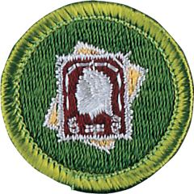

# Stamp Collecting Merit Badge

## Overview

The world’s most popular hobby, stamp collecting is enjoyed by millions throughout the world. Through this hobby. you can experience history: postage stamps are like tiny windows that introduce the people of the world to the country’s leaders, customs, history, products, and environment.

## Requirements

* (1) Do the following:Resource:
    * (a) Discuss how you can better understand people, places, institutions, history, and geography as a result of collecting stamps. Resources:
    * (b) Briefly describe some aspects of the history, growth, and development of the United States postal system. Tell how it is different from postal systems in other countries. Resources:

* (2) Define topical stamp collecting.  Name and describe three other types of stamp collections.Resources:
* (3) Show at least ONE example of each of the following:Resource:
    * (a) Perforated and imperforate stamps Resources:
    * (b) Mint and used stamps Resource:
    * (c) Sheet, booklet, and coil stamps Resource:
    * (d) Numbers on plate block, booklet, coil, or marginal markings Resource:
    * (e) Overprint and surcharge Resources:
    * (f) Metered mail Resources:
    * (g) Definitive, commemorative, semipostal, and airmail stamps Resources:
    * (h) Cancellation and postmark Resource:
    * (i) First day cover Resource:
    * (j) Postal stationery (aerogramme, stamped envelope, and postal card). Resource:

* (4) Do the following:
    * (a) Demonstrate the use of ONE standard catalog for several different stamp issues. Explain why catalog value can vary from the corresponding purchase price. Resources:
    * (b) Explain the meaning of the term condition as used to describe a stamp. Show examples that illustrate the different factors that affect a stamp's value. Resource:

* (5) Demonstrate the use of at least THREE of the following stamp collector's tools:
    * (a) Stamp tongs Resources:
    * (b) Water and tray Resource:
    * (c) Magnifiers Resource:
    * (d) Hinges and stamp mounts Resource:
    * (e) Perforation gauge Resource:
    * (f) Glassine envelopes and cover sleeves Resource:
    * (g) Watermark fluid. Resource:

* (6) Do the following:Resource:
    * (a) Show a stamp album and how to mount stamps with or without hinges. Show at least ONE page that displays several stamps. Resource:
    * (b) Discuss at least THREE ways you can help to preserve stamps, covers, and albums in first-class condition. Resource:

* (7) Do TWO of the following:
    * (a) Design a stamp, cancellation, or cachet. Resources:
    * (b) Visit a post office, stamp club, or stamp show with an experienced collector. Explain what you saw and learned. Resources:
    * (c) Write a review of an interesting article from a stamp newspaper, magazine, book, or website (with your parent or guardian's permission). Resource:
    * (d) Research and report on a famous stamp-related personality or the history behind a particular stamp. Resource:
    * (e) Describe the steps taken to produce a stamp. Include the methods of printing, types of paper, perforation styles, and how they are gummed. Resource:
    * (f) Prepare a two- to three-page display involving stamps. Using ingenuity, as well as clippings, drawings, etc., tell a story about the stamps , and how they relate to history, geography, or a favorite topic of yours. Resource:

* (8) Mount and show, in a purchased or homemade album, ONE of the following:Resource:
    * (a) A collection of 250 or more different stamps from at least 15 countries
    * (b) A collection of a stamp from each of 50 different countries, mounted on maps to show the location of each
    * (c) A collection of 100 or more different stamps from either one country or a group of closely related countries
    * (d) A collection of 75 or more different stamps on a single topic. (Some interesting topics are Scouting, birds, insects, the Olympics, sports, flowers, animals, ships, holidays, trains, famous people, space, and medicine). Stamps may be from different countries.
    * (e) A collection of postal items discovered in your mail by monitoring it over a period of 30 days. Include at least five different types listed in requirement 3.

## Resources

- [Stamp Collecting merit badge page](https://www.scouting.org/merit-badges/stamp-collecting/)
- [Stamp Collecting merit badge PDF](https://filestore.scouting.org/filestore/Merit_Badge_ReqandRes/Pamphlets/Stamp%20Collecting_2024.pdf) ([local copy](files/stamp-collecting-merit-badge.pdf))
- [Stamp Collecting merit badge pamphlet](https://www.scoutshop.org/stamp-collecting-merit-badge-pamphlet-662439.html)

Note: This is an unofficial archive of Scouts BSA Merit Badges that was automatically extracted from the Scouting America website and may contain errors.