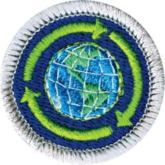

# Sustainability Merit Badge

## Overview

**Eagle required**

Learn to reduce waste and teach sustainable practices to others so you can help conserve Earth’s resources with the Sustainability Merit Badge. Scouts will develop and implement a plan to reduce their water usage, household food waste, and learn about the sustainability of different energy sources, including fossil fuels, solar, wind, nuclear, hydropower, and geothermal.

## Requirements

* (1) Describe the meaning of sustainability in your own words. Explain the importance of sustainability to society and how you can contribute to fulfilling the needs of current generations without compromising the needs of future generations.Resources:
* (2) Do ONE of the following and discuss with your counselor:Resources:
    * (a) Evaluate your household water usage. If available, review water bills from the past year and evaluate the seasonal changes in water use. Identify three ways to help reduce water consumption. Resources:
    * (b) Explain why water is necessary in our lives. Create a diagram to show how your household gets its clean water from a natural source and what happens with the water after you use it. Tell two ways to preserve your community's access to clean water in the future. Resources:
    * (c) Different areas of the world are affected by either too much (flooding) or too little (drought) water. Explore whether either or both affect where you live. Identify three water conservation or flood mitigation practices (successful or unsuccessful) that have been tried where you live or in an area of the world that interests you. Resources:

* (3) Do ONE of the following and discuss with your counselor:Resources:
    * (a) Explore the sustainability of different types of plant-based, animal-based and aquaculture food. Identify where four different foods (such as milk, eggs, tuna fish, avocados, or ketchup) come from and how they are processed and transported from the source to you. Resources:
    * (b) Identify four factors that limit the availability of food in different regions of the world. Discuss how each factor influences the sustainability of worldwide food supplies. Share three ways individuals, families, or your community can create their own food sources. Resources:
    * (c) Develop a plan to reduce your household food waste in a sustainable manner. Establish a baseline and then track and record your results for two weeks. Resources:

* (4) Do ONE of the following and discuss with your counselor:Resources:
    * (a) Create a sketch depicting how you would design a sustainable community and be prepared to explain how the housing, work locations, shops, schools, and transportation systems affect energy, pollution, natural resources, and the economy of the community. Resources:
    * (b) Identify one unsustainable practice in your community and develop a written plan to fix it. Resources:
    * (c) Identify five sustainability factors in housing and rate your own home's sustainability against these factors. Resources:

* (5) Do ONE of the following and discuss with your counselor:Resources:
    * (a) Learn about the sustainability of different energy sources, including coal, gas, geothermal, hydro power, nuclear, petroleum, solar, and wind. Identify three common energy sources in the United States and describe how the production and consumption of each of these energy sources affects sustainability. Resources:
    * (b) List eight ways your family consumes energy, such as gas appliances, electricity, heating systems or cooling systems, and transportation. For one home- and one transportation-related energy use, list three ways to help reduce consumption, reduce your carbon footprint, and be a better steward of this resource. Resources:
    * (c) List five ways you and your family could reduce energy consumption in your home, such as adjusting your thermostat, window shades, opening windows, reducing hot-water temperature, and minimizing water consumption. Identify the benefits and risks of each idea and implement if possible. Resources:

* (6) Do ONE of the following and discuss with your counselor:Resources:
    * (a) Create a list of 15 items of your personal "stuff." Classify each item as an essential need (such as soap) or a desirable want (such as a video game). Identify any excess "stuff" you no longer need, working with your family, if possible. Donate, repurpose, or recycle those items you can.
    * (b) List five ways having too much "stuff" affects you, your family, your community, AND the world. For each of the five ways, consider the following aspects: the financial impact, time spent, maintenance, health, storage, and waste generation. Identify practices that can be used to avoid accumulating too much "stuff."
    * (c) Research the impact waste has on the environment (land, water, air). Find out what the trash vortex is and how it was formed. Explain the number system for plastic recyclables and which plastics are more commonly recycled. Identify the average lifespan of one electronic device in your household, and whether it can be recycled in whole or part. Resources:

* (7) Do TWO of the following and discuss with your counselor:
    * (a) The United Nations lists 17 Sustainable Development Goals. These include Zero Hunger, Clean Water and Sanitation, Affordable and Clean Energy, Sustainable Cities and Community, Responsible Consumption and Production, Climate Action, Life Below Water, and Life on Land. Pick one of these eight and summarize the goal and its current and future impact on you, your family, community, and the world. Resources:
    * (b) Identify how the planetary life-support systems (soil, climate, freshwater, atmospheric, nutrient, oceanic, ecosystems, and species) support life on Earth and interact with one another. Share what happens to the planet's sustainability when these systems are disrupted by natural events or human activity. Resources:
    * (c) Identify how product life cycles (the cycle of design, sourcing, production, use, and disposal or reuse) influence current and future sustainability. Choose one common product to demonstrate how the full product life cycle would apply. Resources:
    * (d) Learn how the world's population affects the sustainability of Earth. Discuss three human activities that may contribute to putting Earth at risk, now and in the future. Resources:
    * (e) Explain the term species (plant or animal) decline. Share the human activities that contribute to species decline, what can be done to help reverse the decline, and its impact on a sustainable environment. Resources:
    * (f) Find a world map that shows the pattern of temperature change for a period of at least 100 years. Identify three factors that scientists believe affect the global weather and temperature. Discuss how climate change impacts sustainability of food, water, or other resources.

* (8) Do the following:
    * (a) On a campout or other outdoor Scouting activity that you attend, make notes on the sustainability practices you and your fellow Scouts practice. Observe transportation, forestry, soil conservation, water resources, habitat, buildings, campsites, and sanitation. Share what you observed and learned with your counselor. Resources:
    * (b) Discuss with your counselor how living by the Scout Oath, Scout Law, Leave No Trace Seven Principles and the Outdoor Code in your daily life helps promote sustainability. Resources:
    * (c) Identify 5 behavioral changes that you and your family can make to improve the sustainability of your household. Share and discuss each with your counselor. Resources:

* (9) Learn about career opportunities in the sustainability field. Pick one and find out the education, training, and experience required. Discuss what you have learned with your counselor and explain why this career might interest you.Resources:

## Resources

- [Sustainability merit badge page](https://www.scouting.org/merit-badges/sustainability/)
- [Sustainability merit badge PDF](https://filestore.scouting.org/filestore/Merit_Badge_ReqandRes/Pamphlets/Sustainability_2024.pdf) ([local copy](files/sustainability-merit-badge.pdf))
- [Sustainability merit badge pamphlet](https://www.scoutshop.org/scouts-bsa-sustainability-merit-badge-pamphlet-662441.html)

Note: This is an unofficial archive of Scouts BSA Merit Badges that was automatically extracted from the Scouting America website and may contain errors.