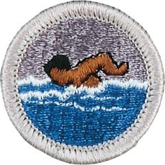

# Swimming Merit Badge

## Overview

**Eagle required**

Swimming is a leisure activity, a competitive sport, and a basic survival skill. Scouts who earn this badge will learn about safety when swimming and diving, how swimming can contribute to overall fitness and health, and gain some basic competitive swimming skills.

## Requirements

* (1) Do the following:
    * (a) Explain to your counselor how Scouting's Safe Swim Defense plan anticipates, helps prevent and mitigate, and provides responses to likely hazards you may encounter during swimming activities.
    * (b) Discuss the prevention and treatment of health concerns that could occur while swimming, including hypothermia, dehydration, sunburn, heat exhaustion, heatstroke, muscle cramps, hyperventilation, spinal injury, stings and bites, and cuts and scrapes.

* (2) Before doing the following requirements, successfully complete the BSA  swimmer test: Jump feetfirst into water over the head in depth. Level off and swim 75 yards in a strong manner using one or more of the following strokes: sidestroke, breaststroke, trudgen, or crawl; then swim 25 yards using an easy, resting backstroke. The 100 yards must be completed in one swim without stops and must include at least one sharp turn. After completing the swim, rest by floating.
* (3) Correctly perform the following strokes:
    * (a) Demonstrate the front crawl or the trudgen using good form.
    * (b) Demonstrate the back crawl using good form.
    * (c) Demonstrate the sidestroke using good form.
    * (d) Demonstrate the breaststroke using good form.
    * (e) Demonstrate the elementary backstroke using good form.

* (4) Swim continuously for 150 yards in a strong manner using each of the following strokes in any order; front crawl or trudgen (25 yards); back crawl (25 yards); sidestroke (25 yards); breaststroke (25 yards); and elementary backstroke (50 yards).
* (5) Do the following:
    * (a) Demonstrate water rescue methods by reaching with your arm or leg, by reaching with a suitable object, and by throwing lines and objects. Explain why swimming rescues should not be attempted when a reaching or throwing rescue is possible, and explain why and how a rescue swimmer should avoid contact with the victim.
    * (b) With a helper and a practice victim, show a line rescue both as tender and as rescuer. The practice victim should be approximately 30 feet from shore in deep water.

* (6) Do the following:
    * (a) Float faceup in a resting position for at least three minutes with minimal movement.
    * (b) Demonstrate survival floating for at least five minutes.
    * (c) While wearing a properly fitted U.S. Coast Guard-approved life jacket, demonstrate the HELP and huddle positions. Explain their purposes.
    * (d) Explain why swimming or survival floating will hasten the onset of hypothermia in cold water.

* (7) In water over your head, but not to exceed 10 feet, do the following:
    * (a) Use the feetfirst method of surface diving and bring an object up from the bottom.
    * (b) Do a headfirst surface dive (pike or tuck), and bring the object up again.
    * (c) Do a headfirst surface dive to a depth of at least 5 feet and swim underwater for three strokes. Come to the surface, take a breath, and repeat the sequence twice.

* (8) Following the guidelines set in the BSA Safe Swim Defense, in water at least  7 feet deep*, show a standing headfirst dive from a dock or pool deck. Show  a long shallow dive, also from the dock or pool deck.
* (9) Explain the health benefits of regular aerobic exercise, and discuss why  swimming is favored as both fitness and therapeutic exercise.
* \* If your state, city, or local community requires a water depth greater than 7 feet, it is important to  abide by that mandate.

## Resources

- [Swimming merit badge page](https://www.scouting.org/merit-badges/swimming/)
- [Swimming merit badge PDF](https://filestore.scouting.org/filestore/Merit_Badge_ReqandRes/2023_Updates/35957(23)_Swimming_REQ.pdf) ([local copy](files/swimming-merit-badge.pdf))
- [Swimming merit badge pamphlet](None)

Note: This is an unofficial archive of Scouts BSA Merit Badges that was automatically extracted from the Scouting America website and may contain errors.