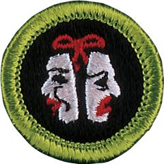

# Theater Merit Badge

## Overview

While earning the Theater merit badge, Scouts will learn to appreciate live performances as members of the audience as well as go behind the footlights to see the view from the other side. Much more goes on in theater than ever meets the audience’s eye.

## Requirements

* (1) See or read three full-length plays.* Write a review of each. Discuss with your counselor the plot or story. If you chose to watch the plays, comment on the acting and the staging. (* Watching plays on television, video, or as a movie is not permitted.)
* (2) Write a one-act play that will take at least 10 minutes to perform. The play must have a main character, conflict, and a climax.
* (3) Discuss with your counselor the safety precautions that should be practiced when working in a theater to protect the cast and crew. Then do THREE of the following:
    * (a) Act a major part in a full-length play; or act a part in three one-act plays.
    * (b) Direct a play. Cast, rehearse, and stage it. The play must be at least 10 minutes long.
    * (c) Design the set for a play or a theatrical production. Make a model of it.
    * (d) Design the costumes for five characters in a theatrical production set in a historical time.
    * (e) Show skill in hair and makeup design. Make up yourself or a friend as a historical figure, a clown, an extraterrestrial, or a monster as directed.
    * (f) With your counselor's approval, help with the building and painting of the scenery for a theatrical production.
    * (g) With your counselor's approval, design the lighting for a play; or help install, focus, color, program, and operate the lighting for a theatrical production.
    * (h) With your counselor's approval, help install, focus, equalize, program, and operate the sound for a theatrical production.
    * (i) Serve as the stage manager for a theatrical production. Document all cues and stage setups in your calling script.
    * (j) Serve as musical director for a musical theater production.

* (4) Mime or pantomime any ONE of the following, chosen by your counselor.
    * (a) You have come into a large room. It is full of pictures, furniture, and other things of interest.
    * (b) As you are getting on a bus, your books fall into a puddle. By the time you pick them up, the bus has driven off.
    * (c) You have failed a school test. You are talking with your teacher, who does not buy your story.
    * (d) You are at camp with a new Scout. You try to help them pass a cooking test. The Scout learns very slowly.
    * (e) You are at a banquet. The meat is good. You don't like the vegetable. The dessert is ice cream.
    * (f) You are a circus performer such as a juggler, high-wire artist, or lion tamer doing a routine.

* (5) Explain the following: proscenium arch, central or arena staging, center stage, stage right, stage left, downstage, upstage, stage crew, flies, portal, cyclorama, stage brace, spotlight, floodlight, lighting control board, sound mixing desk, thrust staging, ground plans, and sightlines.

## Resources

- [Theater merit badge page](https://www.scouting.org/merit-badges/theater/)
- [Theater merit badge PDF](https://filestore.scouting.org/filestore/Merit_Badge_ReqandRes/35959(21)Theater_REQ.pdf) ([local copy](files/theater-merit-badge.pdf))
- [Theater merit badge pamphlet](None)

Note: This is an unofficial archive of Scouts BSA Merit Badges that was automatically extracted from the Scouting America website and may contain errors.